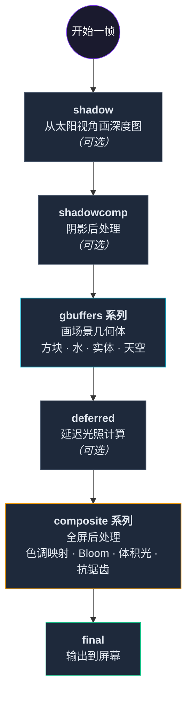
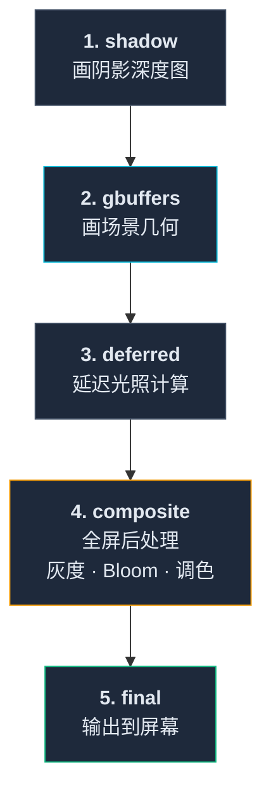

这一节我们会讲解：

- 渲染管线是什么——用"工厂流水线"的比喻理解它
- 每一帧画面经历的完整步骤——从 shadow 到 final
- gbuffers-style pass 和 composite-style pass 的区别
- 为什么你的 `composite.fsh` 是**最后一棒**

如果你之前在 0.4 节对着几十个文件发过呆——"这些文件到底按什么顺序执行？"——这一节就是答案。

---

## 工厂流水线

想象一家汽车工厂。

一辆汽车不是"一个工人从头做到尾"的。它是在流水线上，经过几十个工位，每个工位做一件特定的事：工位一装底盘、工位二装发动机、工位三装车门、工位四喷漆……

Minecraft 的渲染管线就是一条"画面流水线"。每一帧画面不是"一个程序画出来的"——它是经过十几个工位（pass），每个 pass 在上一个 pass 的输出基础上做一件事。

你作为光影开发者，可以**定制这条流水线上的某些工位**。Iris 负责把工位串联起来。

---

## 一帧画面的完整旅程

当你站在 Minecraft 的世界里，Iris 为每一帧画面执行以下流程：



每一帧，这个流程从头到尾跑一次。60 FPS = 每秒跑 60 次。

> （Base-330 模板不包含 shadow pass，此步骤在实际使用中可选）

---

## 两种 Pass：Gbuffers 型和 Composite 型

你可能注意到了——上面的流程里有两种风格的 pass。

### Gbuffers-style pass（几何 pass）

- **代表**：`shadow`、`gbuffers_terrain`、`gbuffers_water`、所有 `gbuffers_xxx`
- **做什么**：渲染实际的 3D 几何体——方块、水、实体、天空……
- **特点**：有**顶点信息**——法线、纹理坐标、顶点位置。你可以做光照、做材质映射、做法线贴图。
- **类比**：工厂流水线上**造零件的工位**——产生原始数据。

### Composite-style pass（全屏 pass）

- **代表**：`composite`、`deferred`、`final`
- **做什么**：在整张屏幕上做后处理——模糊、调色、光晕……
- **特点**：**没有顶点信息**——只有一个全屏矩形。你只能从之前 pass 输出的纹理中读取数据。
- **类比**：工厂流水线上**做质检和包装的工位**——不造新东西，只处理已有的。

>  **一个简化的记忆方式**：gbuffers pass 们画 3D 世界 → composite pass 们给画面做"美颜滤镜"。

---

## 为什么你的灰度滤镜在 `composite` 里？

现在你可以回答这个问题了。

你的灰度滤镜是一个**全屏后处理效果**——它不需要知道每个像素对应哪个方块。它只需要拿到已经渲染好的彩色画面，然后把它变灰。

这正好是 composite pass 的职责——在场景已经画完之后，对整张画面做处理。

如果你想把灰度滤镜放在 `gbuffers_terrain.fsh` 里——也行，但那样的话**只有草方块会变灰**。水还是蓝色的，天空还是蓝色的，云还是白色的。因为 `gbuffers_terrain` 只处理固体方块。

而放在 `composite.fsh` 里——**所有东西都变灰**。因为 composite 处理的是已经合成好的最终画面。

---

## 深入：每个 Pass 的编号

你可能会看到 `composite.fsh`、`composite1.fsh`、`composite2.fsh`……这些编号意味着什么？

它们是**同一个 pass 类型的多个实例**——按顺序执行。

```
composite.fsh   ← 第一个 composite pass（编号为空 = 0）
composite1.fsh  ← 第二个
composite2.fsh  ← 第三个
...
composite7.fsh  ← 第八个（一般最多 7 或 8 个）
```

每个 composite pass 可以做不同的事。BSL 的使用方式是这样的：

| Pass | BSL 的用途 |
|------|-----------|
| `composite` | 色调映射 + 色彩分级 |
| `composite1` | 体积光（光柱） |
| `composite2` | 运动模糊 |
| `composite3` | 景深 |
| `composite4` | Bloom 预处理 |
| `composite5` | Bloom 合成 |
| `composite6` | FXAA 抗锯齿 |
| `composite7` | TAA 抗锯齿 |

每个 composite pass 读取上一个 pass 的输出，做自己的处理，然后把结果传给下一个。

>  **你不需要现在就理解每个 composite pass 干什么。** Base-330 模板只有一个 `composite.fsh`。等你需要更多 pass 的时候，自己加就行。

---

## 从代码的角度看管线

在 Base-330 的 `shaders.properties` 里，你可能会看到类似这样的配置（或者它是隐式的——没有配置就是默认启用）：

```properties
# shadow 相关
# program.world0/shadow.enabled=SHADOW   ← 如果定义了 SHADOW 宏才启用

# gbuffers 系列——默认全部启用，不需要显式配置
# 除非你想用条件编译控制某些 pass

# deferred
# program.world0/deferred.enabled=AO      ← 如果定义了 AO 宏才启用

# composite
# 默认都启用，可以加条件
```

每一个 `program.xxx.enabled=MAGIC_WORD` 都是在说："如果某个条件满足，就启用这个 pass"。

---

## 内心独白：你该从哪入手？

面对这一整条管线，你可能会想："我该先学哪个 pass？"

答案是：**composite。** 理由有三：

1. **最容易看到效果**——改一行代码，F3+R，立刻看到变化
2. **不涉及 3D 数学**——你在 composite 里处理的只是一张 2D 图片，不需要理解法线、矩阵、投影
3. **结果是全局的**——你的效果会覆盖整个画面，成就感最大

这就解释了我们的教程结构：**第 1 章 composite → 第 2 章 gbuffers → 第 3 章 deferred → 第 4 章 shadow → 后处理。**

我们沿着管线从后往前学——从你最容易理解的"最终画面处理"开始，逐步深入到"3D 世界的渲染"。

>  这有点像学做菜——先学怎么摆盘（composite），再学怎么烹饪（gbuffers），最后学怎么种菜（shadow mapping）。摆盘最容易出效果，能给你继续前进的动力。

---

## 本章要点

在我们的教程里，你只需要记住这条简化版的管线：




-  **管线 = 工厂流水线**：每个 pass 在上一个 pass 的输出上做一件事
-  **Gbuffers 型**：画 3D 世界（有顶点信息）
-  **Composite 型**：做 2D 后处理（只有全屏纹理）
-  **编号**：`composite1`、`composite2`……是同一个类型的多个实例
-  **先学 composite**：最容易、最直观、最有成就感

> **这里的要点是：你现在写的 `composite.fsh` 是管线的倒数第二棒——场景已经画好了，你的工作是在它被显示到屏幕之前，做最后的美化。**

---

下一章：[1.1 — 你的第一个着色器：灰度滤镜](/01-composite/01-grayscale/)
