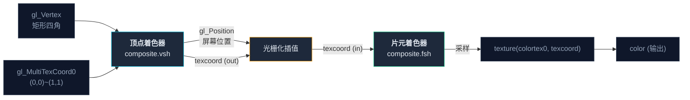

这一节我们会讲解：

- 为什么 composite pass 需要顶点着色器——哪怕它只"画一个矩形"
- `composite.vsh` 的逐行解析——比你想象的简单得多
- 顶点着色器如何产生 `texcoord`——片元着色器的"坐标纸条"
- 为什么你不应该跳过这一节——gbuffers 的顶点着色器才是真正的战场

如果你觉得"反正 composite 的顶点着色器我不用改，为什么要学"——这完全是个合理的疑问。但请给我 10 分钟。当你进入第 2 章、需要在 `gbuffers_terrain.vsh` 里做顶点动画时，你会感谢这 10 分钟的。

---

## 打开 `composite.vsh`

用 VS Code 打开 Base-330 的 `shaders/composite.vsh`。你会看到：

```glsl
#version 330 compatibility

out vec2 texcoord;

void main() {
    gl_Position = gl_ModelViewProjectionMatrix * gl_Vertex;
    texcoord = (gl_TextureMatrix[0] * gl_MultiTexCoord0).xy;
}
```

就这些。6 行有效代码。

---

## 第一行：`out vec2 texcoord;`

```glsl
out vec2 texcoord;
```

我们从片元着色器的角度看过 `in vec2 texcoord`——它是从顶点着色器传过来的"坐标纸条"。而这里的 `out vec2 texcoord` 就是**纸条的发出端**。

> **顶点着色器：`out` → 片元着色器：`in`**。中间由 GPU 的光栅化器自动插值。

---

## 第二行：`gl_Position = ...`

```glsl
gl_Position = gl_ModelViewProjectionMatrix * gl_Vertex;
```

这一行干了一件非常具体的事：**把顶点的 3D 坐标转换成屏幕上的 2D 位置。**

- `gl_Vertex`：当前顶点的位置（一个齐次坐标 `vec4(x, y, z, 1.0)`）
- `gl_ModelViewProjectionMatrix`：一个 4×4 矩阵，把世界坐标映射到屏幕坐标
- `gl_Position`：输出——GPU 知道"这个顶点应该画在屏幕的 (x, y) 位置"

对于 composite pass，Iris 给顶点着色器传的 `gl_Vertex` 本身就是全屏矩形的四个角——`(-1,-1)`、`(1,-1)`、`(-1,1)`、`(1,1)`。乘以矩阵后，它们恰好覆盖整个屏幕。

>  **这就是全屏四边形的"骗局"**：composite 的顶点着色器其实传了 4 个顶点——但经过光栅化之后，它们变成了 200 万个像素。这和你用 gbuffers 渲染方块没有任何区别——只不过这个"方块"恰好铺满了你的屏幕。


---

## 第三行：`texcoord = ...`

```glsl
texcoord = (gl_TextureMatrix[0] * gl_MultiTexCoord0).xy;
```

这一行计算每个顶点的**纹理坐标**——也就是在 1.1 节里你用来从 `colortex0` 取色的 `texcoord`。

- `gl_MultiTexCoord0`：顶点的原始纹理坐标
- `gl_TextureMatrix[0]`：纹理变换矩阵（Minecraft 用它来处理纹理图集的缩放/偏移）
- `.xy`：只取前两个分量（我们只需要 2D 纹理坐标，不需要第三维）

对于全屏矩形，四个角的纹理坐标分别是 `(0,0)`、`(1,0)`、`(0,1)`、`(1,1)`。经过 GPU 的插值，中间的每个像素都会得到恰好正确的坐标——这就是为什么 `texcoord` 的范围是 `[0,1]`。

---

## 完整的数据流



每一次你写 `texture(colortex0, texcoord)`，你都在感谢顶点着色器为你计算好了 `texcoord`。

---

## 那你什么时候需要修改顶点着色器？

**在 composite pass 里——几乎从来不需要。** 全屏矩形的顶点着色器已经完美了：画一个满屏矩形，产生覆盖全屏的纹理坐标。你不需要改它。

**在 gbuffers pass 里——经常需要。** 当你在处理实际的 3D 几何体时，顶点着色器可以做很多事情：

- **顶点动画**：让草叶随风摆动（修改 `gl_Position`）
- **世界曲率**：让地平线微微弯曲（BSL 有这个功能）
- **计算额外数据**：把世界坐标、法线等传给片元着色器

我们会在第 2 章深入 gbuffers 的顶点着色器。但现在，你只需要知道：**composite 的顶点着色器是个"全屏矩形的生成器"——它不重要，但它背后的原理在 gbuffers 里会变得至关重要。**

---

## 关于 `ftransform()`

你可能会在一些老教程里看到：

```glsl
gl_Position = ftransform();
```

这是 GLSL 1.20 时代的写法。在 330 版本里，你应该用显式的矩阵乘法：

```glsl
gl_Position = gl_ModelViewProjectionMatrix * gl_Vertex;
```

两条语句等价——但显式写法更清晰（你明确知道在做什么），而且符合 330 的编程风格。

---

## 本章要点

1.  **composite 的顶点着色器只"画一个全屏矩形"**——4 个顶点，光栅化成 200 万个像素
2.  **`out` → `in`**：顶点着色器输出 → 光栅化插值 → 片元着色器接收
3.  **`gl_Position`** = 顶点在屏幕上的位置——所有顶点着色器的最终输出
4.  **`texcoord`** = 纹理坐标——"这个像素对应纹理上的哪个位置"
5.  **composite 中几乎不需要改顶点着色器**——但 gbuffers 中它是主角

> **这里的要点是：你现在看到的 `composite.vsh` 虽然简单，但它是着色器双人舞的完整示范。顶点着色器负责"定位"，片元着色器负责"上色"——这个模式在所有的 pass 中都是一样的。**

---

下一节：[1.6 — shaders.properties：配置文件与功能开关](/01-composite/06-shaders-properties/)
