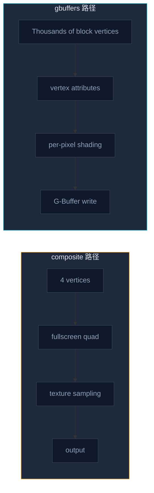

这一节我们会讲解：

- 为什么 `composite.fsh` 像一个只能摸照片的盲人画家
- 为什么 `gbuffers_terrain.fsh` 能拿到方块的顶点、法线、纹理坐标和颜色
- gbuffers 写入 G-Buffer，而 composite 从 G-Buffer 读取，这个方向为什么不能搞反
- `gbuffers_terrain` 在整个场景里负责什么，以及其他 gbuffers pass 又负责什么

好吧，我们开始吧。你已经写过 `composite.fsh`，也在第 1.1 节只改了一行就把画面变灰了。那时你可能会想：既然我已经能改整张画面了，为什么还要学一个听起来更麻烦的 `gbuffers_terrain.fsh`？

好问题。答案是：你在 composite 里处理的是一张已经画好的图，而在 gbuffers 里处理的是正在被画出来的世界。

---

## 先来一个比喻

想象一下，你面前有两个人。

第一个人是第 0.1 节里的那个盲人画家。回想第 0.1 节——那个千手观音，在 composite 里只能看到一张已经画好的图。他摸不到方块的边，摸不到草方块朝上的面，也不知道这个像素来自石头、树叶还是僵尸的脸。他只能问：这张照片在 `(0.43, 0.71)` 这个位置是什么颜色？

第二个人站在 Minecraft 世界里，面前真的有一堆方块。你给他一个草方块的三角形，他能看到这个三角形的顶点在哪里，表面朝哪个方向，贴图该取哪一块，生物群系有没有把草染成偏黄或偏绿。没错，这个人就是 gbuffers。

你可能会想：“那 composite 是不是比较低级？”不要着急，不是。composite 很强，只是它强在后处理；gbuffers 很强，是因为它还站在几何体旁边。

> composite 读图，gbuffers 造图。

这里的要点是：composite 面对的是结果图，gbuffers 面对的是 3D 几何体本身。

---

## composite 到底看见了什么

我们先从你熟悉的地方出发。内心独白一下：如果我想让整张画面变灰，我需要知道每个像素属于哪个方块吗？不需要。我只要拿到这个像素的颜色，把 RGB 混成灰度，再输出就行。

这就是 composite 的工作方式。`composite.vsh` 只提交一个全屏四边形，通常就是 4 个顶点。GPU 把这 4 个顶点光栅化成整张屏幕，于是 `composite.fsh` 对每个屏幕像素运行一次。

但是注意这里的代价：你的片元着色器只知道 `texcoord`，然后用它去 `texture(colortex0, texcoord)`。它看到的是纹理像素，不是 Minecraft 方块。

顺便说一下，第 1.4 节我们已经拆过这个"全屏四边形的骗局"。它不是魔法，它只是用 4 个顶点铺满屏幕，然后让片元着色器假装自己在处理整个世界。

> composite 的输入主要是已经存在的 colortex0 这类纹理，它不重新接触原始方块顶点。

---

## gbuffers 到底看见了什么

现在换到 `gbuffers_terrain`。内心独白是这样的：如果我想让草叶随风摆动，我能只靠一张最终画面做到吗？好像不行，因为最终画面里草叶已经被拍扁成像素了。我要在它被拍扁之前动它。

这就是 `gbuffers_terrain.vsh` 出场的地方。它运行在真实的 3D 几何体上，不是 4 个全屏顶点，而是成千上万个方块顶点。一个简单的结构长这样：

```glsl
#version 330 compatibility

out vec2 texcoord;
out vec4 vertexColor;
out vec3 normal;

void main() {
    gl_Position = gl_ModelViewProjectionMatrix * gl_Vertex;
    texcoord = (gl_TextureMatrix[0] * gl_MultiTexCoord0).xy;
    vertexColor = gl_Color;
    normal = gl_NormalMatrix * gl_Normal;
}
```

这里你第一次真正拿到了“方块本人”的资料。`gl_Vertex` 是当前顶点的位置，`gl_Normal` 是表面法线，`gl_MultiTexCoord0` 是贴图坐标，`gl_Color` 常常带着 Minecraft 给方块的顶点颜色，比如生物群系草色和树叶颜色。

我知道这看起来很复杂，但你可以先把它理解成一张身份证。composite 只拿到照片，gbuffers 拿到身份证、住址、朝向、衣服颜色，甚至还知道这个人是不是站在沼泽地里。

> gbuffers 的片元着色器能接收从顶点着色器传下来的几何属性，所以它能做 composite 做不到的事。

---

## 为什么这些属性这么重要

你可能会想：多几个变量而已，有那么大区别吗？有，而且非常大。

如果你有 `normal`，你就能做基础光照。最粗略的漫反射可以写成这样：

$$
light = \max(\operatorname{dot}(N, L), 0)
$$

读出来就是：表面法线 `N` 越朝向光线方向 `L`，它越亮；背对光线，就不亮。这个公式很小，但它背后需要一个前提：你得知道表面朝哪儿。composite 通常不知道这个原始法线，除非前面的 pass 已经把法线写进某张 G-Buffer 纹理里。

如果你有 `gl_Vertex`，你可以在顶点着色器里改位置，于是草会摆动，水面会起伏，树叶会抖。注意，这不是把照片上的绿色像素左右挪一挪；这是在方块被画到屏幕之前，真的移动几何体。

如果你有贴图坐标和法线，你还可以做 normal mapping，让一个平平的方块表面看起来像有凹凸。好吧，这个我们后面会慢慢做，不要着急。

> per-vertex lighting、normal mapping、vertex animation 这些效果需要几何信息，所以它们属于 gbuffers 的主场。

---

## 写入和读取：方向别反了

第 0.5 节的工厂流水线里，gbuffers 是“造零件”的工位，composite 是“包装和美化”的工位。现在我们把这个比喻说得更具体一点：gbuffers 把材质信息写进 G-Buffer，composite 再从这些缓冲里读出来继续加工。

一个简化的 `gbuffers_terrain.fsh` 可能长这样：

```glsl
#version 330 compatibility

uniform sampler2D texture;

in vec2 texcoord;
in vec4 vertexColor;
in vec3 normal;

/* RENDERTARGETS: 0,1,2 */
layout(location = 0) out vec4 outColor;
layout(location = 1) out vec4 outNormal;
layout(location = 2) out vec4 outMaterial;

void main() {
    vec4 albedo = texture(texture, texcoord) * vertexColor;
    vec3 n = normalize(normal) * 0.5 + 0.5;

    outColor = albedo;
    outNormal = vec4(n, 1.0);
    outMaterial = vec4(1.0, 0.0, 0.0, 1.0);
}
```

内心独白一下：为什么要写三个输出？因为延迟渲染不是只要“最终颜色”。它还想把颜色、法线、材质编号这类信息分开放好，等后面的 deferred 或 composite pass 再读。Iris 里常见的 `colortex0` 到 `colortex7` 就可以被当成这些抽屉。

不管怎样，你现在只需要记住方向：`gbuffers_terrain.fsh` 写入 `colortex0-7` 这类 G-Buffer；`composite.fsh` 用 `sampler2D colortex0` 这类 uniform 去读取它们。

> gbuffers 是生产者，composite 是消费者，二者不是同一个工位。

---

## 两条路径放在一起看

你应当自己盯着这张图看 20 秒，确保你真的同意每个箭头的方向。



> composite 的路径短，因为它处理屏幕；gbuffers 的路径更早，因为它处理世界。

---

## `gbuffers_terrain` 只负责地形

最后一个常见误解：你可能会以为 `gbuffers_terrain.fsh` 会处理整个世界。好吧，名字确实有点诱导人，但它主要处理地形方块，尤其是固体方块，也就是你视野里大约 90% 的可见场景。

Iris 里还有很多兄弟 pass：`gbuffers_water` 处理水和半透明地形，`gbuffers_entities` 处理实体，`gbuffers_skybasic` 和 `gbuffers_skytextured` 处理天空，`gbuffers_particles` 处理粒子（Base-330 模板未包含，更完整的光影包中才有）。你现在不需要全部掌握，只要知道它们都属于“几何 pass”这个大家族。

> 第 2 章先学 `gbuffers_terrain`，不是因为它更重要——而是因为它覆盖了你视野里绝大多数东西，是你的第一个 gbuffers 练习场。

---

## 本章要点

- `composite.fsh` 处理全屏四边形，通常只面对纹理采样后的像素。
- `gbuffers_terrain.fsh` 处理真实方块几何体，能接收 `gl_Vertex`、`gl_Normal`、`gl_MultiTexCoord0`、`gl_Color` 等属性。
- gbuffers 能做顶点动画、逐顶点或逐像素光照、法线相关效果；composite 更适合调色、模糊、Bloom 这类后处理。
- gbuffers 写入 G-Buffer，也就是 `colortex0-7` 这些缓冲；composite 从这些缓冲读取。
- `gbuffers_terrain` 主要负责固体地形方块，水、实体、天空、粒子有各自的 gbuffers 变体。

这里的要点是：你现在从"改一张照片"走向"参与画出这个世界"，这就是 gbuffers 和 composite 的本质区别。

下一节：[2.2 — 打开 gbuffers_terrain：第一份地形着色器](/02-gbuffers/02-gbuffers-terrain/)
