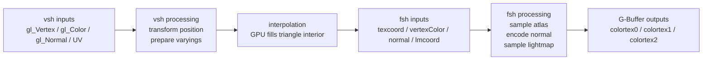

这一节我们会讲解：

- `gbuffers_terrain` 这个程序名从哪里来
- `gbuffers_terrain.vsh` 怎样把方块顶点送到屏幕上
- `gbuffers_terrain.fsh` 怎样把颜色、法线、光照信息写进 G-Buffer
- 为什么 `normalize(normal) * 0.5 + 0.5` 是一个“打包”动作
- Minecraft 的 lightmap 为什么像一张提前烤好的照明小抄

第 2.1 节我们讲到了 gbuffers 能拿到几何属性：顶点、法线、纹理坐标、顶点颜色。好吧，现在我们不再站在门口聊天了，直接把 `gbuffers_terrain.vsh` 和 `gbuffers_terrain.fsh` 拆开，看每一行到底在干什么。

顺便说一下，我核对过 Iris 的 `ProgramId.java`：`Terrain(ProgramGroup.Gbuffers, "terrain", TexturedLit)` 会生成源码名 `gbuffers_terrain`。所以这个文件名不是我们随便拍脑袋起的，它就是 Iris 认识的地形 pass。

> `gbuffers_terrain` 是地形方块进入 G-Buffer 的主入口。

## 顶点阶段：vsh

先看 `gbuffers_terrain.vsh`。内心独白来一下：如果我是 GPU，我现在拿到的不是一个像素，而是一个方块网格的顶点；那我第一件事应该是什么？当然是把这个顶点放到屏幕上的正确位置。

```glsl
#version 330 compatibility

out vec2 texcoord;
out vec4 vertexColor;
out vec3 normal;
out vec2 lmcoord;

void main() {
    gl_Position = gl_ModelViewProjectionMatrix * gl_Vertex;
    texcoord = (gl_TextureMatrix[0] * gl_MultiTexCoord0).xy;
    vertexColor = gl_Color;
    normal = gl_NormalMatrix * gl_Normal;
    lmcoord = (gl_TextureMatrix[1] * gl_MultiTexCoord1).xy;
}
```

`#version 330 compatibility` 说的是：我们使用 GLSL 330，同时保留旧式 OpenGL 变量，比如 `gl_Vertex`、`gl_Color`、`gl_ModelViewProjectionMatrix`。你可以把它理解成“现代语法，但还允许用 Minecraft 这套老接口”。

`out vec2 texcoord; out vec4 vertexColor; out vec3 normal;` 这三句是在准备把几何资料交给片元着色器。`out` 像传送带的出口：顶点着色器在这里放货，片元着色器那边用同名同类型的 `in` 接货。

`gl_Position = gl_ModelViewProjectionMatrix * gl_Vertex;` 是最核心的一句。`gl_Vertex` 是方块顶点的模型坐标，乘上模型、视图、投影合成矩阵以后，它就变成裁剪空间坐标。再通俗点：这句负责回答“这个顶点最后落在屏幕哪里”。

`texcoord = (gl_TextureMatrix[0] * gl_MultiTexCoord0).xy;` 处理方块贴图坐标。Minecraft 的方块贴图通常在一张大 atlas 里，石头、泥土、草侧面都挤在同一张图上。`texcoord` 就像地图上的取货地址，告诉后面的 `.fsh` 应该从 atlas 的哪一小块采样。

`vertexColor = gl_Color;` 很容易被低估。它常常带着生物群系染色：平原草更绿，沙漠附近的草偏黄，沼泽颜色又阴一点。也就是说，草方块不是只靠贴图决定颜色，Minecraft 还会给它一层环境色。

`normal = gl_NormalMatrix * gl_Normal;` 把法线变到眼空间。法线是“这个面朝哪儿”的箭头，后面算光照时会用到。注意它不是位置，所以不能直接用普通模型视图矩阵乱乘；`gl_NormalMatrix` 专门处理这种方向向量。

最后的 `lmcoord` 是 lightmap 坐标，完整的 lightmap 写法需要它从顶点阶段传到片元阶段。你可以先把它当成另一张小地图的坐标，后面会拿它去查“这里有多少天空光、多少方块光”。

## 插值：中间那只看不见的手

顶点着色器只在顶点上运行，但片元着色器是在像素上运行。那三角形内部的 `texcoord`、`vertexColor`、`normal` 从哪里来？GPU 会自动插值。

如果三角形一个角是深绿色，另一个角是浅绿色，中间就会被平滑混出来。法线和纹理坐标也是这样。这个过程像你把三种颜料滴在三角形三个角，GPU 帮你把整块布染匀。



## 片元阶段：fsh

现在看 `gbuffers_terrain.fsh`。内心独白换一下：我现在是一个片元，已经知道自己属于哪个方块表面，也知道该取哪块贴图；那我要写进哪些缓冲？

```glsl
#version 330 compatibility

uniform sampler2D texture;
uniform sampler2D lightmap;

in vec2 texcoord;
in vec4 vertexColor;
in vec3 normal;
in vec2 lmcoord;

/* RENDERTARGETS: 0,1,2 */
layout(location = 0) out vec4 outColor;
layout(location = 1) out vec4 outNormal;
layout(location = 2) out vec4 outLightmap;

void main() {
    vec4 albedo = texture(texture, texcoord) * vertexColor;
    vec3 encodedNormal = normalize(normal) * 0.5 + 0.5;
    vec4 bakedLight = texture(lightmap, lmcoord);

    outColor = albedo;
    outNormal = vec4(encodedNormal, 1.0);
    outLightmap = bakedLight;
}
```

`in vec2 texcoord; in vec4 vertexColor; in vec3 normal;` 对应前面 `.vsh` 的 `out`。名字和类型对上，GPU 才知道这条传送带要怎么接。`in vec2 lmcoord;` 也是同理，它给 lightmap 采样用。

`uniform sampler2D texture;` 是方块纹理 atlas。这里的 `texture` 变量名看起来和 `texture(...)` 函数撞脸，但 GLSL 允许这样写；读的时候你要在脑子里区分：前者是采样器，后者是采样动作。

`uniform sampler2D lightmap;` 是 Minecraft 的烘焙光照图。所谓烘焙，不是烤面包那么玄，就是游戏先把天空光和方块光整理成一张表；片元着色器用 `lmcoord` 去查，马上知道这里亮不亮。

`/* RENDERTARGETS: 0,1,2 */` 是 Iris 读得懂的注释，意思是这个 pass 要写多个颜色附件。然后 `layout(location = 0) out vec4 outColor;` 写到第 0 个目标，`layout(location = 1) out vec4 outNormal;` 写到第 1 个目标，`layout(location = 2) out vec4 outLightmap;` 写到第 2 个目标。你可以把它们想成三个抽屉：颜色放一格，法线放一格，lightmap 放一格。

`vec4 albedo = texture(texture, texcoord) * vertexColor;` 先从 atlas 取出方块本来的颜色，再乘上顶点颜色。草地为什么会因群系变色？就在这里合成。贴图给“衣服花纹”，`vertexColor` 给“环境染色”。

`vec3 encodedNormal = normalize(normal) * 0.5 + 0.5;` 是法线编码。法线原本每个分量大致在 `[-1, 1]`，但纹理通常存 `[0, 1]`。所以我们做一个线性搬家：

$$
encoded = normal \times 0.5 + 0.5
$$

`-1` 会变成 `0`，`0` 会变成 `0.5`，`1` 会变成 `1`。这就像把一根从地下室到一楼的尺子，整体搬到从地面到二楼，形状没变，只是存储范围变了。

`vec4 bakedLight = texture(lightmap, lmcoord);` 查的是 Minecraft 的 baked lightmap。里面通常可以理解为天空光加方块光的信息：露天的草地更亮，洞穴深处更暗，火把旁边会有方块光。

最后三句 `outColor = albedo; outNormal = vec4(encodedNormal, 1.0); outLightmap = bakedLight;` 才是真正写 G-Buffer。后面的 deferred 或 composite pass 不需要重新问“这个像素来自哪个方块”，它只要打开这些抽屉，把颜色、法线、光照信息拿出来继续算。

## 本章要点

- Iris 的 `gbuffers_terrain` 程序名来自 `ProgramId` 里的 `Terrain(ProgramGroup.Gbuffers, "terrain", TexturedLit)`。
- `.vsh` 负责把 `gl_Vertex` 变成 `gl_Position`，并把贴图坐标、顶点颜色、法线、lightmap 坐标传给 `.fsh`。
- `texcoord` 指向方块纹理 atlas，`vertexColor` 常用于生物群系染色。
- `normal = gl_NormalMatrix * gl_Normal` 得到眼空间法线，后面光照会依赖它。
- `.fsh` 用 `texture(texture, texcoord) * vertexColor` 得到 albedo，用 `normalize(normal) * 0.5 + 0.5` 把法线打包进 `[0,1]`，再用 `texture(lightmap, lmcoord)` 读取天空光和方块光。
- `/* RENDERTARGETS: 0,1,2 */` 和 `layout(location=N) out` 让一个片元同时写入多个 G-Buffer 目标。

下一节：[2.3 — 光照是怎么算的：从法线到漫反射](/02-gbuffers/03-lighting/)
