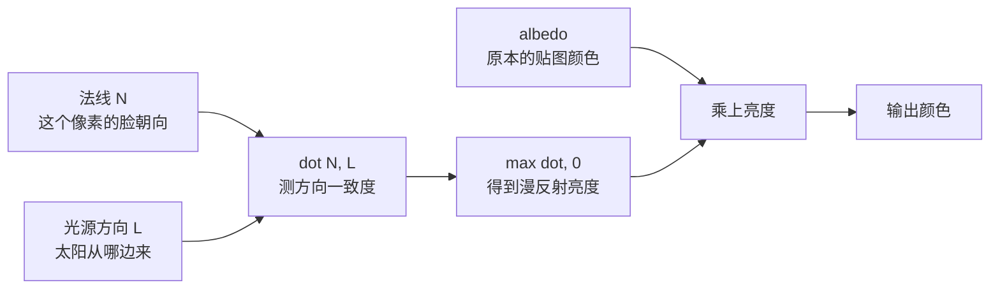

这一节我们会讲解：

- 为什么 2.2 节拿到的法线终于要派上用场
- `dot(N, L)` 到底在量什么
- Lambert 漫反射公式为什么长这样
- Half-Lambert 为什么能让背光面不那么死黑
- 如何在 `gbuffers_terrain.fsh` 里直接写出第一版光照
- `sunPosition` 和 `lightmap` 分别从哪里来

在 2.2 节我们拿到了方块的法线。现在——这东西有什么用？

好吧，先别急着写代码。你心里应该先嘀咕一句：一个面朝哪边，为什么会影响颜色？这就是光照的入口。

太阳是一个巨大的手电筒，法线是你的脸朝哪个方向。正对太阳，光结结实实打在脸上，最亮；侧着脸，光擦过去，变暗；背对太阳，光打不到脸，最暗。没错，法线不是拿来摆设的，它就是告诉着色器：“这个像素的脸朝哪儿。”

> 光照的第一件事，就是比较“脸的方向”和“光的方向”有多一致。

## 从感觉到点积

我们把法线叫 `N`，把指向太阳的方向叫 `L`。这两个都是方向向量。现在问题变成：怎么用一个数字表示它们有多“同向”？答案就是点积：

```glsl
dot(N, L)
```

你可以把点积想成一个“方向一致度测量仪”。当 `N` 和 `L` 指向同一个方向时，`dot(N, L) = 1`，意思是完全正对光，亮。当它们互相垂直时，`dot(N, L) = 0`，光只是擦边经过，不贡献亮度。当它们相反时，点积会小于 0，也就是这个面背对光。

可问题来了：亮度能是负数吗？当然不能。你不能拿一个负手电筒把物体照得“比黑还黑”。所以我们把负数夹到 0：

$$
light = \max(\operatorname{dot}(N, L), 0)
$$

这就是经典的 Lambert 漫反射。名字听起来像某个很严肃的老教授，但它做的事很朴素：面越朝向光，越亮；面越背向光，越暗。



## 第一版 GLSL

现在我们回到 `gbuffers_terrain.fsh`。内心小剧场应该是这样：我已经有了贴图颜色，也有了法线；Iris 又能告诉我太阳在哪里。那我只要算 `dot`，再把颜色乘暗一点，不就有光照了吗？

对，就是这么直接。

```glsl
uniform vec3 sunPosition;

// 假设 normal 是从顶点着色器传进来的法线，outColor 已经是贴图颜色。
vec3 N = normalize(normal);
vec3 L = normalize(sunPosition);
float diffuse = max(dot(N, L), 0.0);
outColor.rgb *= diffuse;
```

顺便说一下，`normalize` 很重要。点积的“1 到 -1”解释成立，有个前提：`N` 和 `L` 都是单位向量。也就是说，它们只表示方向，不夹带长度。你不希望太阳因为向量长度是 100，就把亮度也硬生生放大 100 倍。

那 `sunPosition` 从哪里来？不是你自己算的。Iris 提供了这个 uniform：

```glsl
uniform vec3 sunPosition;
```

在 Iris 源码里，它就是以 `sunPosition` 这个名字注册给 shader 的。所以你在 shader 里声明同名 uniform，就能拿到太阳在当前 GBuffer 空间里的方向信息。

在第 2.2 节，`gbuffers_terrain.fsh` 已经把法线写进了 `colortex1`——那是延迟渲染用的。但我们现在先做前向版本，直接在 `gbuffers` 里算光照。原因很简单：先把“光照为什么成立”学清楚，再去拆复杂管线，不然你会像拿着十把钥匙站在一扇门前，每把都看起来有点对。

## 为什么背面全黑了

你跑起来可能会发现一个问题：背对太阳的面完全黑了。数学上这没错，`max(dot(N, L), 0.0)` 就是这么干的。可现实里呢？背光面通常不会完全黑，因为天空、地面、墙壁都会把光弹来弹去。Minecraft 里也有环境感和方块光。

所以有时你会看到 Half-Lambert：

$$
light = \operatorname{dot}(N, L) \times 0.5 + 0.5
$$

它干了一件很“美术友好”的事：把 `-1..1` 映射到 `0..1`。原来背对光的 `-1` 变成 `0`，侧面的 `0` 变成 `0.5`，正面的 `1` 还是 `1`。没错，它不是严格物理，但它很会做人：侧面不会一下掉进黑洞，方块会更柔和。

```glsl
float diffuse = dot(N, L) * 0.5 + 0.5;
outColor.rgb *= diffuse;
```

## 别忘了 Minecraft 自己的光

到这里你已经有了太阳方向光。可是 Minecraft 还有另一套光：天空光和方块光。比如洞穴里的火把、白天阴影里的天空亮度，这些不是靠 `dot(N, L)` 算出来的，而是 Minecraft 光照引擎提前给你的。

在 shader 里，它们通常来自 lightmap：

```glsl
uniform sampler2D lightmap;

vec3 bakedLight = texture(lightmap, lmcoord).rgb;
outColor.rgb *= bakedLight;
```

`lightmap` 这个 sampler 名字也由 Iris 提供。你可以把它想成 Minecraft 递给你的一张小抄：这个像素附近的天空光和方块光大概是多少。于是完整一点的前向漫反射可以这样写：

```glsl
uniform vec3 sunPosition;
uniform sampler2D lightmap;

vec3 N = normalize(normal);
vec3 L = normalize(sunPosition);

float diffuse = max(dot(N, L), 0.0);
vec3 bakedLight = texture(lightmap, lmcoord).rgb;

outColor.rgb *= diffuse * bakedLight;
```


好吧，这里你要在脑子里分清两盏灯。第一盏是方向光：太阳或月亮，它靠 `dot(N, L)` 看面朝不朝它。第二盏是烘焙光：`lightmap`，它来自 Minecraft 的天空光和方块光。方向光负责“表面朝向感”，烘焙光负责“这个地方本来亮不亮”。两者乘起来，方块终于不再像一张扁平贴纸，而开始有了立体感。

## 本章要点

- 法线 `N` 表示表面朝向，光源方向 `L` 表示太阳或月亮从哪边来。
- `dot(N, L)` 衡量两个方向有多一致：同向亮，垂直暗，反向更暗。
- Lambert 漫反射的核心公式是 $$light = \max(\operatorname{dot}(N, L), 0)$$。
- Half-Lambert 用 $$light = \operatorname{dot}(N, L) \times 0.5 + 0.5$$ 让背光和侧面更柔和。
- `sunPosition` 是 Iris 提供的 uniform，`lightmap` 是 Iris 提供的 sampler。
- 实际画面里通常有两类光：太阳/月亮方向光，加上 Minecraft 的天空光和方块光。

下一节：[2.4 — 实战：卡通渲染](/02-gbuffers/04-project/)
