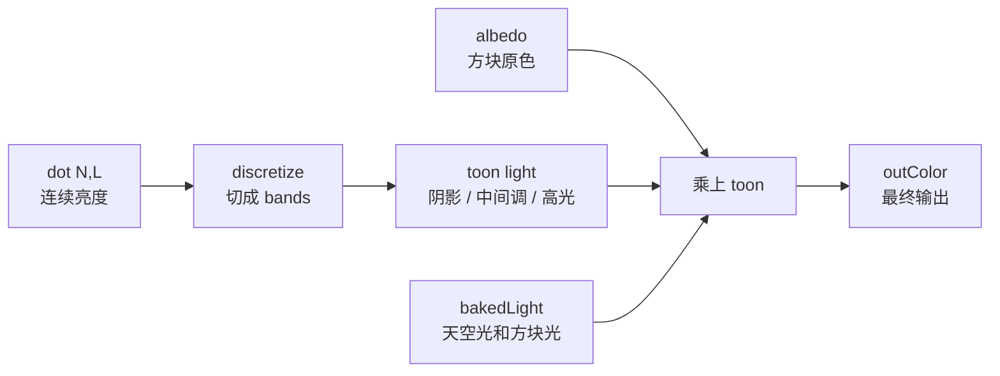

这一节我们会讲解：

- 如何把第 2.3 节的连续漫反射改成卡通渲染
- `step(edge, x)` 为什么能制造硬边界
- 怎样把 `diffuse` 分成阴影、中间调、高光几档
- 如何在 `gbuffers_terrain.fsh` 里保留 Minecraft 的 baked light
- 你可以调哪些数，得到 3 档、4 档、5 档不同风格

在第 2.3 节，我们用 `max(dot(N,L), 0)` 做了平滑的漫反射。现在做一个大胆的改动：不平滑了，用台阶。

先别急着写代码。你脑子里可以先出现一盏手电筒照在方块上：普通漫反射像一条慢慢变暗的坡，从亮面滑到暗面；卡通渲染不走坡，它走楼梯。亮就是亮，中间就是中间，暗就是暗，中间少一点“灰溜溜的过渡”。这就是你在 Borderlands 或 Zelda Wind Waker 里看到的那种硬朗风格。

> 卡通光照的核心不是换光源，而是把连续亮度切成几个离散色块。

## 从连续到分档

第 2.3 节的漫反射亮度是这样来的：

$$
diffuse = \max(\operatorname{dot}(N, L), 0)
$$

它会得到 `0.0` 到 `1.0` 之间的一串连续数。比如 `0.12`、`0.36`、`0.81`，都各有各的亮度。现在我们心里嘀咕一句：如果我不想要这么细呢？如果我只想要阴影、中间调、高光几个抽屉呢？

最直接的办法是乘上档数，向下取整，再除回来：

```glsl
float diffuse = max(dot(N, L), 0.0);
float bands = 4.0;
float toon = floor(diffuse * bands) / bands;
```

`diffuse * bands` 像把一根尺子放大，`floor` 像拿刀把小数尾巴切掉，最后 `/ bands` 再缩回 `0..1`。于是原本光滑的坡，被切成了几级台阶。

## step：硬边界开关

GLSL 还有一个很适合卡通风格的函数：

```glsl
step(edge, x)
```

它的规矩特别直白：如果 `x < edge`，返回 `0.0`；如果 `x >= edge`，返回 `1.0`。也就是说，`step` 是一个开关。过线了，啪，打开；没过线，啪，关着。

但我们想要多档，不是只要黑白两档，所以可以把几个 `step` 叠起来：

```glsl
float toon = step(0.3, diffuse) * 0.5
           + step(0.7, diffuse) * 0.5;
```

这里 `diffuse < 0.3` 时是阴影，过了 `0.3` 进中间调，过了 `0.7` 再加一层亮度，进入高光。你看，它不像物理课，更像美术课：阈值放在哪里，画面性格就在哪里。



## 完整 gbuffers_terrain.fsh

下面这版保留了第 2.2 节的颜色、法线、lightmap 输出，但把第 2.3 节的连续漫反射换成了 cel shading。注意关键句：`toon * bakedLight`。卡通分档负责“朝向太阳的明暗块”，Minecraft 的 lightmap 负责“这个地方本来亮不亮”。洞穴还是洞穴，火把还是火把，只是太阳光变成了台阶。

```glsl
#version 330 compatibility

uniform sampler2D texture;
uniform sampler2D lightmap;
uniform vec3 sunPosition;

in vec2 texcoord;
in vec4 glcolor;
in vec3 normal;
in vec2 lmcoord;

/* RENDERTARGETS: 0,1,2 */
layout(location = 0) out vec4 outColor;
layout(location = 1) out vec4 outNormal;
layout(location = 2) out vec4 outLightmap;

void main() {
    vec4 albedo = texture(texture, texcoord) * glcolor;

    vec3 N = normalize(normal);
    vec3 L = normalize(sunPosition);
    float diffuse = max(dot(N, L), 0.0);

    float bands = 4.0;
    float toon = floor(diffuse * bands) / bands;

    vec3 bakedLight = texture(lightmap, lmcoord).rgb;
    vec3 encodedNormal = N * 0.5 + 0.5;

    outColor = vec4(albedo.rgb * toon * bakedLight, albedo.a);
    outNormal = vec4(encodedNormal, 1.0);
    outLightmap = vec4(bakedLight, 1.0);
}
```

如果你想要更像动画片的三段式，也可以不用 `floor`，直接手写阈值：

```glsl
float toon = step(0.3, diffuse) * 0.5
           + step(0.7, diffuse) * 0.5;
```


这时画面大概可以这样理解：`diffuse < 0.3` 是 shadow band，颜色明显压暗；`0.3..0.7` 是 midtone，接近方块正常颜色；`>= 0.7` 是 highlight，亮面干净利落，甚至你可以额外混一点白色，让它更像手绘高光。

你可以调节 band 数量和阈值，试试 3 档、5 档不同的风格。3 档更粗、更漫画；5 档更细，仍然卡通，但没那么“剪纸”。这里没有唯一正确答案，只有你想让画面说话的语气。

> ⚠️ **GLSL compatibility 模式的变量名陷阱**：顶点着色器和片元着色器之间通过变量**名**匹配来传递数据。在 `#version 330 compatibility` 模式下，`glcolor` 是 GLSL 内置的自动连接名——vsh 写 `out vec4 glcolor`，fsh 读 `in vec4 glcolor`，GPU 自动把它们连起来。但如果你用自定义名如 `vertexColor`，它们就不会自动连接，fsh 收到的将是 (0,0,0,0)，导致 `albedo * vertexColor` 全黑。简单规则：**vsh 和 fsh 的 in/out 变量名必须完全一致，大小写也要对上。**

## 本章要点

- 第 2.3 节的 `max(dot(N, L), 0.0)` 给出连续漫反射亮度。
- 卡通渲染把连续亮度切成离散 bands，让明暗边界变硬。
- `step(edge, x)` 在阈值两侧返回 `0.0` 或 `1.0`，很适合制作硬分界。
- `floor(diffuse * bands) / bands` 可以快速做 3 档、4 档、5 档这类分层光照。
- `toon * bakedLight` 同时保留太阳方向感和 Minecraft 自己的天空光、方块光。

下一节：[2.5 — 为什么需要 G-Buffer？](/02-gbuffers/05-gbuffer-intro/)
