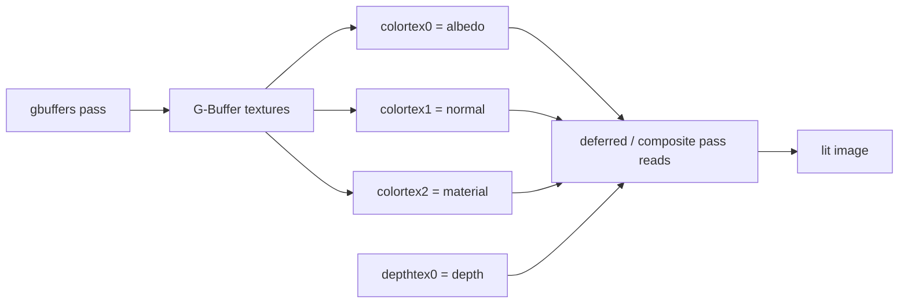

这一节我们会讲解：

- 为什么一个 `colortex0` 不够用
- 前向渲染为什么会浪费光照计算
- G-Buffer 如何把“几何信息”先存起来
- `RENDERTARGETS: 0,1,2` 到底在说什么
- 法线为什么要从 `[-1,1]` 打包到 `[0,1]`
- 为什么深度通常直接读 `depthtex0`

在第 2.2 节我们看到了 `gbuffers_terrain.fsh` 有三个输出：颜色、法线、材质。好吧，当时你可能会有一个很自然的问题：为什么不能只输出颜色？我只想把方块画出来，怎么突然多了这么多“账本”？

先别急着写代码。我们先在脑子里搭一个小剧场：你正在给一个像素上色。你知道它的颜色是草方块的绿色，于是你把绿色写进 `colortex0`。很好，这张纹理就像一个小抽屉，专门放颜色。

> 一个 `colortex0` 只能存颜色。

那如果你还想把“法线”也存起来呢？法线可不是颜色，它表示表面朝向。你不能把它硬塞进同一个抽屉里，除非你愿意把颜色弄丢，或者搞一个以后自己都看不懂的压缩格式。于是最朴素的办法来了：再开一个 `colortex1`。如果还想存材质，比如粗糙度、金属度、发光强度，那就再开 `colortex2`。这就是 G-Buffer 的核心想法：不是一张万能纹理，而是一组几何信息纹理。

顺便说一下，Iris 的源码里确实按 `colortex0`、`colortex1`、`colortex2` 这样的名字注册渲染目标采样器；也就是说，这不是我们随便起的外号，而是 shader 里真的会读写的缓冲名字。



现在我们问一个更关键的问题：为什么要这么麻烦？答案藏在“光照什么时候算”里面。

前向渲染，也就是 forward rendering，做事很直接：几何体来了，片元着色器运行，然后立刻算颜色和光照。像厨师边切菜边炒菜，动作很爽快。但问题也很明显：如果某个像素后来被前面的墙挡住了，你刚才给它算的光照就白算了。它根本不会出现在最终画面里，可你已经为它付了账。

所以我们心里嘀咕一下：如果光照很贵，而有些片元最后看不见，那能不能先别急着算光？能不能先把“这个像素是什么东西”记录下来，等画面里真正留下来的像素确定以后，再统一算光？

这就是延迟渲染，也就是 deferred rendering。第一遍不急着做完整光照，只写几何数据：反照率 albedo、法线 normal、深度 depth、材质 material。它们被写进一组纹理，也就是 G-Buffer。第二遍，在 `deferred` 或 `composite` 这样的全屏 pass 里，再读取这些纹理，对屏幕上的每个像素只算一次光照。

回想第 1.1 节——你的 `composite.fsh` 只有一个 `RENDERTARGETS: 0`，它的任务很简单：把结果写到 `colortex0`。但现在 `gbuffers` 阶段要做的是“登记信息”，不是直接交最终答卷。所以它可能需要同时写多个缓冲。

```glsl
/* RENDERTARGETS: 0,1,2 */

layout(location = 0) out vec4 outColor;
layout(location = 1) out vec4 outNormal;
layout(location = 2) out vec4 outMaterial;

void main() {
    vec3 albedo = vec3(0.4, 0.8, 0.3);
    vec3 normal = normalize(vec3(0.0, 1.0, 0.0));
    float roughness = 0.7;

    outColor = vec4(albedo, 1.0);
    outNormal = vec4(normal * 0.5 + 0.5, 1.0);
    outMaterial = vec4(roughness, 0.0, 0.0, 1.0);
}
```

这里 `/* RENDERTARGETS: 0,1,2 */` 的意思是：这个 shader 会同时写入 `colortex0`、`colortex1`、`colortex2`。而 `layout(location = 0) out vec4 outColor;` 就是把 `outColor` 绑定到第 0 个输出，也就是 `colortex0`。同理，`location = 1` 对应 `colortex1`，`location = 2` 对应 `colortex2`。

你可以把它想成一张表格：第一列写颜色，第二列写法线，第三列写材质。`RENDERTARGETS` 先告诉 Iris：“我要填哪几列。” `layout(location = ...)` 再告诉 OpenGL：“这个变量负责填哪一列。”

法线这里还有一个小机关。真实法线的分量范围是 `[-1,1]`，比如向左可能是 `-1.0`，向右可能是 `1.0`。但普通颜色纹理更习惯存 `[0,1]`。于是我们写入时要打包：

$$
packed = normal \times 0.5 + 0.5
$$

读取时再解包：

$$
normal = packed \times 2.0 - 1.0
$$

这个公式并不神秘。`-1` 会变成 `0`，`0` 会变成 `0.5`，`1` 会变成 `1`。就像把一根从地下室到二楼的尺子，重新贴成从一楼到二楼的标签，长度没变，只是编号换了。

那深度呢？是不是也要手动写进 `colortex2`？通常不用。Iris 会提供 `depthtex0`，它来自渲染目标的深度纹理。你在后面的 pass 里可以采样它，用来知道这个屏幕像素离相机有多远。所以常见做法是：颜色、法线、材质写进 `colortex`；深度直接读 `depthtex0`。


于是 G-Buffer 存在的理由就很清楚了：它让 `gbuffers` pass 专心记录“这个像素是什么”，让后面的 `deferred` 或 `composite` pass 再决定“这个像素应该被怎样照亮”。一个 `colortex0` 只能存颜色。如果你想把“法线”也存起来，那就再开一个 `colortex1`。再把材质存进 `colortex2`。如果需要更多信息，就继续扩展到 `colortex3`、`colortex4`，直到你的渲染策略够用为止。

好吧，听起来像多绕了一圈，但这圈很值。因为光照不再被每个几何片元反复计算，而是对最终屏幕像素集中计算一次。你先把案卷整理好，再开庭审理；这比每来一个证人就判一次案靠谱多了。

## 本章要点

- 前向渲染在几何 pass 里直接算光，可能会为被遮挡片元浪费计算。
- 延迟渲染先把 albedo、normal、material 等几何数据写入 G-Buffer，再在后续 pass 里统一算光。
- `/* RENDERTARGETS: 0,1,2 */` 表示同时写入 `colortex0`、`colortex1`、`colortex2`。
- `layout(location = 0) out vec4 outColor;` 会把 `outColor` 绑定到 `colortex0`。
- 法线写入纹理前通常用 `normal * 0.5 + 0.5` 打包，读取后用 `packed * 2.0 - 1.0` 解包。
- 深度通常直接从 `depthtex0` 读取，不需要你手动写入颜色缓冲。

下一节：[2.6 — RENDERTARGETS：写入多个缓冲](/02-gbuffers/06-rendertargets/)
