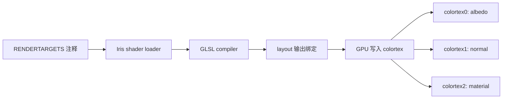

这一节我们会讲解：

- 为什么 G-Buffer 必须用 MRT，而不是老老实实画好几遍
- `/* RENDERTARGETS: 0,1,2 */` 到底在告诉 Iris 什么
- `layout(location = 0) out vec4 outColor;` 怎样绑定到 `colortex0`
- 为什么大家都用 `vec4`，哪怕法线只要 3 个数、深度只要 1 个数
- BSL 这类真实 shader pack 会怎样分配这些缓冲
- 最常见的 RENDERTARGETS 写错方式

在第 2.5 节我们知道了 G-Buffer 需要同时写多个缓冲。现在来看具体怎么做。

好吧，先让我们把脑内小剧场打开：你现在是片元着色器。一个方块表面上的像素跑到你面前，说：“请告诉我颜色。”你刚想写 `vec4(color, 1.0)`，结果渲染管线又补一句：“顺便把法线、材质、粗糙度也记下来。”

如果每种信息都重新渲染一遍，那就像同一张试卷抄三遍：第一遍抄姓名，第二遍抄答案，第三遍抄分数。能做，但太笨。MRT（Multiple Render Targets）就是让你一次考试，顺手把几张表都填了。

> MRT 的核心不是“更复杂”，而是“同一个片元，同时写多个输出”。

## RENDERTARGETS 是给 Iris 看的

在 Iris 里，你通常在片元着色器顶部写：

```glsl
/* RENDERTARGETS: 0,1,2 */
```

这不是普通注释那么简单。没错，它长得像注释，但 Iris 的 shader pack loader 会读它。它的意思是：这个 pass 会写 `colortex0`、`colortex1`、`colortex2`。

我们可以把它想成餐厅后厨的备菜单：厨师 GLSL 负责做菜，Iris 负责提前把 0、1、2 号盘子摆好。你没写 `2`，却想往 2 号盘子倒汤，那就别怪服务员一脸迷惑。



顺便说一下，Iris 源码里 `IrisSamplers` 会按 `colortex` 加编号注册采样器，而实际颜色缓冲上限来自 `IrisLimits.MAX_COLOR_BUFFERS = 32`。不过教程里我们先盯住 `colortex0~7`，因为这是 OptiFine 传统和大量 shader pack 最常用的主战场。

## location 绑定到 colortex

接下来是 GLSL 自己的语法：

```glsl
layout(location = 0) out vec4 outColor;
layout(location = 1) out vec4 outNormal;
layout(location = 2) out vec4 outMaterial;
```

内心独白来了：`location = 0` 是不是就等于 `colortex0`？对，在这个 pass 的输出列表里，它就是第 0 个颜色附件。你写 `outColor = ...`，GPU 最后就把它送进 `colortex0`。同理，`location = 1` 进 `colortex1`，`location = 2` 进 `colortex2`。

可以粗略记成：

$$
\text{layout(location = N)} \Rightarrow \text{colortexN}
$$

注意，这里有两个东西必须对齐：`RENDERTARGETS` 里声明了哪些编号，GLSL 里就要声明对应的 `out` 变量。声明了 `0,1,2`，却只写了 `location = 0` 和 `location = 1`，那 2 号输出就没有人负责。反过来，你声明 `location = 3`，但 `RENDERTARGETS` 只有 `0,1,2`，也是典型的错位。

## 为什么全是 vec4

你可能会想：法线是 `vec3`，深度是 `float`，材质 ID 也许一个数就够了，为什么 shader pack 里到处都是 `vec4`？

答案很朴素：这些缓冲本质上是纹理，而常见颜色纹理是 RGBA 四通道。它像一个四格收纳盒，R、G、B、A 都在那里。你不一定每格都塞满，但盒子就是四格。

所以法线可以这样打包：

```glsl
outNormal = vec4(normalize(worldNormal) * 0.5 + 0.5, 1.0);
```

深度或者材质也可以塞进某个通道：

```glsl
outMaterial = vec4(roughness, metallic, emission, materialId);
```

这就是 G-Buffer 的日常：不是每张纹理只放一种东西，而是把信息像行李箱一样压进去。BSL v10.1.3 的 `gbuffers_terrain.glsl` 就是这种思路。它在高级材质路径下用 `/* DRAWBUFFERS:0367 */`，然后把平滑度和天空遮蔽写到一个输出，把编码后的法线和深度标志写到另一个输出，再把 fresnel 相关数据写到第三个输出。

## 常见布局

真实 shader pack 通常会有几档布局。

最小布局只写颜色：

```glsl
/* RENDERTARGETS: 0 */
```

这很像 composite pass，只需要一张最终颜色图。

标准 G-Buffer 常见写法是：

```glsl
/* RENDERTARGETS: 0,1,2 */
```

一般可以理解为：`colortex0` 放 albedo，也就是基础颜色；`colortex1` 放 normal，可能顺手塞一点材质标志；`colortex2` 放 material，比如 roughness、metallic、emission 之类。

高级布局就会很肥：

```glsl
/* RENDERTARGETS: 0,1,2,3,4,5,6,7 */
```

这就是 full fat，BSL 级别的豪华自助餐。按 BSL 的思路粗略看，`colortex0` 主要是 albedo color，`colortex1` 常被拿来放 normal 加 material flags，`colortex2` 可以放 specular data，`colortex3~7` 则给各种高级效果周转：反射、体积光、时间数据、遮蔽、特殊材质缓存等等。具体每个包会变，但“颜色、法线、材质、额外效果数据”这个分工不会跑太远。

## DRAWBUFFERS 的旧写法

你还会在老包里看到：

```glsl
/* DRAWBUFFERS: 0367 */
```

这是 OptiFine 时代的 legacy 写法，意思是选择写入 0、3、6、7 这些 draw buffers。BSL v10.1.3 的 terrain 程序就还在用它，并配合 `gl_FragData[0]`、`gl_FragData[1]` 这种旧式输出。Iris 能兼容很多这类写法，但如果你在写现代教程代码，优先用 `RENDERTARGETS` 加 `layout(location = N) out vec4 ...`，脑子会清爽很多。

## 一个完整的三输出 terrain 片元着色器

下面这个 `gbuffers_terrain.fsh` 是最小可读版本。它不追求真实 PBR，只演示“一次片元，三个输出”。

```glsl
#version 330 compatibility

/* RENDERTARGETS: 0,1,2 */

uniform sampler2D gtexture;

in vec2 texCoord;
in vec3 normal;
in vec4 vertexColor;

layout(location = 0) out vec4 outAlbedo;
layout(location = 1) out vec4 outNormal;
layout(location = 2) out vec4 outMaterial;

void main() {
    vec4 baseColor = texture(gtexture, texCoord) * vertexColor;

    if (baseColor.a < 0.1) {
        discard;
    }

    vec3 encodedNormal = normalize(normal) * 0.5 + 0.5;

    outAlbedo = baseColor;
    outNormal = vec4(encodedNormal, 1.0);
    outMaterial = vec4(0.5, 0.0, 0.0, 1.0);
}
```

好吧，最后抓两个坑。第一，忘记声明所有输出变量：`RENDERTARGETS: 0,1,2` 写了，`layout(location = 2)` 没写。第二，编号错位：你以为 `outNormal` 在 `colortex1`，结果写成了 `location = 2`。这种 bug 最烦，因为画面不一定立刻炸，只是后面的 composite 读到一锅乱炖。

本章要点：`RENDERTARGETS` 告诉 Iris 这个 pass 要写哪些 `colortex`；`layout(location = N)` 把 GLSL 输出变量绑定到对应编号；G-Buffer 喜欢用 `vec4`，因为纹理天然适合 RGBA 打包；真实 shader pack 会把颜色、法线、材质和高级效果数据分散到多个缓冲里。

下一节：[2.7 — 实战：法线可视化](/02-gbuffers/07-project/)
