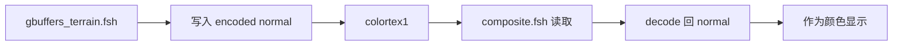

这一节我们会讲解：

- 为什么法线可视化是最经典的 G-Buffer 调试方法
- 怎样把 `colortex1` 里的法线读回 `composite.fsh`
- 为什么要先从 `[0,1]` 解码回 `[-1,1]`
- 你应该在草方块、顶面、侧面看到什么颜色
- 全黑、全白、颜色怪异时通常哪里写错了

在第 2.5 和 2.6 节我们学会了把法线写进 G-Buffer。现在——怎么验证它写对了？最简单的方法：把它当颜色画出来。

好吧，听起来有点粗暴。法线不是颜色，它是方向；方向怎么能当颜色？但这正是图形调试里最常用的小把戏：把看不见的数据，硬翻译成你眼睛能看见的 RGB。就像你拿手电筒照进抽屉，不是为了欣赏抽屉，而是为了确认钥匙到底有没有放进去。

> 调试 G-Buffer 的第一原则：先把数据画出来，再谈它美不美。

## 法线就是颜色

我们先建立一个很朴素的对应关系：

$$
RGB = XYZ
$$

也就是说，法线的 `x` 分量控制红色，`y` 分量控制绿色，`z` 分量控制蓝色。一个表面朝右，`x` 更大，它就会更红；一个表面朝上，`y` 更大，它就会更绿；一个表面朝前，`z` 更大，它就会更蓝。

这时候你脑子里可以冒出一句：“等等，法线不是有负数吗？”对，真正的法线分量范围是 `[-1,1]`，而屏幕颜色只能舒服地显示 `[0,1]`。所以我们写入 G-Buffer 时已经做过编码：

$$
packed = normal \times 0.5 + 0.5
$$

读取时要反过来：

$$
normal = packed \times 2.0 - 1.0
$$

这就像把温度计从“零下到零上”的刻度，贴成“0 到 1”的贴纸。存的时候贴纸方便，读的时候你得把贴纸撕回真实温度。

![法线编码与解码：[-1,1] 范围通过 ×0.5+0.5 打包到 [0,1]，读回时用 ×2.0-1.0 还原](/images/normal_encode.png)

## 两步走

这里有一个容易拧巴的地方：法线是在 `gbuffers_terrain.fsh` 写的，但我们要在 `composite.fsh` 显示。为什么？因为 `gbuffers_terrain.fsh` 是几何阶段，它负责把每个方块表面的数据塞进 G-Buffer；`composite.fsh` 是全屏阶段，它负责从这些纹理里读数据，再决定屏幕最终显示什么。

Iris 的 `IrisSamplers` 里也能对上这个规则：`colortex0`、`colortex1`、`colortex2`、`colortex3` 只会从 fullscreen passes 开始注册为可采样目标。所以在 `composite.fsh` 里读 `colortex1` 是正常路线，不是偷看答案。



第一步，我们假设你已经按第 2.6 节那样写了 terrain 输出：`gbuffers_terrain.fsh` 把编码后的法线写进 `colortex1`。也就是类似这样：

```glsl
vec3 encodedNormal = normalize(normal) * 0.5 + 0.5;
outNormal = vec4(encodedNormal, 1.0);
```

第二步，打开 `composite.fsh`，声明 `colortex1`，把它读出来：

```glsl
uniform sampler2D colortex1;

vec3 packedNormal = texture(colortex1, texcoord).rgb;
vec3 decoded = packedNormal * 2.0 - 1.0;  // decode from [0,1] to [-1,1]
color.rgb = decoded * 0.5 + 0.5;  // map to visible colors
```

你可能会嘀咕：刚解码，怎么又 `* 0.5 + 0.5` 变回去了？这不是绕圈吗？是的，故意绕圈。解码这一步验证“我读到的是法线编码”；重新映射这一步只是为了把真实法线转成屏幕能显示的颜色。调试时我们宁可多写一行，也不要让脑子猜来猜去。

## 你应该看到什么

如果一切正常，草方块的顶面应该明显偏绿，因为它的法线朝上，`y` 分量大。方块侧面会根据朝向偏红或者偏蓝：朝左右的面红色更明显，朝前后的面蓝色更明显。斜坡、模型边缘或者带法线贴图的表面，则会出现更细碎的颜色变化。

这时你看到的画面不会“漂亮”，甚至有点像 Minecraft 被泼了一桶荧光颜料。但它非常诚实。它告诉你：`gbuffers_terrain.fsh` 确实写了东西，`colortex1` 确实被保留下来，`composite.fsh` 也确实读到了它。


## 常见错误

如果画面几乎全黑，你很可能把已经编码到 `[0,1]` 的值又当成真实法线乱算，或者 `colortex1` 根本没有被写入。如果画面几乎全白，通常是编码公式写错了，比如把本来就 `[0,1]` 的 packed normal 又加了一次 `0.5`。如果颜色完全不像方向，先检查 `RENDERTARGETS` 和 `layout(location = 1)` 是否对齐。

这个技巧不只属于法线。你也可以把 `colortex0` 的 albedo 直接显示，把 material buffer 的某个通道拉出来显示，甚至把 depth 转成灰度图。G-Buffer 调试的思路永远一样：别在黑箱外面祈祷，打开箱子，把里面每一层都照出来。

## 本章要点

- 法线可视化是验证 G-Buffer 是否正确写入、正确读取的经典方法。
- `gbuffers_terrain.fsh` 负责把编码后的 normal 写进 `colortex1`。
- `composite.fsh` 是 fullscreen pass，可以读取 `colortex1` 并把结果显示到屏幕。
- packed normal 的范围是 `[0,1]`，真实 normal 的范围是 `[-1,1]`，读取后要用 `packed * 2.0 - 1.0` 解码。
- 顶面偏绿、侧面偏红或偏蓝，说明法线方向和颜色通道大体对上了。
- 全黑、全白、颜色错位时，优先检查编码、解码、`RENDERTARGETS` 和 `layout(location)`。

下一章：[第 3 章 — 延迟光照：让光照真实起来](/03-deferred/01-forward-vs-deferred/)
