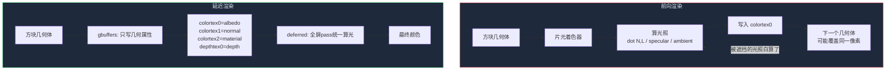

这一节我们会讲解：

- 前向渲染为什么像"边切菜边炒菜"，延迟渲染为什么像"先把所有材料备好再统一烹饪"
- 被遮挡的片元是怎么浪费计算的——以及延迟渲染如何避免这个坑
- 两种渲染管线在对光照数的扩展能力上天差地别
- 你在第 2 章写的 `colortex0`、`colortex1`、`colortex2` 就是为了这一刻
- 延迟渲染的代价是什么：带宽和 G-Buffer 存储压力

好吧，我们开始吧。你已经写了两章的 shader，也知道 gbuffers 负责把颜色、法线、光照信息写进 G-Buffer，composite 负责从这些纹理里读数据做后处理。但你可能还没认真问过一个问题：**为什么非要多绕一圈？直接在 gbuffers 里算完光照、把最终颜色写进 colortex0 不好吗？**

好问题。我们先别急，来看一个厨房。

---

## 两个厨师的故事

想象你面前有两个厨师，他们的任务都是给 100 道菜做晚饭。

第一个厨师叫阿前。"前"是 forward 的前。他的工作方式很生猛：炒菜锅只有一个，每道菜来了，他同时切菜、点火、下锅、调味、出锅，一气呵成。干完一道菜，再干下一道。中间有些菜他炒了一半，发现锅烧糊了——但木已成舟，他已经花了力气。

第二个厨师叫阿延。"延"是 deferred 的延。他的策略完全不同：先不管火候和调味，他先把 100 道菜的所有食材都洗好、切好、分装进小碗，码得整整齐齐。然后他退后一步，扫一眼菜单，确认哪些菜是客人真的要上的，最后再统一开火、调味、摆盘。

> 前向渲染边画边算光照；延迟渲染先记录几何属性，再统一算光。

这个比喻很快就能对应到渲染管线上。`gbuffers_terrain.fsh` 就是那个"切菜备料"的工位——它跑在每一个方块表面上，把 albedo 写进 `colortex0`，法线写进 `colortex1`，材质写进 `colortex2`。这时候它**不急着算完整的光照**，它只是"登记信息"。

等到所有方块都登记完了，`deferred.fsh` 上场。它是一个全屏 pass，像复合着色器一样跑在屏幕的每一个像素上。它从 `colortex0`、`colortex1`、`colortex2` 里把之前登记的信息拿出来，对**最终留在屏幕上的每一个像素**，只算一次光照。

---

## 被遮挡的片元：前向渲染的隐形浪费

内心独白一下：如果我是 GPU，我现在要画一个全景。远处有一座山，但山前面有一棵树。树的叶子挡住了山的一部分像素。

在前向渲染里，GPU 会先画山。山的片元着色器兢兢业业地采样纹理、算法线、算 `dot(N, L)`、乘环境光、乘高光……算了半天。然后轮到树，树的片元写入了同一个像素的位置——山刚才算的那些光照，全部被覆盖了，等于白干。

这叫做 overdraw。它不致命，但它浪费。在 Minecraft 这种方块密集、遮挡复杂的场景里，overdraw 会让 GPU 为许多最终不可见的片元白算光照。

延迟渲染绕开了这个坑。它说："第一遍，我不算光照。我只看这个像素最终属于哪个方块表面，把它的颜色、法线、材质记下来。"等所有几何体都画完，深度测试自然保证了——每个屏幕像素上存着的，就是离相机最近的那个表面的属性。然后第二遍，对着这些"胜利像素"统一算光，不存在任何白算。



---

## 一个光源还是十个光源

前向渲染还有一个不太好展开的弱点：光照数量。在 `gbuffers_terrain.fsh` 里，如果你要在每个片元上算 5 盏灯的光照，你的代码复杂度会乘 5。更糟的是，每一个被遮挡的片元也会乘 5——浪费也跟着乘 5。

延迟渲染恰恰相反。在 deferred pass 里，光照是对屏幕像素算的。你加一盏灯，就是在 deferred 的循环里多跑一次光照计算；屏幕像素数量是固定的，所以计算量和光源数基本是线性关系。

这也是为什么几乎所有现代光影包——BSL、Complementary、AstraLex——都选择了延迟渲染架构。不是前向渲染不能做，而是**当你开始加第二盏灯、加 AO、加镜面高光、加反射的时候，延迟渲染的结构让你每一步都只加在最终像素上，而不是白白撒在不可见的片元上**。

---

## 代价：G-Buffer 的带宽

说到这里你也该意识到，延迟渲染不是免费的。G-Buffer 需要同时写入和读回多张纹理——albedo、normal、material、depth——每张纹理都是一大块显存。在带宽紧的硬件上，这个开销不能忽略。这也是为什么我们在第 2 章那么在意"打包"——能用 `vec4` 的 4 个通道尽量压缩信息，就是为了少占纹理。

还好，Minecraft 的几何量不算极端。对大多数玩家的 GPU 来说，多几张 `colortex` 的读写开销远低于 overdraw 浪费的片元光照。这个买卖划算。

---

## 你的 colortex 终于要上战场了

回想第 2.6 节——你写的 `gbuffers_terrain.fsh` 有三行输出：

```glsl
layout(location = 0) out vec4 outColor;    // → colortex0
layout(location = 1) out vec4 outNormal;   // → colortex1
layout(location = 2) out vec4 outMaterial; // → colortex2
```

那时候你可能觉得："存法线到底干嘛？存材质又是干什么？"现在答案很清楚了：**这些就是给 deferred pass 准备的案卷**。颜色是告诉 deferred"这个像素本来是绿色的草还是灰色的石头"，法线是"这个表面朝向哪儿，应该怎么被太阳打亮"，材质是"表面多光滑、反不反光、有多金属感"。

你现在等于是坐在一个资料室前面，左手边是第 2 章的 G-Buffer 成品，右手边是即将在第 3.4 节开写的 `deferred.fsh`。中间缺的一环——也是这一章要解决的问题——就是**怎么从这些纹理里，算出最终的光照**。

---

## 本章要点

- 前向渲染在几何 pass 中立刻计算光照，被遮挡的片元白白浪费了光照计算。
- 延迟渲染的第一遍（gbuffers）只记录几何属性，第二遍（deferred）对最终屏幕像素统一算光，避免 overdraw 浪费。
- 延迟渲染在多光源场景下计算量基本与光源数成正比，而前向渲染会因为片元遮挡导致浪费进一步放大。
- 第 2 章写入的 `colortex0`（albedo）、`colortex1`（normal）、`colortex2`（material）正是给 deferred pass 准备的 G-Buffer 数据。
- 延迟渲染的代价是 G-Buffer 的显存带宽，但在 Minecraft 场景里这个代价远小于 overdraw 的节省。
- BSL、Complementary 等主流光影包都采用延迟渲染架构——不是巧合，是工程上的自然选择。

> 前向渲染像边切菜边炒菜——爽快但费料；延迟渲染像先把食材备齐再统一烹饪——多一道手续，但每份食材都用在该用的地方。

下一节：[3.2 — 从 G-Buffer 重建世界坐标](/03-deferred/02-world-pos-reconstruct/)
