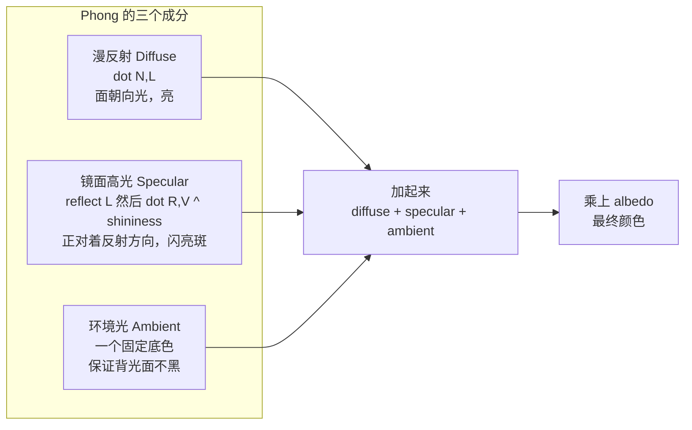

这一节我们会讲解：

- Phong 模型的三块积木：漫反射（Lambert） + 镜面高光（Specular） + 环境光（Ambient）
- 漫反射你已经会了——它就是 `max(dot(N, L), 0)`
- `reflect()` 函数和 `dot(R, V)^shininess` 如何制造那个"亮斑"
- 环境光为什么是必须的——没有它，背光面是全黑的
- 三块积木如何在 deferred pass 里组合成最终光照

好吧，我们开始吧。在第 2.3 节你已经在 `gbuffers_terrain.fsh` 里做过一次漫反射——`max(dot(N, L), 0)`。那时候我们只是想让方块"立体起来"，没打算做得太精致。现在我们要做一个真正完整的光照模型：**不仅考虑面朝向光有多亮，还要考虑那个正对相机时闪出来的亮斑，还要保证背光面不至于全黑**。

这三个成分分别是 diffuse、specular 和 ambient。它们合在一起，就是计算机图形学里最有名的光照模型之一：Phong。

---

## 三块积木

在写代码之前，我们先把三块积木分别拆出来，看清楚每块到底在干嘛。

内心独白：如果我只拿一盏灯照一个球，球上最亮的地方在哪儿？正对灯的那一块。这是 diffuse，它靠 `dot(N, L)`。那第二亮的地方在哪儿？如果我把眼睛放在球前面，我应该能看到一个**小亮斑**——那是灯光在球表面反射后直接射入眼睛的位置。这是 specular。那球的底部呢？完全背对灯，但现实里它不会是纯黑的，因为墙壁、地板、空气都会弹一些光回来。这是 ambient。



---

## 漫反射：老熟人

漫反射你已经熟透了：

```glsl
vec3 N = normalize(normal);   // 从 colortex1 解包来的法线
vec3 L = normalize(sunPosition);
float diff = max(dot(N, L), 0.0);
```

它衡量的是"这个表面有多正对太阳"。很朴素，很诚实。但只看它一个，画面会比较"平"——亮面亮，暗面暗，中间过渡很均匀，像一张被大灯均匀照着的石膏像。

---

## 镜面高光：那个亮斑

镜面高光是 Phong 模型里最有性格的成分。它的逻辑是这样的：

1. 找反射方向：光线 `L` 照到表面法线 `N` 上，会反射出去。反射方向 `R` 可以用 GLSL 的内置函数一步算出：
   ```glsl
   vec3 R = reflect(-L, N);
   ```
   注意这里 `L` 是"从表面指向光源"的方向，而 `reflect()` 期望的第一个参数是"入射方向"（从光源指向表面），所以要取反。

2. 比较反射方向和视线方向：你的眼睛在相机位置 `camPos`，看向表面的方向是 `V`。如果 `R` 和 `V` 很接近，说明反射光正好打进你的眼睛——亮斑出现。
   ```glsl
   vec3 V = normalize(cameraPosition - worldPos);
   float spec = pow(max(dot(R, V), 0.0), shininess);
   ```

3. `shininess` 是什么？它是"亮斑有多集中"。`shininess = 2` 时亮斑很大、很散漫，像橡胶球。`shininess = 32` 时亮斑很小、很锐利，像抛光的金属。`shininess = 128` 时亮斑几乎是一个小点，像镜子上的反光。

你可以把 `pow(dot(R, V), shininess)` 想成一个**方向灵敏度调节器**。`dot(R, V)` 小于 1 时，指数越高，结果掉得越快——只有几乎完全对准的那一小块才能亮起来。


---

## 环境光：禁止死黑

环境光最不"物理"但最"实用"。你不做它，背光面就是纯黑色。它通常就是一个很小的常数：

```glsl
vec3 ambient = vec3(0.05);
```

只靠这一个数，背光面就从一个黑洞变成了"能看见轮廓的暗面"。在真实的光影包里，环境光会被 SSAO（第 6 章）、天空光、方块光等进一步替代，但现在我们先拿它占个位。

---

## 三合一

三块积木拼在一起：

$$
light = diffuse \times \text{sunColor} + specular \times \text{sunColor} + ambient
$$

`sunColor` 是给太阳光染色的——白天是温暖的白色，黄昏是橙红色。你可以直接用 `vec3(1.0)` 省事，也可以从 Iris 的 `uniform vec3 sunColor;` 读取。最终颜色就是把光照乘到 albedo 上：

```glsl
vec3 finalColor = albedo * light;
```

---

## 完整 deferred lighting 片段

现在我们站在 deferred pass 的视角，假设我们已经从 G-Buffer 读到了 albedo 和 normal，用第 3.2 节的方法重建了 `worldPos`：

```glsl
// ─── 从 G-Buffer 读取 ───
uniform sampler2D colortex0;  // albedo
uniform sampler2D colortex1;  // encoded normal
uniform sampler2D depthtex0;

uniform mat4 gbufferProjectionInverse;
uniform mat4 gbufferModelViewInverse;
uniform vec3 sunPosition;
uniform vec3 cameraPosition;

// ─── 世界坐标重建 ───
vec3 worldPosFromDepth(vec2 texcoord) {
    float depth = texture(depthtex0, texcoord).r;
    vec3 ndc = vec3(texcoord, depth) * 2.0 - 1.0;
    vec4 clip = vec4(ndc, 1.0);
    vec4 view = gbufferProjectionInverse * clip;
    view.xyz /= view.w;
    return (gbufferModelViewInverse * vec4(view.xyz, 1.0)).xyz;
}

// ─── Phong 光照 ───
vec3 phongLight(vec3 albedo, vec3 normal, vec3 worldPos) {
    vec3 N = normalize(normal);
    vec3 L = normalize(sunPosition);
    vec3 V = normalize(cameraPosition - worldPos);

    // Diffuse
    float diff = max(dot(N, L), 0.0);

    // Specular
    vec3 R = reflect(-L, N);
    float spec = pow(max(dot(R, V), 0.0), 32.0);

    // Ambient
    float ambientStrength = 0.05;

    vec3 light = (diff + spec) * vec3(1.0) + ambientStrength;
    return albedo * light;
}

void main() {
    vec2 uv = texcoord;
    vec3 albedo = texture(colortex0, uv).rgb;
    vec3 packedNormal = texture(colortex1, uv).rgb;
    vec3 normal = packedNormal * 2.0 - 1.0;  // decode
    vec3 worldPos = worldPosFromDepth(uv);

    vec3 color = phongLight(albedo, normal, worldPos);
    gl_FragColor = vec4(color, 1.0);
}
```

内心独白一下这段代码的结构：`worldPosFromDepth` 是第 3.2 节的产物，它把屏幕像素变回世界坐标。`phongLight` 是本节的核心——它拿到了位置、法线和颜色，输出了带光照的颜色。`main` 则像一个调度员：从 colortex 读数据，解码法线，走重建和光照，输出。

---

## 每个成分的视觉解释

你可以做一个很直观的调试实验：在 `phongLight` 里，**暂时只返回其中一个成分**：

- 只返回 `albedo * diff`：你会看到第 2.3 节熟悉的 lambert 漫反射——阳面亮，阴面暗，没有亮斑。
- 只返回 `albedo * spec`：你会看到黑色背景上浮着几个小白点——只有刚好反射到眼睛的面才亮。
- 只返回 `albedo * ambientStrength`：全屏几乎黑——只有一个微弱的基本亮度。

三样合在一起，方块就有了"被一盏聚光灯照着"的完整感觉：阳面明亮、高光锐利、阴面至少能看见轮廓。

---

## 本章要点

- Phong 光照模型由三部分组成：漫反射（diffuse）、镜面高光（specular）、环境光（ambient）。
- 漫反射 `max(dot(N, L), 0)` 衡量表面朝向光源的程度，你已经会了。
- 镜面高光用 `reflect(-L, N)` 找反射方向，再用 `dot(R, V)^shininess` 制造亮斑。`shininess` 越大亮斑越集中。
- 环境光是一个小常数（如 `0.05`），保证背光面不出现死黑。
- 最终光照 = `(diffuse + specular) × sunColor + ambient`，乘上 albedo 得到颜色。
- 在 deferred pass 中，albedo 来自 `colortex0`，法线来自 `colortex1`（需解码），世界坐标来自深度重建。
- 调试时可以逐个成分单独输出，观察每个成分对画面的贡献。

> Phong 模型不完美，但它很诚实。三块积木各管一摊，调哪块动哪块——这是你理解一切更复杂光照模型的基础。

下一节：[3.4 — deferred.fsh 的写法](/03-deferred/04-deferred-pass/)
