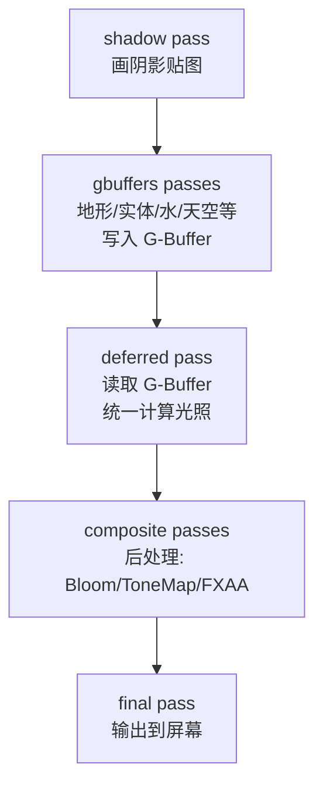

这一节我们会讲解：

- `deferred.fsh` 在 Iris 管线里的位置——它在 gbuffers 之后、composite 之前
- 为什么 deferred 像一个"全屏 pass"，却享受 composite 的所有纹理读取权限
- 从 `colortex0`（albedo）、`colortex1`（normal）、`colortex2`（material）和 `depthtex0` 读数据的具体写法
- uniform 声明规范：哪些由 Iris 自动提供，哪些需要你自己写
- 一个完整可运行的 `deferred.fsh` 示例
- Iris 怎么知道 deferred pass 在什么时候执行——`shaders.properties` 里的调度

好吧，我们开始吧。你现在已经有三块独立的知识：知道前向渲染和延迟渲染的区别（3.1），知道怎么从深度重建世界坐标（3.2），知道 Phong 光照的三块积木怎么搭（3.3）。现在要把它们拼成**一个能真正跑起来的文件**：`deferred.fsh`。

---

## deferred 在管线里的位置

先把工厂流水线的地图再扫一眼。Iris 的渲染顺序大致如下：



deferred 夹在 gbuffers 和 composite 中间。gbuffers 已经把颜色、法线、材质、深度都写好了；deferred 负责取出来，算出光照，写回 `colortex0`（或者直接输出最终颜色）；composite 再基于这些结果做后处理。

在 Iris 的设计里，deferred pass 本质上是一个 **composite-style** pass。它和 composite 一样跑在全屏四边形上，能访问所有 `colortex` 和 `depthtex`——区别只在于它被排在 gbuffers 之后，composite 之前。

---

## deferred.fsh 的基本骨架

一个最小可运行的 deferred.fsh 长这样：

```glsl
#version 330 compatibility

/* RENDERTARGETS: 0 */

uniform sampler2D colortex0;  // albedo
uniform sampler2D colortex1;  // encoded normal
uniform sampler2D colortex2;  // material (roughness, metallic, etc.)
uniform sampler2D depthtex0;  // depth

uniform mat4 gbufferProjectionInverse;
uniform mat4 gbufferModelViewInverse;
uniform vec3 sunPosition;
uniform vec3 cameraPosition;
uniform float viewWidth;
uniform float viewHeight;

in vec2 texcoord;

layout(location = 0) out vec4 outColor;

void main() {
    vec2 uv = texcoord;

    // 读取 G-Buffer
    vec3 albedo = texture(colortex0, uv).rgb;
    vec3 packedNormal = texture(colortex1, uv).rgb;
    vec3 normal = packedNormal * 2.0 - 1.0;

    // 重建世界坐标
    float depth = texture(depthtex0, uv).r;
    vec3 ndc = vec3(uv, depth) * 2.0 - 1.0;
    vec4 clip = vec4(ndc, 1.0);
    vec4 view = gbufferProjectionInverse * clip;
    view.xyz /= view.w;
    vec3 worldPos = (gbufferModelViewInverse * vec4(view.xyz, 1.0)).xyz;

    // 光照
    vec3 N = normalize(normal);
    vec3 L = normalize(sunPosition);
    vec3 V = normalize(cameraPosition - worldPos);

    float diff = max(dot(N, L), 0.0);
    vec3 R = reflect(-L, N);
    float spec = pow(max(dot(R, V), 0.0), 32.0);

    vec3 ambient = vec3(0.05);
    vec3 light = (diff + spec) * vec3(1.0) + ambient;

    outColor = vec4(albedo * light, 1.0);
}
```

一步一步走一遍。顶部是 `#version 330 compatibility` 加 `/* RENDERTARGETS: 0 */`——和 composite 一样，deferred 通常只写一个输出，就是最终颜色。

---

## 纹理读取：colortex0、1、2

这是 deferred pass 的核心读操作。注意命名规则和 Iris 的约定必须严格对上：

```glsl
uniform sampler2D colortex0;  // → 颜色（albedo）
uniform sampler2D colortex1;  // → 法线（encoded normal）
uniform sampler2D colortex2;  // → 材质（roughness/metallic/emission）
uniform sampler2D depthtex0;  // → 深度
```

Iris 的 `IrisSamplers` 会按这些名字注册纹理采样器。你不能随便叫它 `albedoTex` 或者 `normalTex`——在 #330 compatibility 模式下，Iris 按标准命名匹配 uniform 和真实纹理。

> colortex0~7 由 Iris 按 RENDERTARGETS 分配，depthtex0/1 由渲染管线的深度缓冲提供。

---

## 法线解码：别忘了这一步

gbuffers 写 `normal * 0.5 + 0.5` 把 `[-1,1]` 打包到 `[0,1]`。deferred 必须反着解：

```glsl
vec3 packedNormal = texture(colortex1, uv).rgb;
vec3 normal = packedNormal * 2.0 - 1.0;
```

如果你跳过这一步，`normal` 的范围还是 `[0,1]`，`dot(N, L)` 会全部偏正、偏亮，光照完全没方向感。这是 deferred 最常犯的排版错误之一。

---

## colortex2：材质的占位符

在第 3.3 节我们只用了颜色和法线。`colortex2` 在当前阶段是"先穿着空衣服"。在后面的章节里（比如第 12 章的 PBR），`colortex2` 会放 roughness、metallic、emission 等材质参数，用来驱动 GGX 高光、能量守恒之类的物理效果。现在你只需要知道：

```glsl
uniform sampler2D colortex2;
```

这行声明放在那里就行。等你学到 PBR，这一行的数据会直接喂进高光和漫反射的计算。

---

## uniform 声明：哪些是 Iris 给的

你可能想问：我怎么知道哪些 uniform 可以直接写，哪些需要自己在 Java 端注册？答案很简单——下面这些是 Iris 自动提供的，你只管声明同名变量：

| uniform | 来源 |
|---|---|
| `sampler2D colortex0~7` | Iris 按 `RENDERTARGETS` 分配 |
| `sampler2D depthtex0/1` | 渲染目标的深度纹理 |
| `mat4 gbufferProjection` | MatrixUniforms 提供 |
| `mat4 gbufferProjectionInverse` | MatrixUniforms 自动求逆 |
| `mat4 gbufferModelView` | MatrixUniforms 提供 |
| `mat4 gbufferModelViewInverse` | MatrixUniforms 自动求逆 |
| `vec3 sunPosition` | CelestialUniforms 提供 |
| `vec3 cameraPosition` | Iris 系统 uniform 提供 |
| `float viewWidth / viewHeight` | Iris 系统 uniform 提供 |

这些都在 Iris 源码里有明确的注册路径——比如 `MatrixUniforms.addMatrixUniforms()` 里用 `addMatrix(uniforms, "Projection", ...)` 生成 `gbufferProjection` 和 `gbufferProjectionInverse`。所以你声明同名 uniform 就能拿到数据，不需要写任何 Java 代码。

---

## 天空判断：别把天也一起照亮了

有一个很容易踩的坑：deferred 跑在全屏四边形上——**包括天空**。如果你不加判断，天空也会被当成一个"表面"来算法线、算光照，最后出来一个很诡异的光污染色。

朴素的做法是用深度判断：

```glsl
float depth = texture(depthtex0, uv).r;
if (depth >= 1.0) {
    outColor = vec4(0.0);  // 天空——或保留原版天空色
    return;
}
```

深度为 `1.0`（或近似 `1.0`）意味着这个像素没有几何体，也就是天空。更严格的光影包会用 Iris 提供的 `isSkyEmpty` 或检查 sky color buffer，但现在这个简化判断够用。

---

## 完整 deferred.fsh（带天空判断）

把上面的所有知识拼成一份完整文件：

```glsl
#version 330 compatibility

/* RENDERTARGETS: 0 */

uniform sampler2D colortex0;
uniform sampler2D colortex1;
uniform sampler2D colortex2;
uniform sampler2D depthtex0;

uniform mat4 gbufferProjectionInverse;
uniform mat4 gbufferModelViewInverse;
uniform vec3 sunPosition;
uniform vec3 cameraPosition;

in vec2 texcoord;

layout(location = 0) out vec4 outColor;

vec3 worldPosFromDepth(vec2 uv) {
    float depth = texture(depthtex0, uv).r;
    vec3 ndc = vec3(uv, depth) * 2.0 - 1.0;
    vec4 clip = vec4(ndc, 1.0);
    vec4 view = gbufferProjectionInverse * clip;
    view.xyz /= view.w;
    return (gbufferModelViewInverse * vec4(view.xyz, 1.0)).xyz;
}

void main() {
    vec2 uv = texcoord;

    float depth = texture(depthtex0, uv).r;
    if (depth >= 1.0) {
        outColor = vec4(0.0);
        return;
    }

    vec3 albedo = texture(colortex0, uv).rgb;
    vec3 packedNormal = texture(colortex1, uv).rgb;
    vec3 normal = packedNormal * 2.0 - 1.0;
    vec3 worldPos = worldPosFromDepth(uv);

    vec3 N = normalize(normal);
    vec3 L = normalize(sunPosition);
    vec3 V = normalize(cameraPosition - worldPos);

    float diff = max(dot(N, L), 0.0);
    vec3 R = reflect(-L, N);
    float spec = pow(max(dot(R, V), 0.0), 32.0);

    vec3 ambient = vec3(0.05);
    vec3 light = (diff + spec) * vec3(1.0) + ambient;

    outColor = vec4(albedo * light, 1.0);
}
```

这份代码大约 45 行，但它已经把延迟渲染的核心闭环走通了：G-Buffer 读取 → 法线解码 → 世界坐标重建 → Phong 光照 → 输出。

---

## shaders.properties 里的调度

最后一步：告诉 Iris 有 deferred pass 要跑。在 `shaders.properties` 里，你需要声明 deferred 对应的程序文件。Iris 会自动找 `deferred.vsh` 和 `deferred.fsh`，但 properties 里也通常会有类似这样的条目来声明有哪些 pass：

```properties
# Deferred lighting pass
program.deferred=deferred.vsh deferred.fsh
```

如果你是第一次接触 `shaders.properties`，先不用深究每一条选项——第 3.5 节的实战会手把手带你配好。现在你只需要知道：Iris 识别到 `deferred.*` 这两个文件并且 properties 里声明了它，就会在 gbuffers 完成后、composite 开始前，自动插入 deferred pass。

---

## 本章要点

- `deferred.fsh` 是 composite-style 全屏 pass，排在 gbuffers 之后、composite 之前。
- 它读取 `colortex0`（albedo）、`colortex1`（encoded normal）、`colortex2`（material）和 `depthtex0`（depth）。
- 法线读取后必须解码：`packed * 2.0 - 1.0`。
- `gbufferProjectionInverse` 和 `gbufferModelViewInverse` 由 Iris 自动提供，你直接在 shader 里声明即可。
- 天空像素的判断：深度 ≈ 1.0 时跳过光照，避免把天空当成方块照亮。
- `shaders.properties` 中的 `program.deferred=deferred.vsh deferred.fsh` 告诉 Iris 加载 deferred pass。
- 一个完整的 deferred.fsh 只需要约 45 行 GLSL，但已经闭环走通了延迟渲染的核心逻辑。

> deferred pass 像延迟渲染的"中央厨房"——前厅的 gbuffers 把食材（几何属性）准备好了送进来，你只需要对着菜单（光照公式）统一烹饪。所有的光照逻辑，从这一刻起，都在一个地方。

下一节：[3.5 — 实战：基础延迟光照](/03-deferred/05-project/)
