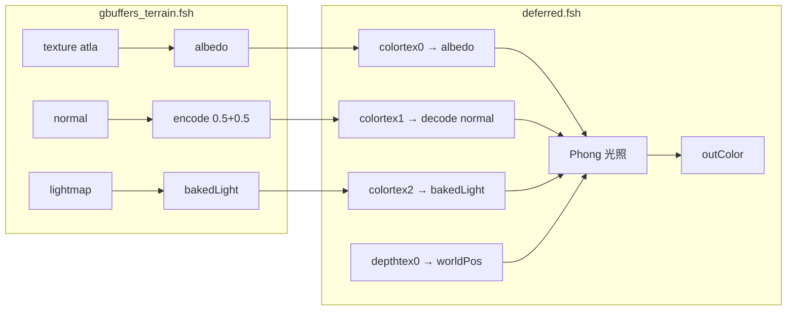

这一节我们会讲解：

- 实战目标：用延迟 Phong 光照替换前向光照，从 G-Buffer 取数据、在 deferred 里算光
- 修改 `gbuffers_terrain.fsh`：去掉光照计算，只写 albedo、normal、material 和 lightmap
- 新建 `deferred.fsh`：读取 G-Buffer，重建世界坐标，实现 Phong 光照
- 新建 `deferred.vsh`：最简全屏四边形顶点着色器
- 更新 `shaders.properties`：声明 deferred program
- 预期效果：方块有立体光照感，阳面亮、镜面有高光、阴面有环境光
- 自测清单：逐一对照，确认每一环都接对了

好吧，我们开始吧。这一节是第三章的收尾——你有理论（3.1）、有坐标重建公式（3.2）、有光照模型（3.3）、有 deferred.fsh 结构（3.4）。现在把这些都装进你的 shaderpack，让方块第一次"真正地"被延迟光照打亮。

---

## 实战目标

你现在手里应该有一个来自第 2 章的 shaderpack，里面至少有：
- `shaders/` 目录
- `shaders.properties`
- `gbuffers_terrain.vsh` 和 `gbuffers_terrain.fsh`
- `composite.vsh` 和 `composite.fsh`

这一节我们要做三件事：
1. **改造 `gbuffers_terrain.fsh`**：不再在 terrain 里直接算光照。它只负责把几何信息写进 G-Buffer。
2. **新建 `deferred.vsh` 和 `deferred.fsh`**：在全屏上读取 G-Buffer 并计算 Phong 光照。
3. **更新 `shaders.properties`**：让 Iris 知道有一个 deferred pass 在 gbuffers 之后执行。

---

## 第一步：改造 gbuffers_terrain.fsh

在第 2 章，你的 terrain 可能同时写了颜色、法线和 lightmap，并且已经直接在片元着色器里用了 `dot(N, L)` 做漫反射。现在我们要把光照部分拆掉，让 terrain 只当"资料登记员"。

```glsl
#version 330 compatibility

uniform sampler2D texture;
uniform sampler2D lightmap;

in vec2 texcoord;
in vec4 glcolor;
in vec3 normal;
in vec2 lmcoord;

/* RENDERTARGETS: 0,1,2 */
layout(location = 0) out vec4 outColor;
layout(location = 1) out vec4 outNormal;
layout(location = 2) out vec4 outLightmap;

void main() {
    vec4 albedo = texture(texture, texcoord) * glcolor;

    // 法线编码：从 [-1,1] 打包到 [0,1]
    vec3 encodedNormal = normalize(normal) * 0.5 + 0.5;

    // Minecraft 的天空光和方块光（烘焙光）
    vec4 bakedLight = texture(lightmap, lmcoord);

    outColor = albedo;
    outNormal = vec4(encodedNormal, 1.0);
    outLightmap = bakedLight;
}
```

和原来相比，最大的变化是：**没有 `sunPosition`、没有 `dot(N, L)`、没有 `diffuse * bakedLight`**。terrain 现在只做三件事——贴颜色、编码法线、查 lightmap。

> ⚠️ 注意变量名：vsh 的 `out vec4 glcolor` 和 fsh 的 `in vec4 glcolor` 通过兼容模式自动连接。如果你用自定义名如 `vertexColor`，必须在 vsh 和 fsh 里完全一致且类型匹配，否则 fsh 收到的全是零。

---

## 第二步：新建 deferred.vsh

`deferred.vsh` 就是最朴素的全屏四边形——和 composite.vsh 几乎一样：

```glsl
#version 330 compatibility

out vec2 texcoord;

void main() {
    gl_Position = gl_ModelViewProjectionMatrix * gl_Vertex;
    texcoord = (gl_TextureMatrix[0] * gl_MultiTexCoord0).xy;
}
```

它不做任何变换，只把纹理坐标传给片元着色器。是的，deferred 的起点也是 4 个顶点铺满屏幕。

---

## 第三步：新建 deferred.fsh

这是本次实战的核心文件。它把第 3.2 节的坐标重建和第 3.3 节的 Phong 光照装在一起：

```glsl
#version 330 compatibility

/* RENDERTARGETS: 0 */

uniform sampler2D colortex0;  // albedo
uniform sampler2D colortex1;  // encoded normal
uniform sampler2D colortex2;  // baked lightmap
uniform sampler2D depthtex0;  // depth

uniform mat4 gbufferProjectionInverse;
uniform mat4 gbufferModelViewInverse;
uniform vec3 sunPosition;
uniform vec3 cameraPosition;

in vec2 texcoord;

layout(location = 0) out vec4 outColor;

// 从深度重建世界坐标
vec3 worldPosFromDepth(vec2 uv) {
    float depth = texture(depthtex0, uv).r;
    vec3 ndc = vec3(uv, depth) * 2.0 - 1.0;
    vec4 clip = vec4(ndc, 1.0);
    vec4 view = gbufferProjectionInverse * clip;
    view.xyz /= view.w;
    return (gbufferModelViewInverse * vec4(view.xyz, 1.0)).xyz;
}

void main() {
    vec2 uv = texcoord;

    // 天空跳过
    float depth = texture(depthtex0, uv).r;
    if (depth >= 1.0) {
        outColor = vec4(0.0);
        return;
    }

    // 读取 G-Buffer
    vec3 albedo = texture(colortex0, uv).rgb;
    vec3 packedNormal = texture(colortex1, uv).rgb;
    vec3 normal = packedNormal * 2.0 - 1.0;       // decode
    vec3 bakedLight = texture(colortex2, uv).rgb;  // lightmap

    // 重建世界坐标
    vec3 worldPos = worldPosFromDepth(uv);

    // Phong 光照
    vec3 N = normalize(normal);
    vec3 L = normalize(sunPosition);
    vec3 V = normalize(cameraPosition - worldPos);

    float diff = max(dot(N, L), 0.0);

    vec3 R = reflect(-L, N);
    float spec = pow(max(dot(R, V), 0.0), 32.0);

    vec3 ambient = vec3(0.05);

    // 方向光 + 环境光，乘上 Minecraft 的烘焙光
    vec3 light = (diff + spec) * vec3(1.0) + ambient;
    light *= bakedLight;  // 叠加天空光和方块光

    outColor = vec4(albedo * light, 1.0);
}
```

这里做了几个值得单独拎出来的选择：

1. **`colortex2` 存的是 lightmap**，不是材质参数。这是为了和你在第 2.6 节写的 terrain 保持一致。等学到 PBR（第 12 章），你会把 lightmap 移到别的 colortex，把材质参数放进 colortex2。
2. **`bakedLight` 在 deferred 里乘上**，而不是在 terrain 里。这样所有光照（方向光 + 烘焙光）在一个地方统一处理，调起来不用在两个文件之间来回切。
3. **天空判断用 `depth >= 1.0`**。这是朴素版；高级光影包还会有天空颜色回填的步骤，但先让这一步跑通最重要。



---

## 第四步：更新 shaders.properties

给 `shaders.properties` 加上 deferred pass 的声明。如果你的 shaders.properties 还比较空，至少应该有：

```properties
# 声明 deferred program
program.deferred=deferred.vsh deferred.fsh

# pass 顺序由 Iris 自动管理，不需要手动排
```

Iris 会根据文件扩展名 `.vsh` / `.fsh` 和 program 名字自动找到对应的 shader 文件。`deferred.vsh` 和 `deferred.fsh` 放在 `shaders/` 根目录下即可。

---

## 预期效果

如果你每一步都跟下来了，启动游戏进入世界后，你应该看到：

- **方块有明显的立体光照**：面向太阳的面亮、背向太阳的面暗，和露天/洞穴的光照层次分明。
- **高光亮点**：在适当的视角下，方块的平坦面上会出现小而锐利的白色亮斑——那是 `specular` 在起作用。如果看不到，试着把 `shininess` 从 `32` 降到 `8`，亮斑会变大更容易察觉。
- **阴面不会死黑**：`ambient` 的 `0.05` 让阴影面至少能看出方块的颜色。
- **天空是黑的**：深度大于 `1.0` 的像素被跳过了——天空暂时留黑，后面章节会补。


---

## 自测清单

在进入下一章之前，逐条勾一遍。每一项都确认无误再往前走：

- [ ] `gbuffers_terrain.fsh` 里**没有** `sunPosition`、`dot(N, L)`、`diffuse` 相关代码——它只写 G-Buffer。
- [ ] `/* RENDERTARGETS: 0,1,2 */` 在 terrain 里声明了，`layout(location = 0,1,2)` 与之一一对应。
- [ ] `deferred.vsh` 存在且通过编译——就 6 行，但缺了它 deferred 起不来。
- [ ] `deferred.fsh` 里的 uniform 名和 Iris 标准一致：`colortex0`、`colortex1`、`colortex2`、`depthtex0`、`gbufferProjectionInverse`、`gbufferModelViewInverse`、`sunPosition`、`cameraPosition`。
- [ ] 法线解码 `packedNormal * 2.0 - 1.0` 无误——不是在乘法线上漏了减号。
- [ ] `shaders.properties` 里有 `program.deferred=deferred.vsh deferred.fsh`。
- [ ] 游戏内按 `F3 + T` 重载 shader 后没有编译报错（Ctrl+D 开 Iris 调试模式查看）。
- [ ] 白天面向太阳的方块明显亮、背对太阳明显暗。
- [ ] 调整视角能看到镜面高光亮斑——如果看不到，先把 `shininess` 从 `32` 降到 `4` 测试。
- [ ] 洞穴和阴影面不是纯黑，能看出方块颜色和轮廓。

---

## 常见排错

**画面全黑**：检查 `depth >= 1.0` 的判断是否误杀了所有像素。可以先注释掉天空判断，看是不是有画面出来。如果出来了，说明深度比较的阈值有问题——试试 `depth > 0.9999`。

**光照没有方向感**：最可能的原因是忘了做法线解码，或者法线在 terrain 里根本没写进 `colortex1`。可以临时改成 `outColor = vec4(normal, 1.0)` 看画面上法线颜色是否正常——如果全是同一种灰色，说明法线没正确传入。

**方块太亮或太暗**：检查 `albedo` 和 `light` 的乘法是否重复乘了 lightmap。terrain 里已经用 `texture(texture, texcoord) * glcolor` 给 albedo 染过色了，deferred 不应该再乘一遍 glcolor。

**镜面高光看不见**：先调低 `shininess`（如 `4.0`）看是不是亮斑太大到看不出来；再确认 `cameraPosition` 和 `sunPosition` 都用 `normalize` 归一化了。

---

## 本章要点

- `gbuffers_terrain.fsh` 不再计算光照，只负责把 albedo、encoded normal、baked lightmap 写进 colortex0~2。
- `deferred.vsh` 是全屏四边形，和 `composite.vsh` 几乎一样。
- `deferred.fsh` 从 `colortex0~2` 读数据、从 `depthtex0` 重建世界坐标、计算 Phong 光照并输出。
- `bakedLight`（Minecraft 的天空光/方块光）在 deferred 中乘入，和方向光统一处理。
- `shaders.properties` 中声明 `program.deferred=deferred.vsh deferred.fsh` 让 Iris 识别 deferred pass。
- 自测清单覆盖了从 terrain 写入、deferred 读取、法线解码、光影效果到 sky skip 的全链路检查。

> 恭喜——你现在有一个能跑的延迟渲染管线了。虽然它只有一盏太阳、一个粗糙的镜面高光和一个小得可怜的环境光常数，但它的骨架是延迟渲染的骨架。往后的 SSAO、阴影、PBR、Bloom、体积光……都是在这个骨架上挂肌肉。而你刚刚亲手搭好了这个骨架。

下一章：[4.1 — 什么是 AO？直觉和原理](/04-ssao/01-ao-intro/)
