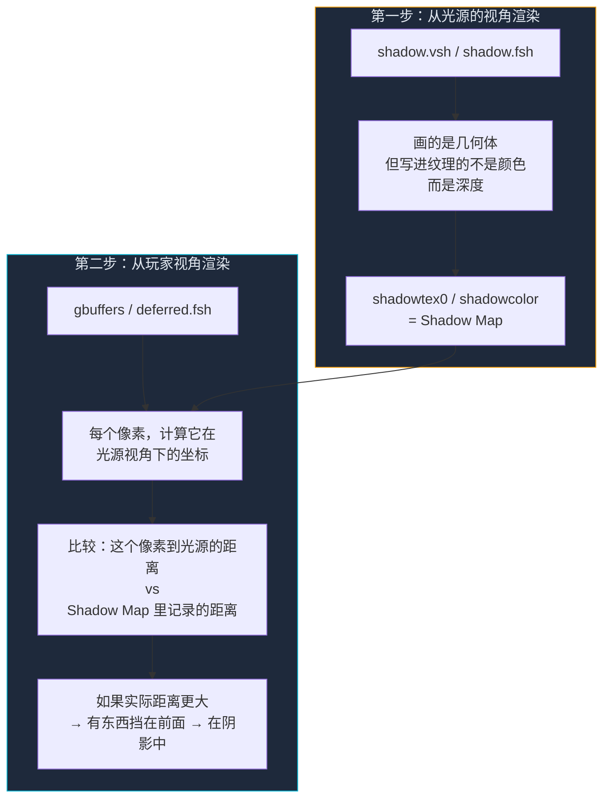

这一节我们会讲解：

- 为什么阴影不是"把方块变黑"这么简单
- Shadow Mapping 的核心直觉：从光源的视角拍一张"距离表"
- 深度图（Shadow Map）是什么，它为什么像一张地形等高线底片
- 玩家视角的像素怎么和这张深度图比较
- 整个流程用一张 mermaid 图串起来

好吧，我们开始吧。在第 2.3 节你已经让方块有了明暗——面朝太阳的亮，背对太阳的暗。那时候你心里可能已经冒出一个念头：既然太阳的光能让草方块亮起来，那它为什么不把旁边的泥土方块挡住光？换句话说，为什么方块只是自己变亮变暗，而不是相互投射阴影？

这个问题的答案，就是 Shadow Mapping。而且坦白说，它在所有进阶效果里算是最优雅的一个：因为它只需要一个 Pass 和一个比较。

> 阴影不是"变暗"，而是"光被挡住了"。先搞清楚光有没有被挡住，再决定要不要暗。

---

## 核心直觉：一张照片，两种读法

我们先不写一行代码。内心独白来一下：假设你站在 Minecraft 世界里。太阳高高挂在头顶偏东的方向，你脚边有一个橡树方块。太阳光笔直地射下来，照在橡树上，也照在旁边的泥土上。现在——你的直觉可能告诉你：橡树的背面应该是阴影。

但场景真的理解这个关系吗？在你的着色器面前，橡树的方块和泥土的方块是一块钱一块钱地送进来的，像传送带上的零件。GPU 看到泥土方块时，它并不知道头顶有没有橡树。毕竟，把这些零件画到屏幕上的时候，它们之间的关系已经被拍扁了。

这就是它。Shadow Mapping 做了一件聪明到几乎像作弊的事：**在渲染玩家视角之前，先从太阳的角度先渲染一遍。**



停下来，盯住这张图 20 秒。你能感觉到它的优雅吗？第一步做的不是在屏幕上画东西，而是从太阳的眼睛拍一张"谁离太阳最近"的清单。第二步回到玩家视角，每个像素都去问这张清单："太阳看见的离它最近的东西，离太阳有多远？我自己离太阳又有多远？如果我自己更远，说明太阳看见的不是我——说明有什么东西挡在我和太阳之间。"

> 阴影不是"加一层黑色"。阴影的根源是：从光源看，有另一块几何体离光源更近。

---

## Shadow Map：一张"离光源最近距离"的纹理

这张从太阳视角渲染出来的纹理就叫 Shadow Map，在 Iris 里通常对应 `shadowtex0` 或 `shadowcolor`。它的每一格存的不是颜色，而是深度——这个方向上的几何体离光源有多远。

你可以把它想成一个"谁的优先级最高"的表。想象太阳在地上画了一个方格子，每个格子里它都写了一个数字：从这个格子看出去，离太阳最近的那个东西离太阳有多远。

```glsl
// 不要在 shader 里这样写——这只是思维模型
float closestToLight = texture(shadowtex0, shadowUV).r;
float myDistanceToLight = length(lightSpacePos);
float inShadow = myDistanceToLight > closestToLight ? 1.0 : 0.0;
```

这个逻辑的价值在于：它不是基于物理方程，而是基于几何遮挡。没有光追，没有向量场，只有一张距离表，一把尺子，和一个大于号。

> Shadow Mapping 的本质是：两套坐标，一张深度图，一次比较。

---

## 为什么这个方法这么聪明

现在我们来复盘一下，为什么 Shadow Mapping 称得上"优雅"。

第一，它不依赖场景复杂度。不管你的视野里有一千个方块还是一百万个，shadow pass 只管从光源的角度光栅化一遍，然后把最近的点存下来。后续的比较只是纹理采样，常数时间。

第二，它自然地处理了遮挡。橡树挡住泥土，栅栏挡住草地，山顶挡住山脚——所有这些关系被自动编码进深度图里。你不需要画一条从每个片元到太阳的射线。你只需要"查表"。

第三，它天然支持动态场景。每当方块被放置或破坏，shadow pass 重新跑一遍，Shadow Map 就更新了。Minecraft 的太阳虽然在游戏逻辑里是"绕圈"的，但你从不需要手动追踪它的运动——Iris 已经给了你 `shadowModelView` 和 `shadowProjection`。


---

## 但是，这个方案并不完美

先打预防针。在你兴奋地准备写 shadow pass 之前，你需要知道 Shadow Mapping 自带几个麻烦。这不是设计缺陷，而是用一张低维图片近似三维世界的必然代价。

第一个麻烦叫 **shadow acne**，也就是阴影痤疮。深度图和实际几何体之间有浮点误差，导致一个平面有时会错误地判断"自己被自己挡住了"，于是表面出现奇怪的条纹或斑点。我们会在 §4.3 详细拆它，但现在你只需要知道它长什么样：像一块本应被阳光照到的地方，莫名其妙地出现了一道道细小的黑纹。

第二个麻烦叫 **锯齿**。Shadow Map 是一张有固定分辨率的纹理，比如 1024×1024。但如果太阳离很远，每个像素覆盖的面积就很大——阴影边缘会呈现像素方块，而且越远的阴影越粗糙。这会在 §4.4 用 PCF 软阴影来处理。

第三个麻烦是**拉伸**。太阳斜照的时候，Shadow Map 的一个像素在地面上可能覆盖五六个像素，阴影就像被拉变形了。这是透视的本质，但认识它有助于理解为什么 CSM 会存在（第 8 章的内容，现在先不管）。

> Shadow Mapping 不是完美的，但它是所有实时阴影技术的基石。理解它的弱点，就等于理解了后面所有的优化。

---

## 从概念到代码：预览一下

在后面的章节里，你在 `shadow.vsh` 里会看到类似这样的变换：

```glsl
gl_Position = shadowProjection * shadowModelView * gl_Vertex;
```

在 deferred 或 gbuffers 里采样阴影时，你会看到：

```glsl
float shadow = shadow2D(shadowtex0, shadowCoord);
```

这两行之间的所有故事，就是 §4.2 到 §4.4 的全部内容。但现在，你已经知道了核心秘密：阴影的产生，不是靠一个复杂的公式，而是靠两张图的深度比较。

---

## 本章要点

- Shadow Mapping 的核心是"从光源的视角渲染深度图，再从玩家视角比较深度"。
- 第一步（shadow pass）：从太阳视角画出场景，但把每个方向上的最近深度存进 Shadow Map。
- 第二步（采样比较）：在玩家视角的着色器里，把世界坐标变换到光源空间，和 Shadow Map 记录的深度做对比。
- 如果实际距离大于 Shadow Map 里的记录值，说明有东西挡在中间，这个像素就在阴影里。
- Shadow Map 本质上是一个查找表，阴影判断被化简成一次纹理采样和一次比较。
- Shadow Mapping 自带 shadow acne、锯齿、拉伸等问题，这些是后续优化要解决的点。

> 从太阳的眼睛看世界——这就是 Shadow Mapping 的全部魔力。它是一个只有两张图、一次比较的优雅算法。

下一节：[4.2 — shadow.vsh/.fsh 解剖：从光源的视角渲染](/04-shadows/02-shadow-pass/)
