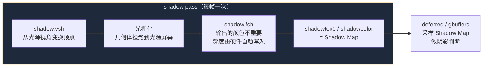

这一节我们会讲解：

- `shadow.vsh` 和 `shadow.fsh` 在整个管线里的位置
- `shadowModelView` 和 `shadowProjection` 是什么，为什么它们和 gbuffers 里的矩阵不一样
- shadow pass 的输出到底是什么——`shadowcolor` 和 `shadowtex0` 的区别
- 为什么 shadow.fsh 几乎"什么都不做"就完事了
- 如何判断你的 shadow pass 是否真的在工作

在第 4.1 节我们讲了 Shadow Mapping 的核心直觉：先站在太阳的位置拍一张深度图。好吧，这一节我们就真的去写这个"站在太阳位置"的 shader。

内心独白来一下：如果我是一个片元，我的任务是代表光源的视角，那我应该写什么进输出？颜色吗？不对，太阳不在乎草方块是绿还是黄。太阳只在乎一个问题——从这个方向看出去，离我最近的东西有多远？

> shadow pass 不写颜色。它只写深度。

---

## shadow pass 的任务说明书

Iris 的渲染顺序里，shadow pass 很早就被执行——通常在 gbuffers 之前。原理是因为后面 deferred 和 composite 需要采样 Shadow Map。你先做 shadow，再画世界。

shadow pass 是一个 **gbuffers-style** pass。听起来和 gbuffers_terrain 有点像，但实际上正好相反。gbuffers_terrain 的顶点着色器从玩家视角变换几何体，而 shadow 的顶点着色器从**光源视角**变换几何体。



这个流程图里有一个细节你应该留意一下：`shadow.fsh` 说"输出的颜色不重要"。这不是偷懒——这是 shadow pass 的设计哲学。在 shadow pass 里，真正有意义的是 GPU 深度缓冲自动写入的深度值。片元着色器的颜色输出只是顺带的，Iris 甚至允许你把 shadow.fsh 写得极短。

---

## shadow.vsh：站在太阳的眼睛里

先看 `shadow.vsh`。它的结构非常像你在第 2.2 节见过的 `gbuffers_terrain.vsh`——毕竟都是在处理几何体，只是看世界的眼睛不一样。

```glsl
#version 330 compatibility

out vec2 texcoord;
out vec4 vertexColor;

void main() {
    gl_Position = shadowProjection * shadowModelView * gl_Vertex;
    texcoord = (gl_TextureMatrix[0] * gl_MultiTexCoord0).xy;
    vertexColor = gl_Color;
}
```

停下来，盯住 `gl_Position` 这一行。在 `gbuffers_terrain.vsh` 里，它用的是 `gl_ModelViewProjectionMatrix`——玩家的 MVP。但在 shadow.vsh 里，换成了 **`shadowProjection * shadowModelView`**。

这两个矩阵不是你自己定义的。它们是 Iris 根据当前光照方向自动计算的 uniform。`shadowModelView` 把顶点从世界坐标变到"以光源为眼睛"的观察空间；`shadowProjection` 再把这个空间投影到裁剪坐标。

简单来说：**`gl_ModelViewProjectionMatrix` 是玩家看世界；`shadowProjection * shadowModelView` 是太阳看世界。**

> 如果你把 `shadowModelView` 误写成 `gl_ModelViewMatrix`，阴影会出现在完全错误的位置——因为光源的视角和玩家的视角根本不是同一个方向。

### 顶点着色器还需要传什么？

你可能注意到 shadow.vsh 仍然传了 `texcoord` 和 `vertexColor`。这两个信息在硬阴影（§4.3）里用不上，但将来做半透明阴影（比如染色玻璃投射的彩色阴影）时，你需要知道贴图颜色。现在先传着，不碍事。

---

## shadow.fsh：最简片元着色器

现在看 `shadow.fsh`。这大概是你到目前为止写过的最短的着色器。内心独白一下：如果我只需要深度，我还要在 shadow.fsh 里写什么？好像——几乎什么都不用写。

```glsl
#version 330 compatibility

uniform sampler2D texture;

in vec2 texcoord;
in vec4 vertexColor;

/* RENDERTARGETS: 0 */
layout(location = 0) out vec4 shadowcolor;

void main() {
    vec4 albedo = texture(texture, texcoord) * vertexColor;
    shadowcolor = albedo;
}
```

等一下——这看起来就像普通的方块渲染！颜色写到 `shadowcolor`，输出的也不是深度。那深度是怎么进的 Shadow Map？

答案是：**GPU 自动做的。** 当你渲染到带有深度缓冲的目标时，深度值由硬件在光栅化阶段自动写入，片元着色器不需要手动管它。`gl_Position.z` 这个值会被 OpenGL 自动存进深度缓冲。Iris 随后把这张深度缓冲暴露为 `shadowtex0`（或者叫 `depthtex1`，取决于配置）。

> `shadowcolor` 存的可能是颜色，但 `shadowtex0` 存的一定是深度。阴影判断读的是 `shadowtex0`，不是 `shadowcolor`。

那为什么还要写 `shadowcolor`？两个原因。第一，Iris 的管线要求 shadow pass 必须写一个颜色附件——这是 OpenGL FBO 的架构约束。第二，有些高级光影会利用 shadowcolor 做额外的事情，比如用颜色区分不同的光源或做 Variance Shadow Maps。你现在的阶段，专注于理解 `shadowtex0` 就够了。

---

## shadowcolor 和 shadowtex0：分清这两个名字

这是一个非常容易踩的坑，我用一段内心独白来帮你理清。

假设你第一次写阴影采样，你会很自然地想："既然 shadow pass 的输出叫 `shadowcolor`，那我就应该读 `shadowcolor`。" 然后你写：

```glsl
// 这样写是错的——别这么写
float depth = texture(shadowcolor, uv).r;
```

然后你会发现：画面没错，但阴影完全不对。方块不管放哪都不在阴影里。为什么？因为你读的是颜色，不是深度。

正确的做法是：读 Iris 专门为 shadow 深度提供的采样器。通常是 `shadowtex0` 或 `shadowtex1`：

```glsl
float depth = texture(shadowtex0, uv).r;
```

`shadowtex0` 是一张深度纹理，存着从光源视角看到的最靠近的深度。`shadowcolor` 是一张颜色纹理，存着你在 shadow.fsh 里写的（可能毫无用处的）颜色。

> `shadowcolor` = 颜色附件（你写的 albedo），`shadowtex0` = 深度纹理（GPU 自动写的深度）。阴影判断读的是 `shadowtex0`。

---

## 如何确认 shadow pass 在正常工作

在没有可视化工具的情况下，你可以用一点"调试黑魔法"来确认 shadow pass 没有跑飞。在 `shadow.fsh` 里临时写一个常量颜色：

```glsl
void main() {
    shadowcolor = vec4(1.0, 0.0, 0.0, 1.0); // 全红
}
```

然后在 deferred.fsh（或 composite.fsh）里直接输出 `shadowcolor`：

```glsl
vec4 debugShadow = texture(shadowcolor, shadowCoord.xy);
outColor = debugShadow;
```

你应该看到画面变成一张从太阳视角拍的黑白+红色照片。如果画面是全黑或纯红——你的 shadow pass 没处理正确坐标。如果能隐约看到方块轮廓——shadow pass 在工作。

调试完记得删掉这些临时代码。它们只是探照灯，不是常驻居民。


---

## 本章要点

- shadow pass 是 gbuffers-style pass，但从光源视角渲染，而非玩家视角。
- `shadow.vsh` 的核心变换是 `shadowProjection * shadowModelView * gl_Vertex`，Iris 自动提供这两个矩阵。
- `shadow.fsh` 的颜色输出几乎无关紧要——真正重要的深度值由 GPU 硬件自动写入。
- Iris 把 shadow pass 的深度缓冲暴露为 `shadowtex0`，这是后续阴影判断的核心数据源。
- `shadowcolor` 是颜色输出，`shadowtex0` 是深度纹理——不要搞混。
- shadow pass 在管线中执行得非常早，在 gbuffers 之前就完成了。

> shadow pass 是 Shadow Mapping 的"第一步"。它的使命只有一个：用最轻量的方式从光源视角把事情"看一遍"，然后把距离记下来。

下一节：[4.3 — 阴影采样与比较：在 deferred 里判断阴影](/04-shadows/03-shadow-sampling/)
