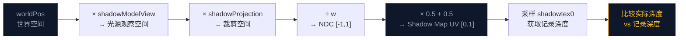
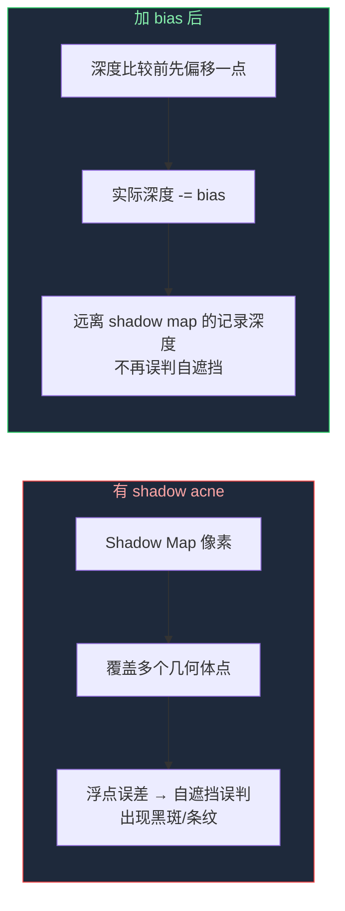

这一节我们会讲解：

- 如何把一个世界空间坐标变换到 Shadow Map 的 UV 坐标
- `shadow2D()` 和手动 `texture() + compare` 的区别
- `shadowModelView` 和 `shadowProjection` 在采样侧怎么用
- Shadow acne（阴影痤疮）是什么、为什么会出现
- 阴影偏移（shadow bias）的三种写法
- 在 `deferred.fsh` 里写出第一版阴影系数

在第 4.2 节我们做了 shadow pass——太阳已经拍好了 Shadow Map。现在你站在玩家视角，手里攥着一个世界坐标，你想知道：这个位置在阴影里吗？

内心独白来一下：我手上有世界坐标，太阳那边有一张深度图。我需要把这世界坐标搬到太阳的坐标系底下，看看深度图说"离太阳最近的东西"比我自己离太阳更近还是更远。如果更近——我在阴影里。

> 采样阴影的每一步都可以归结为：变换坐标系 → 查深度表 → 比大小。

---

## 第一步：把世界坐标投到 Shadow Map 空间

假设你在 `deferred.fsh`（或 `gbuffers_terrain.fsh`）里已经有了当前像素的世界坐标 `worldPos`。这可以是从 G-Buffer 深度重建的，也可以是从顶点着色器通过 varying 传下来的。不管你从哪里拿的，你现在需要做成下面这件事：

```glsl
// 1. 世界空间 → 光源的观察空间
vec4 shadowView = shadowModelView * vec4(worldPos, 1.0);

// 2. 光源的观察空间 → 裁剪空间
vec4 shadowClip = shadowProjection * shadowView;

// 3. 透视除法 → NDC（归一化设备坐标）
vec3 shadowNDC = shadowClip.xyz / shadowClip.w;

// 4. NDC → Shadow Map UV（[0,1] 纹理坐标）
vec3 shadowCoord = shadowNDC * 0.5 + 0.5;
```

每一个步骤都值得停下来想一想。

**步骤 1 和 2** 正是 shadow.vsh 里做的事——把世界空间顶点经过 `shadowModelView` 和 `shadowProjection` 变换到裁剪空间。你会发现这里复用了第 4.2 节 shadow pass 的矩阵。这不是巧合：如果你变换的矩阵和 shadow pass 不一样，你的坐标就和 Shadow Map 对不上了。

**步骤 3** 的透视除法 `clip.xyz / clip.w` 把齐次裁剪坐标变成 NDC。在 NDC 里，x、y、z 都在 `[-1, 1]`。如果 `shadowClip.w` 是 0，千万别除——这意味着这个点在光源背后或无穷远，阴影判断已经没有意义。通常我们会提前 `return` 或 `discard`。

**步骤 4** 把 `[-1,1]` 的 NDC 转成 `[0,1]` 的纹理坐标。这和你在第 2.2 节学的法线打包 `normal * 0.5 + 0.5` 是同一条公式——只是现在打包的是位置，不是法线。



---

## 第二步：比较深度——两种写法

现在你有了 `shadowCoord`——它的 `xy` 是 Shadow Map 上的 UV 坐标，`z` 是这个像素到光源的实际深度。你需要拿 `z` 和 Shadow Map 里记录的深度做比较。

### 写法 A：手动比较

```glsl
float closestDepth = texture(shadowtex0, shadowCoord.xy).r;
float currentDepth = shadowCoord.z;
float shadow = currentDepth > closestDepth ? 1.0 : 0.0;
```

内心独白：这更像第 4.1 节我们说的"逻辑"——记录深度和实际深度比大小。读起来很直观。问题是：`texture()` 只返回原始浮点数，没有硬件级的比较和滤波。而且你拿到的是 `0.0` 或 `1.0` 的硬开关，锯齿会非常明显。

### 写法 B：shadow2D（推荐）

```glsl
float shadow = shadow2D(shadowtex0, shadowCoord).r;
```

等一下——`shadow2D` 是什么？`shadowtex0` 是 `sampler2D`，不是 `sampler2DShadow`，为什么能直接用 `shadow2D`？

这是 Iris 做的魔法。Iris 实际上把 `shadowtex0` 声明为 `sampler2DShadow` 类型，即使你在 shader 里写的是 `uniform sampler2D shadowtex0;`。Iris 的源码在 `ShadowMapPass.java` 和 `ShadowSampling.java` 里处理了这种自动绑定。

所以当你调用 `shadow2D(shadowtex0, shadowCoord)` 时，GPU 会用硬件级 PCF 做比较：它把 `shadowCoord.z` 和纹理里存的深度做对比，深度测试通过返回 `1.0`（照亮），不通过返回 `0.0`（阴影）。你不需要手动写 `>` 符号。

> `shadow2D()` 不是简单的纹理采样。它是硬件加速的深度比较，结果自动在 `[0,1]` 之间。

如果你用的是 `#version 330 compatibility`，可以用 `shadow2D()`。如果你用的是 `#version 150` 或 `#version 120`，可能需要 `shadow2DProj()` 或手动比较。在我们的教程里，统一用 330，所以 `shadow2D()` 就是你最好的朋友。

---

## 意外出现了：Shadow Acne（阴影痤疮）

你满怀信心地把 `shadow` 系数乘到光照上，然后进游戏一看——草方块表面出现了一堆奇怪的条纹和斑点。阳光直射的面变花了，像皮肤上长了一片痤疮。

这就是 **shadow acne**。你的第一个阴影 bug。恭喜。

为什么会这样？内心独白：Shadow Map 的每一个像素记录的是"那个方向上离光源最近"的深度。但 Shadow Map 的分辨率是有限的——一个像素可能覆盖了场景里好几平方厘米的面积。光照方向稍微倾斜时，这个像素记录的深度和实际几何体的深度可能"差不多相等"，浮点误差加上离散采样，导致有些地方自己判断为"被自己挡住了"。

用一张图来感受：



---

## 解决方案：Shadow Bias（阴影偏移）

最简单的修复是在比较深度之前，把实际深度往光源方向"推远"一点点：

```glsl
float bias = 0.005;
float shadow = currentDepth - bias > closestDepth ? 1.0 : 0.0;
```

如果你用的是 `shadow2D()`，bias 也可以写进 shadowCoord 的 z：

```glsl
shadowCoord.z -= bias;
float shadow = shadow2D(shadowtex0, shadowCoord).r;
```

但是——固定的 `0.005` 在面对陡峭表面时可能不够，面对近乎水平的表面时又可能偏太多（导致阴影"漂浮"，也就是 peter panning）。所以聪明一点的写法是 **Slope-Scale Bias**：

```glsl
float bias = max(0.05 * (1.0 - dot(normal, sunDirection)), 0.005);
```

解读一下：`dot(normal, sunDirection)` 表示表面朝向太阳的程度。面朝向太阳时接近 `1.0`，`1.0 - dot` 接近 `0.0`，bias 取最小值 `0.005`——水平入射光不需要太大偏移。面垂直于光时 `dot` 接近 `0.0`，`1.0 - dot` 接近 `1.0`，bias 接近 `0.05`——陡峭的表面需要更大的偏移才能避免自遮挡。

> 固定的 bias 要么不够（shadow acne），要么太多（peter panning）。slope-scale bias 根据表面角度自适应调整。

---

## 完整的第一版阴影系数

现在把这些零件组装成一个完整的阴影计算函数。假设你在 `deferred.fsh` 里，已经有了 `worldPos` 和 `normal`：

```glsl
uniform mat4 shadowModelView;
uniform mat4 shadowProjection;
uniform sampler2D shadowtex0;
uniform vec3 sunPosition;

float calculateShadow(vec3 worldPos, vec3 normal) {
    // 变换到 Shadow Map 空间
    vec4 shadowViewPos = shadowModelView * vec4(worldPos, 1.0);
    vec4 shadowClipPos = shadowProjection * shadowViewPos;

    // 检查是否在光源前方
    if (shadowClipPos.w <= 0.0) return 1.0;

    vec3 shadowNDC = shadowClipPos.xyz / shadowClipPos.w;
    vec3 shadowCoord = shadowNDC * 0.5 + 0.5;

    // 检查 UV 是否在有效范围内
    if (shadowCoord.x < 0.0 || shadowCoord.x > 1.0 ||
        shadowCoord.y < 0.0 || shadowCoord.y > 1.0) {
        return 1.0; // Shadow Map 覆盖不到的地方，不算阴影
    }

    // Slope-scale bias
    vec3 sunDir = normalize(sunPosition);
    float bias = max(0.05 * (1.0 - dot(normal, sunDir)), 0.005);
    shadowCoord.z -= bias;

    // 硬件深度比较
    float shadow = shadow2D(shadowtex0, shadowCoord).r;

    return shadow; // 1.0 = 完全照亮, 0.0 = 完全阴影
}
```

最后，把这个系数乘到光照上：

```glsl
float shadow = calculateShadow(worldPos, normal);
vec3 litColor = albedo * (directLight + ambientLight) * shadow;
```


---

## 检查你的影子是不是长对了

跑起来以后，做几个快速测试：

1. **平地上放一个方块** — 背光面应该有阴影投射到地面上。
2. **阴影方向** — 应该指向太阳的相反方向。如果阴影跑到太阳同侧，你的 shadowModelView 顺序可能反了。
3. **移动太阳** — 用 `/time set day` 到 `/time set noon`，阴影应该变短（正午最短）。如果阴影不变化，你的 `sunPosition` 可能没正确绑定。
4. **没有黑斑** — 检查阴影区域有没有奇怪的条纹。如果有但很轻微，把 bias 调大一点；如果阴影"漂浮"离开方块底部，把 bias 调小。

---

## 本章要点

- 阴影采样需要把世界坐标经过 `shadowModelView` → `shadowProjection` → 透视除法 → `*0.5+0.5` 映射到 Shadow Map UV。
- 使用与 shadow pass 相同的矩阵变换——不一致的矩阵会导致阴影和几何体错位。
- `shadow2D(shadowtex0, shadowCoord)` 使用硬件级深度比较，比手动 `>` 更快、更准。
- Shadow acne 是因为 Shadow Map 分辨率有限加浮点误差导致的自我误判遮挡。
- 阴影偏移 `bias` 修复 shadow acne，但固定 bias 不够灵活——slope-scale bias 根据表面角度自适应。
- 使用前需检查 `shadowClipPos.w` 和 UV 范围，避免无效采样。

> 阴影采样的艺术在于：你拿一个世界坐标，做一次空间漫游，到太阳那边去查一份档案——然后回来告诉你原来的世界是不是被什么挡住了。

下一节：[4.4 — PCF 软阴影：让阴影边缘不再生硬](/04-shadows/04-soft-shadows/)
