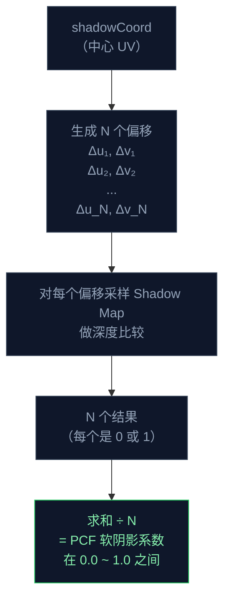

这一节我们会讲解：

- 为什么第 4.3 节的硬阴影有锯齿——Shadow Map 像素不是无限小的
- PCF（Percentage Closer Filtering）的核心思路：多采几次，再平均
- 采样核的设计：均匀网格 vs 泊松圆盘（Poisson Disk）
- 随机旋转——用噪声打破采样规律，消除条带伪影
- 高级 bias：法线偏移（Normal Offset Bias）
- 完整的 PCF 阴影函数代码

在第 4.3 节你终于看到了方块脚下的第一块阴影。但说实话——它有点丑。边缘锐利得像刀切，放大看全是像素格子。远处的阴影尤其严重，像一团马赛克。

内心独白：Shadow Map 是有分辨率的——可能是 1024×1024，也可能是 2048×2048。不管多大，它总有像素边界。一个像素要么被判定为阴影，要么不是。于是整个阴影边缘像一排密密麻麻的楼梯。

这个问题叫**锯齿**。而它的标准解药叫 **PCF**。

> 硬阴影的问题不是阴影颜色不对，而是阴影的判断只有 0 和 1。PCF 的说服力来自"不只是看一个像素"。

---

## PCF 的核心思路

PCF 的全称是 Percentage Closer Filtering，翻译过来挺直白：**"取周围几个点的阴影值，算出百分比"**。

如果你在 Shadow Map 上只采样一次，你只有两个选项：黑还是白。如果你采样 9 次呢？如果 9 次中有 5 次说"在阴影里"，4 次说"照亮了"，那这个像素大概就是 5/9 ≈ 0.56 的阴影强度。

数学上很简单：

$$
shadow = \frac{1}{N} \sum_{i=1}^{N} \text{shadowTest}\left(u + \Delta u_i, v + \Delta v_i\right)
$$

其中每个 `shadowTest` 返回 1.0（照亮）或 0.0（阴影）。你采样 N 次，加起来，除以 N。



多采样的代价是性能——每次采样都是一次纹理读取。但 shadow pass 只渲染一次（至少在你的阶段），PCF 的额外开销相比之下非常值得。

> PCF 不是对阴影颜色做模糊。是对"是不是阴影"这个判断做多次采样，然后平均。这是"更近的滤波"（percentage closer），不是普通的纹理滤波。

---

## 采样核的设计

现在我们面临一个问题：偏移量 `(Δu_i, Δv_i)` 怎么取？

### 方案一：均匀网格——不好看

最朴素的想法是在一个 3×3 的格子里均匀采样：

```glsl
const vec2 offsets[9] = vec2[9](
    vec2(-1, -1), vec2( 0, -1), vec2( 1, -1),
    vec2(-1,  0), vec2( 0,  0), vec2( 1,  0),
    vec2(-1,  1), vec2( 0,  1), vec2( 1,  1)
);

float shadow = 0.0;
for (int i = 0; i < 9; i++) {
    vec3 coord = shadowCoord;
    coord.xy += offsets[i] * texelSize;
    shadow += shadow2D(shadowtex0, coord).r;
}
shadow /= 9.0;
```

这个方案跑起来，阴影边缘确实变柔了——但你会发现一个奇怪的现象：阴影不是柔和，而是变成了 9 条平行的细线！这是因为均匀网格的采样点排列得太整齐了，当 3×3 的格子覆盖在 Shadow Map 的像素网格上时，会产生规则的摩尔纹。

> 规则采样产生规则伪影。你需要不规则。

### 方案二：泊松圆盘（Poisson Disk）——好看很多

泊松圆盘采样会在一个圆形区域内随机分布采样点，同时保证任意两点之间不会靠得太近。结果不会产生明显的格子伪影。

下面是一个 16 点的泊松圆盘采样核，点与点之间有最小距离约束：

```glsl
const vec2 poissonDisk[16] = vec2[16](
    vec2(-0.9420,  0.3993), vec2( 0.9456, -0.7689),
    vec2(-0.0942, -0.9294), vec2( 0.3450,  0.2939),
    vec2(-0.7155,  0.1693), vec2(-0.2640, -0.2159),
    vec2( 0.4160,  0.1829), vec2(-0.6320, -0.5269),
    vec2( 0.1280,  0.5884), vec2(-0.3870,  0.7314),
    vec2( 0.8600, -0.0890), vec2(-0.7710, -0.4020),
    vec2(-0.0880, -0.5470), vec2( 0.5880,  0.6960),
    vec2(-0.4630,  0.0860), vec2( 0.2230, -0.8290)
);
```

每一点都在正方形 `[-1, 1]²` 内，但分布是不规则的。这 16 个点就是你采样时的偏移量。

---

## 随机旋转——打破规律的最后一步

泊松圆盘很好，但它是**静态**的。每一帧都用相同的偏移方向，时间久了你的眼睛还是会察觉到某种规律——尤其是在阴影边缘缓慢移动时。

所以我们加一个随机旋转。Iris 提供了 `frameTimeCounter`——一个在每帧都变化的值。用它做一个简单的旋转：

```glsl
// 用 frameTimeCounter 生成一个伪随机角度
float angle = fract(sin(dot(shadowCoord.xy, vec2(12.9898, 78.233))) * 43758.5453) * 6.2832;

// 旋转矩阵
float cosAngle = cos(angle);
float sinAngle = sin(angle);
```

然后把每个采样点旋转：

```glsl
vec2 rotatedOffset = vec2(
    offset.x * cosAngle - offset.y * sinAngle,
    offset.x * sinAngle + offset.y * cosAngle
);
```

> 随机旋转让每帧的采样方向都不同，视觉上打破了所有重复规律。代价只是每像素一次 `sin` 和 `cos`。

注意这里的随机种子：我们用了 `shadowCoord.xy` 的哈希值。你也可以用 `gl_FragCoord.xy` 或 `worldPos.xy`——只要每像素不一样、每帧也差不多不一样就行。

---

## 法线偏移（Normal Offset Bias）：比 slope-scale 更稳的 bias

在第 4.3 节我们用了 slope-scale bias。PCF 多采样以后，这个 bias 可能不够稳定——因为偏移方向不同，shadow acne 对某些采样方向仍然敏感。

一个更稳的办法是 **法线偏移**：在比较深度之前，沿着表面法线方向把世界坐标微微外推。

```glsl
// 法线偏移：沿法线方向把采样点推出表面
float normalBias = 0.02; // 可调
vec3 biasedPos = worldPos + normal * normalBias;

// 然后再变换 biasedPos 到 shadow 空间
vec4 shadowViewPos = shadowModelView * vec4(biasedPos, 1.0);
```

为什么这比 slope-scale 更合理？因为 shadow acne 的根本原因是表面和 Shadow Map 的深度太接近。沿法线方向推开，就等于把整个表面从 Shadow Map 的等深线"剥出去"，不再和它竞争。而且法线偏移不依赖光照角度——垂直表面和水平表面都适用。

通常你可以同时用法线偏移和 slope-scale bias。前者保证几何体不"戳进"Shadow Map，后者在已有保证的基础上再加一层安全网。

---

## 完整的 PCF 阴影函数

现在把所有零件组装起来——泊松圆盘采样、随机旋转、法线偏移、slope-scale bias，再加一个可调半径：

```glsl
uniform sampler2DShadow shadowtex0;  // Iris 内部类型，兼容 sampler2D
uniform mat4 shadowModelView;
uniform mat4 shadowProjection;
uniform vec3 sunPosition;
uniform float frameTimeCounter;
uniform vec2 shadowMapResolution;  // 可选：用于 texelSize

const vec2 poissonDisk[16] = vec2[16](
    vec2(-0.9420,  0.3993), vec2( 0.9456, -0.7689),
    vec2(-0.0942, -0.9294), vec2( 0.3450,  0.2939),
    vec2(-0.7155,  0.1693), vec2(-0.2640, -0.2159),
    vec2( 0.4160,  0.1829), vec2(-0.6320, -0.5269),
    vec2( 0.1280,  0.5884), vec2(-0.3870,  0.7314),
    vec2( 0.8600, -0.0890), vec2(-0.7710, -0.4020),
    vec2(-0.0880, -0.5470), vec2( 0.5880,  0.6960),
    vec2(-0.4630,  0.0860), vec2( 0.2230, -0.8290)
);

float calculateSoftShadow(vec3 worldPos, vec3 normal, float filterRadius) {
    // 法线偏移
    vec3 biasedPos = worldPos + normal * 0.02;

    // 变换到 Shadow Map 空间
    vec4 shadowViewPos = shadowModelView * vec4(biasedPos, 1.0);
    vec4 shadowClipPos = shadowProjection * shadowViewPos;

    if (shadowClipPos.w <= 0.0) return 1.0;

    vec3 shadowNDC = shadowClipPos.xyz / shadowClipPos.w;
    vec3 shadowCoord = shadowNDC * 0.5 + 0.5;

    // UV 范围检查
    if (shadowCoord.x < 0.0 || shadowCoord.x > 1.0 ||
        shadowCoord.y < 0.0 || shadowCoord.y > 1.0) {
        return 1.0;
    }

    // Slope-scale bias
    vec3 sunDir = normalize(sunPosition);
    float slopeBias = max(0.005 * (1.0 - dot(normal, sunDir)), 0.0005);
    shadowCoord.z -= slopeBias;

    // 随机旋转（基于像素位置的伪随机角度）
    float randomAngle = fract(sin(dot(shadowCoord.xy,
        vec2(12.9898, 78.233))) * 43758.5453) * 6.283185307;
    float cosA = cos(randomAngle);
    float sinA = sin(randomAngle);

    // 用 Shadow Map 分辨率计算 texel 大小
    vec2 texelSize = 1.0 / vec2(1024.0); // 根据实际分辨率调整

    // PCF：16 个泊松圆盘采样
    float shadow = 0.0;
    for (int i = 0; i < 16; i++) {
        vec2 offset = poissonDisk[i] * texelSize * filterRadius;

        // 随机旋转
        vec2 rotatedOffset = vec2(
            offset.x * cosA - offset.y * sinA,
            offset.x * sinA + offset.y * cosA
        );

        vec3 sampleCoord = shadowCoord;
        sampleCoord.xy += rotatedOffset;

        shadow += shadow2D(shadowtex0, sampleCoord).r;
    }

    return shadow / 16.0;
}
```

在 `deferred.fsh` 里调用它：

```glsl
float shadow = calculateSoftShadow(worldPos, normal, 2.5);
vec3 litColor = albedo * (directLight * shadow + ambientLight);
```

这里的 `filterRadius` 控制软阴影的半径。2.5 是一个中等的值——太小了阴影还是硬，太大了阴影会糊掉。你可以把它绑定到 `shaders.properties` 做一个滑杆，让用户自己调。


---

## 性能考量：16 次采样多吗？

对于一个高清光影来说，16 次不算多。BSL 的阴影采样可以到 32 甚至 64 次。对于我们教程的阶段，16 次泊松圆盘 + 随机旋转已经是一个在质量和性能之间很舒服的平衡点。

如果你想要更轻量的版本，可以把采样核缩小到 8 或 9 个点，并把 `filterRadius` 设小。如果你想要更柔和的阴影，增加到 25 个点。这些都是可调的旋钮——你不需要一次选对。

> 采样次数、滤波半径、bias 大小——PCF 的三个旋钮。拧哪一个都影响最终画面的性格。

---

## 本章要点

- 硬阴影的锯齿来源于 Shadow Map 的有限分辨率——每个像素只有"是/否阴影"两种答案。
- PCF 的核心是采样周围多个 Shadow Map 位置，取阴影判断的平均值，使边缘柔化。
- 均匀采样核会产生规则伪影（条纹）；泊松圆盘采样分布不规则，能显著减少伪影。
- 随机旋转打破帧间重复规律，用 `frameTimeCounter` 或像素坐标作为伪随机种子。
- 法线偏移 `worldPos + normal * bias` 把采样点推出表面，比纯 depth bias 更稳定。
- slope-scale bias 仍然是好用的补充：`max(base * (1 - dot(N,L)), minBias)`。

> 软阴影不是让阴影变模糊——它是承认 Shadow Map 不是无限精确的，然后用统计的方式告诉你："这一片大概有 60% 在阴影里"。

下一节：[4.5 — 实战：初次阴影](/04-shadows/05-project/)
