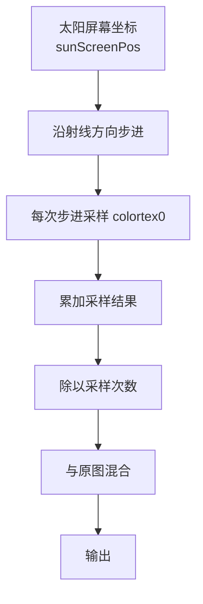

这一节我们会讲解：

- 什么是 God Rays，为什么屏幕空间也能"看见"光束
- 径向模糊的核心思路：从太阳位置沿着射线方向一路采过去
- 步进采样：每次走多远，采多少次，为什么不能一次采完
- `length(uv - sunScreenPos)` 衰减：离太阳越远光线越散
- 如何把太阳的屏幕坐标从 3D 方向算出来
- 完整的 composite pass 实现

好吧，你肯定在现实中见过这个效果。午后阳光从云层缝隙或者树叶间洒下来，你能看见一道道明亮的光束——不是光本身（光本身当然看不见），而是空气中被照亮的微粒勾勒出了光的路径。在图形学里这叫体积光，英文俗称 God Rays，翻译过来就是"上帝射线"。挺形象的名字。

在 Minecraft 里，这个效果不是物理模拟出来的——每一帧要在 composite pass 里算，没有这么多预算跑体积散射。但我们可以用一个很聪明的近似：屏幕空间径向模糊。

---

## 核心直觉：从太阳往外"抹"光

内心独白来一下：屏幕上已经有了画好的场景，太阳在画面右边的某个位置。现在，如果我把太阳位置当作起点，往画面的左下角一路拖——每拖一点就在当前位置取一点颜色，全部加起来——我在做什么？

我在制造一个从太阳位置向外扩散的光痕。那些被"拖"过的像素，最终画面里会带着一层叠加的亮色。



> 径向模糊的本质不是模糊整张图，而是只从太阳位置出发，沿直线向外扩散。

---

## 第一步：找到太阳在屏幕上的位置

太阳本来在 3D 世界里，但我们的 composite pass 只有屏幕坐标。需要把 `sunPosition`（3D 方向）变成屏幕上的 UV 坐标。

内心独白：`sunPosition` 给的是眼睛空间的方向向量，也就是"从我眼睛看，太阳在哪个方向"。如果我把这个方向投影到屏幕上，就能得到太阳在屏幕上的位置。

```glsl
uniform vec3 sunPosition;
uniform mat4 gbufferProjection;

// 把眼睛空间的太阳方向投影到裁剪空间
vec4 sunClip = gbufferProjection * vec4(normalize(sunPosition), 0.0);

// 透视除法得到 NDC
vec3 sunNDC = sunClip.xyz / sunClip.w;

// NDC 转 UV：[-1,1] → [0,1]
vec2 sunScreenPos = sunNDC.xy * 0.5 + 0.5;
```

等一下，如果太阳在你后面呢？那 `sunNDC.z` 会是负的——太阳在屏幕外面。这时候光柱效果不应该出现，或者沿反方向衰减。但在简单实现里，我们只检查 sunScreenPos 是否在 0~1 范围内。如果太阳在屏幕外，你可能根本就不画光柱，或者用一小段投影把光从屏幕边缘射进来。

> 先确保 sunScreenPos 在 [0,1]×[0,1] 里面，否则光柱不知道从哪里射。

---

## 第二步：沿射线步进采样

现在 `sunScreenPos` 已知。对于每个屏幕像素，它的 UV 坐标是 `texcoord`（从 `composite.vsh` 传下来的）。方向就是从太阳到当前像素：

$$
\text{direction} = \operatorname{normalize}(\text{texcoord} - \text{sunScreenPos})
$$

我们沿着这个方向后退几步，每一步取一点颜色，累加起来：

```glsl
#version 330 compatibility

uniform sampler2D colortex0;
uniform vec2 sunScreenPos;
uniform float viewWidth;
uniform float viewHeight;

in vec2 texcoord;

/* RENDERTARGETS: 0 */
layout(location = 0) out vec4 outColor;

void main() {
    vec3 color = texture(colortex0, texcoord).rgb;

    vec2 uv = texcoord;
    vec2 delta = uv - sunScreenPos;

    // 步进参数
    int steps = 16;
    float stepLength = length(delta) / float(steps);
    vec2 stepVec = normalize(delta) * stepLength;

    vec3 accumulated = vec3(0.0);
    float totalWeight = 0.0;

    for (int i = 0; i < steps; i++) {
        uv -= stepVec;  // 从太阳往外走
        // 确保 UV 在有效范围
        if (uv.x < 0.0 || uv.x > 1.0 || uv.y < 0.0 || uv.y > 1.0) break;

        vec3 sampleColor = texture(colortex0, uv).rgb;

        // 权重：离太阳越远越轻
        float dist = length(uv - sunScreenPos);
        float weight = pow(1.0 - clamp(dist, 0.0, 1.0), 2.0);

        accumulated += sampleColor * weight;
        totalWeight += weight;
    }

    if (totalWeight > 0.0) {
        accumulated /= totalWeight;
    }

    // 混合到原画面
    float intensity = 0.3;
    outColor = vec4(color + accumulated * intensity, 1.0);
}
```

---

## 内心独白：这段步进在干啥

`delta` 是从太阳到当前像素的向量。如果我直接在原图上叠一个从太阳过来的亮色，那只是一个径向渐变——每个像素都一样亮。但这不是 God Rays。

God Rays 应该只在**某些地方**出现。为什么？因为太阳光被遮挡了。如果太阳到你的像素之间没有树，光直达地面，你不会看到"光束"——你只看到地面是亮的。如果中间有一片叶子挡住了光，叶子被照得很亮，而叶子周围因为大气散射，你会看到一束发散的光。

所以 `stepVec` 的意思是这样的：我从太阳朝当前像素走，一路采样。如果这路上有亮的东西（比如被照亮的树叶、云朵边缘），这个亮色就被带到了其他像素的位置上。于是——光好像从树叶里"漏"出去了。

换句话说，我们不是在**造**光，而是在**扩散**亮色。

---

## 第三步：距离衰减

`weight = pow(1.0 - dist, 2.0)` 的意思是离太阳越远，每一步采样的贡献越小。这在物理上也说得通：光的能量随着距离平方反比衰减，而且扩散开的亮色在远处本来就应该不明显。如果没有这行，你的光柱会在整张画面上均匀发亮，看起来像把太阳抹了一个屏幕。

你可以调节 `pow` 的指数。指数越高（比如 4.0 或 6.0），光柱越集中在太阳周围；指数越低（比如 1.0），光柱越远。调这个参数的时候你会体验到一种原始的快感：一个数字，整个画面气质就变了。

---

## 第四步：亮度提取——只扩散"亮的东西"

上一段代码的一个问题是：它把所有颜色都往外拖了。这意味着草方块也会被扩散成一个奇怪的径向色块。这不是我们想要的。

解决办法很简单：**只对足够亮的像素做步进采样。** 换句话说，在采样的时候加一个阈值：

```glsl
vec3 sampleColor = texture(colortex0, uv).rgb;

// 亮度阈值：只有超过某个亮度的像素才参与扩散
float luminance = dot(sampleColor, vec3(0.299, 0.587, 0.114));
if (luminance < 0.7) {
    sampleColor = vec3(0.0);  // 不够亮就不参与
}
```

这下就对了：天空的太阳周围是亮的→扩散形成光柱；树冠被太阳照亮的边缘是亮的→扩散成从树缝射出的光束；地面、墙壁暗→不扩散。画面立刻从"一团乱涂"变成了"光线在流动"。

阈值 `0.7` 可以调。暗一点（比如 `0.5`）会让更多像素参与扩散，光柱更"宽"；亮一点（比如 `0.9`）会让光束更干净、对比更强。

> 提取亮部、只扩散亮部——这就是体积光从一团乱涂变成光束的关键转折。

---

## 完整 composite 实现

把上面的东西拼在一起，完整的 `composite.fsh` 光线部分可以这样写：

```glsl
#version 330 compatibility

uniform sampler2D colortex0;
uniform vec3 sunPosition;
uniform mat4 gbufferProjection;
uniform float viewWidth;
uniform float viewHeight;
uniform int worldTime;

in vec2 texcoord;

/* RENDERTARGETS: 0 */
layout(location = 0) out vec4 outColor;

void main() {
    vec3 color = texture(colortex0, texcoord).rgb;

    // ---- 1. 计算太阳屏幕坐标 ----
    vec4 sunClip = gbufferProjection * vec4(normalize(sunPosition), 0.0);
    vec3 sunNDC = sunClip.xyz / sunClip.w;
    vec2 sunScreen = sunNDC.xy * 0.5 + 0.5;

    // 教程截图/GIF 使用日落 preset，把太阳稳定放在画面内，方便观察光束动画。
    #ifdef FORCE_SUNSET
        sunScreen = vec2(0.16, 0.24);
        sunNDC.z = 0.5;
    #endif

    // 太阳在屏幕外就不画光柱
    if (sunNDC.z < 0.0 || sunScreen.x < 0.0 || sunScreen.x > 1.0 ||
        sunScreen.y < 0.0 || sunScreen.y > 1.0) {
        outColor = vec4(color, 1.0);
        return;
    }

    // ---- 2. 步进采样 ----
    vec2 uv = texcoord;
    vec2 delta = uv - sunScreen;
    float totalDist = length(delta);

    int steps = 20;
    vec2 stepVec = delta / float(steps);

    vec3 accumulated = vec3(0.0);
    float totalWeight = 0.0;

    for (int i = 0; i < steps; i++) {
        uv -= stepVec;

        if (uv.x < 0.0 || uv.x > 1.0 || uv.y < 0.0 || uv.y > 1.0) break;

        vec3 sampleColor = texture(colortex0, uv).rgb;

        // 只保留亮部
        float lum = dot(sampleColor, vec3(0.299, 0.587, 0.114));
        if (lum < 0.65) sampleColor = vec3(0.0);

        float dist = length(uv - sunScreen);
        float weight = 1.0 - clamp(dist, 0.0, 1.0);
        weight = pow(weight, 4.0);

        accumulated += sampleColor * weight;
        totalWeight   += weight;
    }

    if (totalWeight > 0.0) {
        accumulated /= totalWeight;
    }

    // ---- 3. 混合 ----
    vec3 shafts = accumulated * 0.65 * max(0.0, 1.0 - totalDist * 0.5);

    #ifdef FORCE_SUNSET
        float disk = 1.0 - smoothstep(0.00, 0.035, totalDist);
        float halo = 1.0 - smoothstep(0.02, 0.28, totalDist);
        float rayAngle = atan(delta.y, delta.x);
        float rayPulse = sin(rayAngle * 14.0 + float(worldTime) * 0.16) * 0.5 + 0.5;
        float animatedShaft = smoothstep(0.25, 1.0, rayPulse) * halo * 0.22;
        shafts += vec3(1.0, 0.70, 0.28) * (disk * 1.3 + halo * 0.38 + animatedShaft);
    #endif

    outColor = vec4(color + shafts, 1.0);
}
```


---

## 优化提示：降采样

20 步采样，每步一次 `texture()`，整张屏幕 1920×1080 就是大约四千万次纹理采样。在集成显卡上，这个耗费可能让你帧率腰斩。一个常规的优化是：在半分辨率（甚至四分之一分辨率）的缓冲上跑 God Rays，然后放大回到全分辨率。原理很简单——光柱本身就是模糊的，降低分辨率几乎没有视觉损失。

这么做需要额外的 composite pass 或一个单独的 colortex 缓冲来存半分辨率的场景颜色。如果你现在是第一次做体积光，先在全分辨率上跑通再说。优化是后面的事。

---

## 本章要点

- God Rays 的核心是屏幕空间径向模糊——从太阳位置沿射线向外逐步采样并累加。
- 太阳的 3D 方向通过 `gbufferProjection` 矩阵投影到屏幕坐标。
- 步进采样`steps`控制走多少次，`stepVec`控制每次走多远：步数多→光柱平滑但贵，步数少→快但有条纹。
- `pow(1.0 - dist, N)` 衰减指数控制光束的指向性——指数越高，光束越集中。
- 亮度阈值是精华：只扩散亮部，不扩散暗部，光柱才有"穿过障碍物"的质感。
- 降采样是性能优化的第一要义，但初学者先跑通全分辨率再优化。

下一节：[5.4 — 自定义雾效：让远处的东西慢慢消失在底色里](/05-atmosphere/04-fog/)
