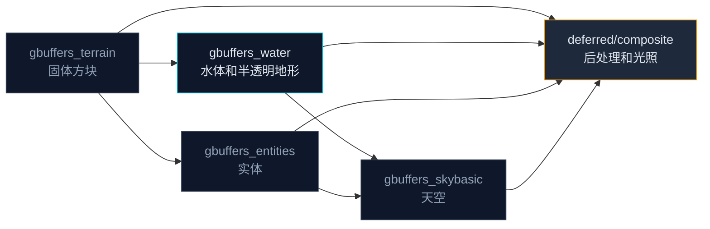

这一节我们会讲解：

- 在 Minecraft 里，水和其他方块到底有什么本质不同
- 为什么 `gbuffers_water` 不能直接用 `gbuffers_terrain` 代替
- 水的渲染管线在全屏管线中处于什么位置
- `gbuffers_water` 拿到哪些几何属性，又丢了哪些

好吧，我们开始吧。你已经用 `gbuffers_terrain` 画了很久的方块了——给它们算光照、做法线可视化、甚至改成卡通渲染。也许你会想：水不也是一个方块吗？我在 `gbuffers_terrain.fsh` 里多加一个 `if` 判断"这是水"，不就行了？

内心独白一下：如果水和其他方块真的一样，那为什么你从来没见过哪个光影把水面写进 `gbuffers_terrain`？

答案是：水有三个属性，每一个都让 `gbuffers_terrain` 的写法失效。

---

## 水的三重身份

第一，水是**半透明的**。石头不透明，画完扔进颜色缓冲就完事了。可水呢？你得先画好水底的东西——河床、水下的方块、沉在水里的实体——然后才把水这个半透明的膜覆上去。如果写进 `gbuffers_terrain`，你的片元着色器根本不知道水底已经画了没有，因为它前面可能画的是水底的沙砾，也可能还没画到。

第二，水是**会动的**。石头不需要动，但水面需要波浪。这波浪不是平移整张贴图，而是沿法线方向扰动——让平平的水面看起来有起伏。法线扰动这件事在 `gbuffers_terrain` 里也能做，但麻烦的是：波浪需要一个全局时钟 `frameTimeCounter` 驱动，而且波浪的速度、方向必须全部一致，不能有的方块快有的方块慢。水还有"水流方向"——Minecraft 会在水的顶点数据里给出流速信息，这在普通地形方块里根本没有。

第三，水是**能反射的**。你在水边站着，能看到天空倒映在水面，能看到远处山的倒影。这不是光照，这是反射。反射需要知道水面以上的场景长什么样——要么提前渲染到一张反射纹理，要么运行时在屏幕空间里追踪。这两个选择都要求水在管线中有自己的位置，不能在 `gbuffers_terrain` 里混过去。

> 水不是"有点特别的方块"，它是一个需要在正确的时间点被单独处理的渲染对象。

---

## Iris 怎么安排水的位置

在 Iris 的管线中，`gbuffers_water` 的执行时机和 `gbuffers_terrain` 错开了。大体顺序是：



注意 `gbuffers_water` 在 `gbuffers_terrain` 之后。这意味着当水的片元着色器运行时，水底的方块（地形）已经写进了 G-Buffer。于是你可以在 `gbuffers_water.fsh` 里读取已经存在的深度或颜色缓冲，来判断"这个像素下面有没有方块"、"水面离镜头有多远"。这个顺序不是巧合——它就是 Iris 对"半透明需要先画不透明物体"这个图形学常识的实现。

顺便说一下，`gbuffers_water` 这个程序名也来自 Iris 源码。`ProgramId.java` 中有一个 `Water(ProgramGroup.Gbuffers, "water", TexturedLit)`，Iris 遇到源码文件 `gbuffers_water.vsh` 和 `gbuffers_water.fsh` 就会把它们绑到这个程序上。所以名字不能乱写，必须是 `gbuffers_water`。

---

## gbuffers_water 拿到了什么

水也是几何体，所以它和 `gbuffers_terrain` 一样能拿到顶点位置、法线、贴图坐标：

```glsl
#version 330 compatibility

out vec2 texcoord;
out vec4 vertexColor;
out vec3 normal;
out vec2 lmcoord;

void main() {
    gl_Position = gl_ModelViewProjectionMatrix * gl_Vertex;
    texcoord = (gl_TextureMatrix[0] * gl_MultiTexCoord0).xy;
    vertexColor = gl_Color;
    normal = gl_NormalMatrix * gl_Normal;
    lmcoord = (gl_TextureMatrix[1] * gl_MultiTexCoord1).xy;
}
```

这看起来和 2.2 节的 `gbuffers_terrain.vsh` 几乎一模一样。没错——顶点阶段的骨架是一样的，因为无论是水还是石头，它们都是 3D 网格，都需要被投影到屏幕。真正的不同在片元阶段。

但有一个微妙的地方：水的 `gl_Color` 可能带着 Minecraft 的水体颜色。海洋、沼泽、河流的生物群系水色各不相同，这部分颜色常常夹在 `vertexColor` 里传进来。所以你不应该把水的贴图颜色直接裸用，而要注意它已经被 `vertexColor` 染过一层了。

---

## gbuffers_water 丢掉了什么

内心独白换一下：既然水比石头多这么多特性，那它付出的代价是什么？

代价是：水的光照逻辑必须自己管。在 `gbuffers_terrain` 里，你可以依赖 lightmap 和 `sunPosition` 做一套完整的漫反射+烘焙光。但水不能照抄。为什么？

因为水面上的光照和方块不一样。方块的亮度取决于"这个面朝不朝太阳"，但水面的亮度有一部分来自水底的散射光，有一部分来自反射的天空光，还有一部分来自水本身的体积颜色。你用 `max(dot(N, L), 0.0)` 直接算水的亮度，会发现水底暗处的水面也跟着变暗——这不对，因为深水处水面一样可以反射天空。

所以 `gbuffers_water.fsh` 不能直接从 2.3 节拷光照代码。水需要一个更适合它的光照模型——先从反射和折射开始，再混上水体的颜色。Fresnel 效应（第 6.3 节）就是这个模型的入口。

> gbuffers_water 继承了 gbuffers_terrain 的几何接口，但需要一套独立的着色逻辑。

---

## 本章要点

- 水是半透明的，必须在水底的方块画完之后才能覆上去——所以它需要自己的 pass。
- 水是动态的，需要 `frameTimeCounter` 驱动波浪动画，方向一致性强。
- 水是反射的，需要访问已渲染的场景信息（深度或颜色缓冲）。
- `gbuffers_water` 执行在 `gbuffers_terrain` 之后，这个顺序保证了水底方块先被写入 G-Buffer。
- `gbuffers_water` 的顶点阶段骨架和 `gbuffers_terrain` 相同，但片元着色逻辑完全不同——不能照搬普通方块的光照。
- Iris 通过 `ProgramId` 里的 `Water` 条目识别 `gbuffers_water` 程序，文件名必须严格匹配。


这里的要点是：在动手写水之前，先接受它不是一个普通方块。它是一个独立的渲染对象，有独立的 pass、独立的着色逻辑。

下一节：[6.2 — 法线贴图水波：让水面动起来](/06-water/02-water-waves/)
