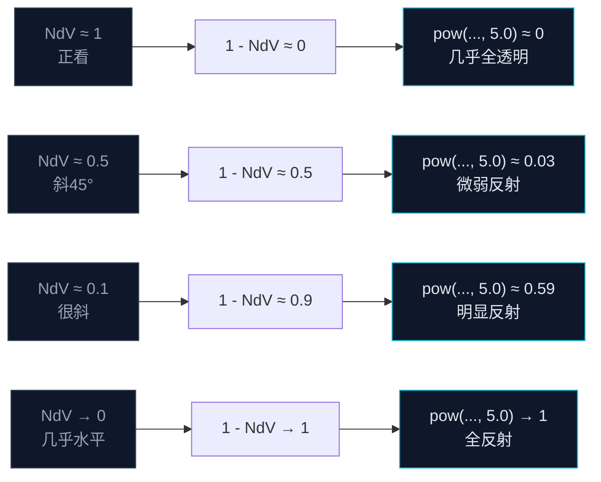

这一节我们会讲解：

- 什么是 Fresnel 效应——不用背公式，先看生活里的例子
- `dot(N, V)` 为什么是 Fresnel 的输入
- `pow(1.0 - dot(N, V), 5.0)` 每一部分都在做什么
- 反射颜色和折射颜色从哪里来
- 在 `gbuffers_water.fsh` 中集成 Fresnel 混合

好吧，我们开始吧。第 6.2 节我们把水面法线扰动起来了，但水现在看起来还是一块均匀的颜色——它既不知道什么时候该反射天空，也不知道什么时候该透出水底。这就是 Fresnel 的工作。

---

## 先别看公式，低头看水

内心独白来一下：你最接近"体验 Fresnel"的时刻，大概是在游泳池边。站直了低头看正下方——水很清，池底的瓷砖历历在目。但抬头看远处的水面——咦，完全看不见池底了，只能看到水面反射的天花板和灯光。

同一个水面，同一池水，为什么正看透、斜看反？

物理书上会说：光在两种介质界面上会部分反射、部分折射。入射角越大（越斜），反射越强。入射角越小（越正），透射越强。这个"入射角决定反射比例"的规律，就叫 Fresnel 效应。

你不需要背 Maxwell 方程组。你只需要记住一个场景：**正看池底，斜看倒影**。

> Fresnel 效应就是：视线越接近水面法线方向 → 越透明；越偏离法线方向 → 越反光。

---

## 把"正不正"翻译成数字

现在问题是：给一个像素，我怎么能判断人在"正着看"还是"斜着看"这个水面？

你手上有两个向量：

- `N`：水面法线（第 6.2 节扰动过的那个 `waveNormal`）。
- `V`：视线方向——从水面位置指向摄像机。

如果人正着看，视线和法线几乎平行，`N` 和 `V` 方向相近。如果人斜着看，视线擦着水面过去，`N` 和 `V` 近乎垂直。

我们怎么量两个方向有多"接近"？点积：

```glsl
float NdV = dot(N, V);
```

正看时 `NdV ≈ 1.0`，斜看时 `NdV ≈ 0.0`。所以 `NdV` 就是一个"正看指数"。

但 Fresnel 需要的是"斜着看有多反射"，也就是 `NdV` 的反面——越大越透明，越小越反射：

```glsl
float fresnel = 1.0 - NdV;
```

好了，正看（`NdV=1`）→ `fresnel=0`（不反射，全透明），斜看（`NdV=0`）→ `fresnel=1`（全反射）。

---

## 为什么要有 `pow(..., 5.0)`

直接拿 `1.0 - NdV` 当混合系数有个问题：变化太快了。你稍微偏一点头，水面就从透明跳成镜子。真实世界没那么陡——反射率的上升是曲线的，从正看开始慢慢增加，到了很斜的角度才飙升。

所以我们需要给它加一个**非线性**。GLSL 里最方便的非线性就是 `pow`：

$$
F = (1 - \operatorname{dot}(N, V))^{5.0}
$$

把指数设成 5.0，就得到一条前半段缓慢爬升、后半段陡峭上升的曲线：



顺便说一下，5.0 不是唯一的选择。BSL 里有时候会看到 2.0 到 8.0 之间的指数，越大的指数意味着反射越晚才开始，但开始以后升得更快。你可以把它当成"Fresnel 锐度滑杆"来理解。

---

## 反射和折射从哪来

Fresnel 算出了混合比例，但混合的两端是什么？

- **折射（refraction）**：你"看透水面"看到的颜色——水底的地形、水里的方块，加上水本身的体积色（蓝绿色）。
- **反射（reflection）**：你看到的水面倒影——天空、远处的山、岸边的树。理想情况下需要用屏幕空间反射（第 6.4 节）来获取；在简单的实现里，也可以近似成天空颜色。

所以在 `gbuffers_water.fsh` 中，你需要两个储备好的颜色，然后把它们用 Fresnel 系数混在一起：

```glsl
vec3 refractionColor = waterBaseColor;  // 暂时用水的底色代替折射
vec3 reflectionColor = skyColor;         // 暂时用天空色代替反射

float fresnel = pow(1.0 - abs(dot(N, V)), 5.0);
vec3 waterColor = mix(refractionColor, reflectionColor, fresnel);
```

这里的 `mix(a, b, t)` 就是 `a * (1-t) + b * t` 的语法糖。当 `fresnel = 0` 时输出全折射；`fresnel = 1` 时输出全反射。

---

## 完整集成到 gbuffers_water.fsh

把第 6.2 节的水波法线和本节的 Fresnel 拼在一起：

```glsl
#version 330 compatibility

uniform sampler2D noisetex;
uniform float frameTimeCounter;
uniform vec3 sunPosition;      // 近似天空色方向
uniform vec3 skyColor;         // 天空色（若 Iris 版本支持）

in vec2 texcoord;
in vec4 vertexColor;
in vec3 normal;
in vec2 lmcoord;

/* RENDERTARGETS: 0,1,2 */
layout(location = 0) out vec4 outColor;
layout(location = 1) out vec4 outNormal;
layout(location = 2) out vec4 outMaterial;

void main() {
    float time = frameTimeCounter;
    vec2 uv = texcoord;
    float step = 0.002;

    // ── 双层水波法线（来自 6.2 节）──
    float nL0 = texture(noisetex, uv * 2.0 + vec2(time * 0.02, time * 0.01)).r;
    float nL1 = texture(noisetex, uv * 2.0 + vec2(time * 0.02 + step, time * 0.01)).r;
    float nL2 = texture(noisetex, uv * 2.0 + vec2(time * 0.02, time * 0.01 + step)).r;
    float dxL = nL1 - nL0;
    float dyL = nL2 - nL0;

    float nH0 = texture(noisetex, uv * 8.0 + vec2(-time * 0.08, time * 0.06)).r;
    float nH1 = texture(noisetex, uv * 8.0 + vec2(-time * 0.08 + step, time * 0.06)).r;
    float nH2 = texture(noisetex, uv * 8.0 + vec2(-time * 0.08, time * 0.06 + step)).r;
    float dxH = nH1 - nH0;
    float dyH = nH2 - nH0;

    float dx = dxL * 0.7 + dxH * 0.3;
    float dy = dyL * 0.7 + dyH * 0.3;
    vec3 N = normalize(vec3(-dx, -dy, 1.0));

    // ── 视线方向 ──
    // 在 gbuffers 中，摄像机在原点沿 Z 轴看；V 通常近似为 (0, 0, 1)
    vec3 V = normalize(vec3(0.0, 0.0, 1.0));

    // ── Fresnel ──
    float fresnel = pow(1.0 - abs(dot(N, V)), 5.0);

    // ── 折射色（暂时用水底色 + 顶点染色）──
    vec3 waterBase = vec3(0.2, 0.5, 0.8);  // 浅海蓝
    vec3 refractionColor = waterBase * vertexColor.rgb;

    // ── 反射色（暂时用天空色近似）──
    // 真实反射在第 6.4 节用 SSR 替换
    vec3 reflectionColor = skyColor;

    // ── Fresnel 混合 ──
    vec3 waterColor = mix(refractionColor, reflectionColor, fresnel);

    outColor = vec4(waterColor, 1.0);
    outNormal = vec4(N * 0.5 + 0.5, 1.0);
    outMaterial = vec4(1.0, 0.0, 0.0, 1.0);
}
```

内心独白再看一遍：`dot(N, V)` 取 `abs` 是因为在有些坐标体系下点积可能为负——我们只关心夹角的大小，不关心正负号。`pow(1.0 - abs(NdV), 5.0)` 把"视觉斜度"变成反射强度。最后 `mix(refractionColor, reflectionColor, fresnel)` 在两个极端之间平滑过渡。


> 有了 Fresnel，水面不再是一块均匀的蓝——它近处透，远处反，开始有了和现实水面一样的视觉特征。

---

## 本章要点

- Fresnel 效应描述的是"视线越斜→反射越强"的物理规律，不需要推 Maxwell 方程，记住游泳池就够了。
- `dot(N, V)` 度量视线和法线有多平行：正看 ≈ 1，斜看 ≈ 0。
- `pow(1.0 - NdV, 5.0)` 把线性比例变成非线性的反射曲线，缓慢爬升然后猛涨。
- `mix(refraction, reflection, fresnel)` 在透射和反射之间平滑过渡。
- 指数 5.0 不是唯一的——越大反射越晚开始但越陡，可以作为效果调节。
- 折射色暂时用水底色代替，反射色用天空色代替——这些占位符在后续章节会被真正的 SSR 和水底折射替换。

下一节：[6.4 — 屏幕空间反射 (SSR)：让水面映出真实世界](/06-water/04-ssr/)
