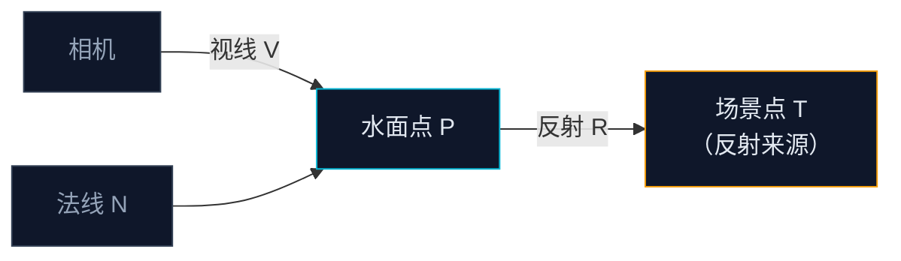

这一节我们会讲解：

- 什么是屏幕空间反射，它的前提是什么
- 如何从水面法线和视线方向算出反射方向
- Ray Marching 的步进逻辑——每一步在做什么、何时停下来
- Hi-Z（层级深度）加速的原理
- SSR 的典型瑕疵：屏幕边缘缺失、拉伸、遮挡缺失
- 在 composite 或 deferred pass 中实现 SSR 的骨架代码

好吧，我们开始吧。第 6.3 节做完以后，水面已经能区分近处透和远处反了。但反射的颜色我们暂时用的是 `skyColor`——一个笼统的天空色。这意味着你站在海边，水面上看不到山的倒影，看不到岸上的树，只有一个傻乎乎的均匀天空蓝。

内心独白一下：反射天空能用天空色凑合，但反射山、反射树、反射建筑，必须真的去看"这个方向上的场景是什么颜色"。怎么做？

---

## 反射的基本思路

想象一根光线从你的眼睛出发，打到水面，然后弹出去，像台球一样反弹到另一个位置。那个位置就是你应该在水面上看到的倒影。

步骤：
1. 水面有一个法线，法线告诉你水面的朝向。
2. 用视线方向和法线算出**反射方向** `R`。
3. 沿着 `R` 往前"走"，每一步停下来看看当前位置有没有东西。
4. 如果有东西，拿它的颜色当反射色。

问题在于步骤 3：怎么知道"当前位置有没有东西"？答案藏在已经渲染好的深度缓冲里。

在 composite 或 deferred pass 中，`depthtex0` 或 `depthtex1` 已经包含了一整帧的深度信息。你只需要知道当前屏幕像素在 3D 空间的对应位置，然后沿反射方向逐步移动，每移动一步就把该处的深度和"深度缓冲中该像素位置记录的真实深度"比较一下。如果步进位置比深度缓冲更"远"（深度值更大），说明你穿到了一个不透明的表面——那就是反射的来源。

> SSR 就是：给定起点和反射方向，拿着深度缓冲当"地图"，一步一步往前查哪里撞到了场景物体。

---

## 第一步：算出反射方向

在 GLSL 里，反射方向一行搞定：

```glsl
vec3 R = reflect(-V, N);
```

`reflect(I, N)` 的数学定义是 `I - 2.0 * dot(N, I) * N`。这里 `I` 是入射光方向，也就是视线方向的反向——因为视线是从表面到眼睛，而反射假设的是从眼睛到表面再弹出去。所以传入 `-V`。

`N` 就是你第 6.2 节扰动过的波浪法线。注意法线越抖，反射方向越散——这就是为什么有波浪的水面，倒影是碎的；平静水面，倒影像镜子。



---

## 第二步：Ray Marching——一步一步走

有了反射方向 `R`，接下来就是沿着它走。每一步做三件事：

1. 把当前位置投影到屏幕，得到屏幕 UV。
2. 从深度缓冲读该 UV 处的真实场景深度。
3. 比较：步进点的深度和真实场景深度谁离相机更近？

```glsl
vec3 rayPos = worldPos;          // 水面位置（世界空间或眼空间）
vec3 rayDir = normalize(R);      // 反射方向
float stepSize = 0.05;           // 步长，越小越精确但越慢
int maxSteps = 100;              // 最大步数，防止死循环

for (int i = 0; i < maxSteps; i++) {
    rayPos += rayDir * stepSize;

    // 投影到屏幕 UV
    vec4 clipPos = projectionMatrix * vec4(rayPos, 1.0);
    vec2 uv = clipPos.xy / clipPos.w * 0.5 + 0.5;

    // 超出屏幕范围就放弃
    if (uv.x < 0.0 || uv.x > 1.0 || uv.y < 0.0 || uv.y > 1.0)
        break;

    // 读深度缓冲
    float sceneDepth = texture(depthtex0, uv).r;
    float rayDepth = clipPos.z / clipPos.w;  // 步进点的深度

    // 如果射线走到了场景后面 → 撞到了
    if (rayDepth > sceneDepth + 0.001) {
        reflectionColor = texture(colortex0, uv).rgb;  // 取该处的颜色
        break;
    }
}
```

内心独白盯一下关键判断：`rayDepth > sceneDepth + 0.001`。这个不等号的方向非常容易写反。记住我们的逻辑：深度缓冲记录的是场景中"离相机最近的物体"的深度。如果步进点的深度**大于**缓冲深度，说明步进点跑到了场景物体的**后面**——也就是撞上了。那个 `+ 0.001` 是一个小偏移，防止精度抖动导致的假阳性。

---

## 一个更聪明的走法：自适应步长

固定步长 0.05 走 100 步，能覆盖 5 个单位的距离。但水面反射经常要追到很远的山——5 个单位可能到不了。你把步长放大，细节就丢了；把步数增加，性能就炸了。

常见的优化：

**1. 二分精炼 (Binary Refinement)**：用大步长快速找到"跨过"的那个位置，然后用二分法在前后两步之间精确查找交点。

**2. Hi-Z (Hierarchical Z-Buffer)**：预先生成一组分辨率递减的深度图（从全分辨率到 1×1），每层存的是对应区域的最大深度/最小深度。Ray Marching 时先从低级（粗）开始走大块，没碰到就跳到下一块；碰到了再往高级（细）追。这能把步数从数百降到几十。

当然，本章先给你最朴素的固定步长版本。等你理解了这个循环在做什么，Hi-Z 只是一个"换一张更快的查阅表"而已。

> Marcher 不是直接跳到目的地——它是一步一步探路，每一步都查一次地图来确认自己有没有撞到东西。

---

## 在哪个 Pass 里做 SSR

你可能会想：SSR 是用深度缓冲和颜色缓冲的，那应该放在 composite 或 deferred 里做，而不是在 `gbuffers_water.fsh` 里。

对了。`gbuffers_water.fsh` 执行时，虽然水底的方块已经写入了 G-Buffer，但你还需要颜色缓冲——这通常要到 composite 阶段才齐全。所以标准做法是：

1. 在 `gbuffers_water.fsh` 中只写法线和水体基础属性到 G-Buffer。
2. 在 `deferred.fsh` 或 `composite.fsh` 中，读回水的法线，做 Ray Marching，算出反射色。
3. 把反射色与 Fresnel 系数混合写回最终颜色缓冲。

为什么要有这个分工？因为 depthtex 和 colortex 在 gbuffers 阶段尚未完全写完（天空、实体可能还没画）。等到 deferred 或 composite 时，画面已经完整了，SSR 才不会反射出一个"空的天空区"。

---

## SSR 的典型瑕疵

SSR 不是魔法，它有天然的限制。如果你提前知道这些限制，调试的时候就不会怀疑人生：

| 瑕疵 | 原因 | 缓解 |
|------|------|------|
| 屏幕边缘反射缺失 | 反射方向指向屏幕外，那里没有深度信息 | 边缘处让反射渐隐回天空色 |
| 反射物体被前景遮挡 | 深度缓冲只有一层，不知道背后的东西 | 步进时额外检查遮挡关系 |
| 拉伸条纹 | 沿反射方向采样不够密，大步长导致跳跃 | 减小步长或加二分精炼 |
| 噪声 | 采样不足 | 稍微模糊反射结果，或加抖动偏移 |

实际光影中，SSR 通常不是唯一的反射来源。远处反射（比如地平线以下的山）因为超屏幕范围，得靠预先渲染的反射纹理（planar reflection）来补充。但 SSR 负责的那部分——你脚下的水面、近岸的倒影——已经足够产生强烈的存在感。


> SSR 能看到屏幕上已有的东西。屏幕外的东西需要其他手段补上——比如反射探针或平面反射。

---

## 骨架代码：deferred 中的 SSR

下面是 deferred 里 SSR 的简化骨架。假设你已经在 `gbuffers_water` 中把水的法线写进了 `colortex1`，深度写入了 `depthtex0`：

```glsl
uniform sampler2D colortex0;   // 场景颜色
uniform sampler2D colortex1;   // G-Buffer 里的编码法线
uniform sampler2D depthtex0;   // 场景深度

uniform mat4 gbufferProjectionInverse;  // 用于从深度重建世界坐标

// 从深度和屏幕 UV 重建世界坐标
vec3 depthToWorld(vec2 uv, float depth) {
    vec4 ndc = vec4(uv * 2.0 - 1.0, depth * 2.0 - 1.0, 1.0);
    vec4 world = gbufferProjectionInverse * ndc;
    return world.xyz / world.w;
}

// 主函数
void main() {
    vec2 uv = texcoord;
    float depth = texture(depthtex0, uv).r;

    // 如果是天空（深度为 1），不处理
    if (depth >= 1.0) { discard; return; }

    vec3 worldPos = depthToWorld(uv, depth);
    vec3 encodedNormal = texture(colortex1, uv).rgb;
    vec3 N = normalize(encodedNormal * 2.0 - 1.0);

    // 只有水面才做 SSR（可以用材质 ID 判断）
    float isWater = texture(colortex2, uv).r;  // 假设材质 ID 存于 colortex2
    if (isWater < 0.5) { discard; return; }

    vec3 V = normalize(-worldPos);  // 视线方向：从世界空间位置指向原点（相机）
    vec3 R = reflect(-V, N);

    // ── Ray Marching ──
    vec3 rayPos = worldPos;
    vec3 rayDir = normalize(R);
    float stepSize = 0.1;
    int maxSteps = 80;
    vec3 reflectionColor = vec3(0.0);
    bool hit = false;

    for (int i = 0; i < maxSteps; i++) {
        rayPos += rayDir * stepSize;

        vec4 clipPos = gbufferProjection * vec4(rayPos, 1.0);
        vec3 ndc = clipPos.xyz / clipPos.w;
        vec2 rayUV = ndc.xy * 0.5 + 0.5;

        if (rayUV.x < 0.0 || rayUV.x > 1.0 || rayUV.y < 0.0 || rayUV.y > 1.0)
            break;

        float sceneDepth = texture(depthtex0, rayUV).r;
        float rayDepth = ndc.z;

        if (rayDepth > sceneDepth + 0.0001) {
            reflectionColor = texture(colortex0, rayUV).rgb;
            hit = true;
            break;
        }
    }

    outColor0 = vec4(reflectionColor, 1.0);
}
```

注意这里我们用了 `gbufferProjectionInverse` 来从屏幕 UV+深度重建 3D 世界位置。这和第 5 章延迟光照里的坐标重建是完全一样的逻辑——你可以回去翻一下 5.2 节。

---

## 本章要点

- SSR 的核心思路：沿反射方向步进，每一步用深度缓冲判断是否碰到了场景物体。
- `reflect(-V, N)` 算出反射方向，波浪法线越抖，反射越碎。
- `rayDepth > sceneDepth` 是碰撞判断的关键：步进深度超过场景深度 → 撞到了。
- 固定步长简单但低效——Hi-Z 和二分精炼可以大幅减少步数。
- SSR 应在 deferred 或 composite 中执行，此时深度和颜色缓冲已完整。
- 屏幕边缘缺失、拉伸、遮挡错误是 SSR 的常见问题，通常靠边缘渐隐和预反射纹理补充。

下一节：[6.5 — 实战：镜面水面](/06-water/05-project/)
