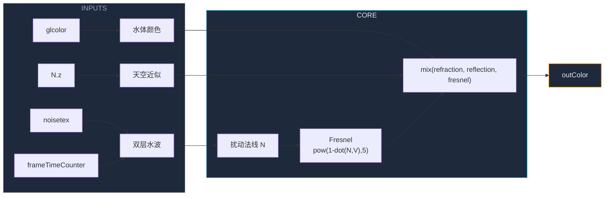

这一节我们会讲解：

- 如何把第 6.2 节的波浪法线和第 6.3 节的 Fresnel 整合进一个完整的 `gbuffers_water.fsh`
- 反射颜色目前用什么代替——在没有完整 SSR 的前提下
- 为什么水底看起来"能透视"实际上不是真的折射
- 期望效果：近处透明见水底，远处反射天空——怎么验证
- 自测清单：调哪些参数可以确认一切正常

在前面几节我们分别学会了三个独立的零件：用噪声扰动法线制造水波，用 Fresnel 公式混合反射和透射，以及 SSR 的步进框架。现在把所有零件装进一个 `gbuffers_water.fsh`。

先别急着写。内心独白理一下：最终画面里的水面，它到底要做几件事？

1. 水面的法线在动（波浪）。
2. 法线动 → 反射方向散开 → 反射的倒影也会碎。
3. Fresnel 判断这个像素在画面中的"斜度"——近处透，远处反。
4. 反射色在完整 SSR 做出来之前，暂时用天空色代替。
5. 水体的基础颜色（蓝绿色）加上环境染色，构成"透过去看到的颜色"。

> 本次实战的目标不是做出完美的实时光追反射，而是让水面"看起来像水"——波浪、透视、反射三角齐全。

---

## 你要改的文件

只需要一个文件：

```
shaders/gbuffers_water.fsh
```

如果你的 shaderpack 还没有这个文件，从 Base-330 模板复制 `gbuffers_terrain.fsh`，把里面的 `outColor` 计算换成下面这套逻辑。

另外确保 `shaders/` 目录下有一张噪声纹理（比如 `noisetex.png`），并且在 `shaders.properties` 或用 `uniform sampler2D` 声明好后正确加载。如果暂时没有，可以用程序化噪声——后面会说明。

---

## 完整代码

下面是整合了水波法线和 Fresnel 的 `gbuffers_water.fsh`：

```glsl
#version 330 compatibility

uniform sampler2D noisetex;
uniform sampler2D lightmap;
uniform float frameTimeCounter;
uniform vec3 sunPosition;

in vec2 texcoord;
in vec4 glcolor;
in vec3 normal;
in vec2 lmcoord;

/* RENDERTARGETS: 0,1,2 */
layout(location = 0) out vec4 outColor;
layout(location = 1) out vec4 outNormal;
layout(location = 2) out vec4 outMaterial;

void main() {
    float time = frameTimeCounter;
    vec2 uv = texcoord;
    float step = 0.002;

    // ═══════════════════════════════════════
    //  第 6.2 节：双层水波法线
    // ═══════════════════════════════════════
    // 低频层 —— 大涌浪，慢移，斜向漂
    float nL0 = texture(noisetex, uv * 2.0 + vec2(time * 0.02, time * 0.01)).r;
    float nL1 = texture(noisetex, uv * 2.0 + vec2(time * 0.02 + step, time * 0.01)).r;
    float nL2 = texture(noisetex, uv * 2.0 + vec2(time * 0.02, time * 0.01 + step)).r;
    float dxL = nL1 - nL0;
    float dyL = nL2 - nL0;

    // 高频层 —— 细涟漪，快移，反向漂
    float nH0 = texture(noisetex, uv * 8.0 + vec2(-time * 0.08, time * 0.06)).r;
    float nH1 = texture(noisetex, uv * 8.0 + vec2(-time * 0.08 + step, time * 0.06)).r;
    float nH2 = texture(noisetex, uv * 8.0 + vec2(-time * 0.08, time * 0.06 + step)).r;
    float dxH = nH1 - nH0;
    float dyH = nH2 - nH0;

    // 合并——低频 70%，高频 30%
    float dx = dxL * 0.7 + dxH * 0.3;
    float dy = dyL * 0.7 + dyH * 0.3;

    // 构造扰动法线：从 (0, 0, 1) 往两侧偏
    vec3 N = normalize(vec3(-dx, -dy, 1.0));

    // ═══════════════════════════════════════
    //  第 6.3 节：Fresnel 混合
    // ═══════════════════════════════════════
    // 在 gbuffers 中，视线方向近似为 (0, 0, 1)
    vec3 V = normalize(vec3(0.0, 0.0, 1.0));
    float NdV = abs(dot(N, V));
    float fresnel = pow(1.0 - NdV, 5.0);

    // ═══════════════════════════════════════
    //  反射色 —— 暂时用天空色近似
    // ═══════════════════════════════════════
    // 完整 SSR 会在第 6.4 节的 deferred pass 中替换这里
    // 这里用 sunPosition 和法线模拟一个简单的"天空有多亮"的估计
    vec3 skyApprox = mix(
        vec3(0.3, 0.5, 0.9),   // 天顶偏蓝
        vec3(0.6, 0.7, 0.8),   // 地平偏白
        clamp(N.z, 0.0, 1.0)   // 法线朝上 → 更蓝；法线倾斜 → 更白
    );

    // 折射色 —— 水体本身的颜色
    vec3 waterBase = vec3(0.15, 0.45, 0.7);   // 中等深度的海洋蓝
    vec3 refractionColor = waterBase * glcolor.rgb;

    // Fresnel 混合：斜 → 反射天空；正 → 透出水色
    vec3 waterColor = mix(refractionColor, skyApprox, fresnel);

    // ═══════════════════════════════════════
    //  写入 G-Buffer
    // ═══════════════════════════════════════
    outColor = vec4(waterColor, 1.0);
    outNormal = vec4(N * 0.5 + 0.5, 1.0);
    outMaterial = vec4(1.0, 0.0, 0.0, 1.0);  // 标记为水体材质，后续 deferred 可识别
}
```

---

## 逐块拆解

### 水波法线（第 10~30 行）

和 6.2 节一模一样——低频 `uv * 2.0` 拉伸噪声、慢速漂移；高频 `uv * 8.0` 压缩噪声、快速反向漂移。合并权重 7:3。

顺便说一下，`dxL * 0.7 + dxH * 0.3` 这个比例不是铁律。如果你想要更碎的水面（比如山间溪流），把高频权重提到 0.5。如果你想要开阔海面的长涌浪，把低频压到 0.9，高频降到 0.1。这是你的第一个可调 knob。

### Fresnel（第 33~37 行）

视线方向 `V` 在 gbuffers 坐标系里近似为 `(0, 0, 1)`——因为相机在原点沿 Z 轴看。`pow(1.0 - NdV, 5.0)` 把"垂直度"变成"反射强度"。

如果你觉得水太反了——几乎不用斜看就变镜子——把指数提到 8.0 试试。反之如果觉得只有极限角度才反，降到 3.0。这个指数决定了 Fresnel 曲线的陡峭程度。

### 天空近似（第 41~51 行）

在真正的 SSR 接入之前，我们用 `N.z` 来近似天空色。`N.z` 是法线的 Z 分量——它表示了水面朝上的程度。法线越朝上（`N.z` 越大），看到的天空越像天顶的深蓝；法线越倾斜，看到的天空越偏地平白。这不是物理正确的反射，但它会让水面的上半部分自然地比下半部分更蓝——而这恰好和实际观察一致。

### 水体颜色（第 53~55 行）

`waterBase * glcolor.rgb` 是水体底色 X 生物群系染色。深海更蓝，沼泽偏绿，河流偏褐——Minecraft 通过 `glcolor` 把生物群系水色传进来，你乘上去就自动适配了。

---

## 期望效果

进入游戏后，找到一片水域（湖泊或海边），观察水面：

- **正下方看**（镜头俯视）：水面接近透明，水体的蓝色较明显，能看到水底方块。Fresnel 系数接近 0，你看到的主要是 `refractionColor`。
- **平视远处**（镜头近乎水平）：水面像一面镜子，反射出天空的颜色。Fresnel 系数接近 1，你看到的主要是 `skyApprox`。
- **视线在 45° 左右**：半透半反，既有水的蓝色又隐约有天空的倒影。
- **波浪在动**：因为 `frameTimeCounter` 不停跑，噪声采样点每帧都在变，波浪法线也跟着变——水面是活的。




---

## 如果没有噪声纹理

如果你的 shaderpack 还没有一张物理的 `noisetex.png`，可以用程序化噪声临时替代。把上面代码中的 `noisetex` 采样换成一个基于 UV 的正弦噪声：

```glsl
// 临时程序化噪声——不需要外部纹理
float pseudoNoise(vec2 uv) {
    return fract(sin(dot(uv, vec2(12.9898, 78.233))) * 43758.5453);
}
```

警告：这种 hash 噪声的高频分量太碎，做出来的波浪会有点"沙沙"的，不像水的平滑涌浪。物理噪声图建议找一张 512×512 的云噪（cloud noise）或 Perlin 噪声贴进去，效果会好很多。BLS 和 Complementary 的 shaderpack 里都带着自己的噪声图，如果你拆包看看它们的 `tex/` 目录，基本都能找到。

---

## 自测清单

把 shaderpack 装进 Iris，进入一个有水的世界（创造模式直接飞到海边或者做一个水池），对照检查：

- [ ] 水面颜色不是纯蓝均匀色——有明暗变化，说明波浪法线在起作用
- [ ] 水面在动——静止几秒后观察，波浪的明暗形状在缓慢漂移
- [ ] 低头正看 → 水色偏蓝绿，"水底可见"感
- [ ] 抬头平视 → 水面明显更亮更灰白，反射天空
- [ ] 不同生物群系的水色不一样（海洋 vs 沼泽 vs 河流）——说明 `glcolor` 染色生效
- [ ] Iris 调试模式（Ctrl+D）无编译报错
- [ ] 调大 Fresnel 指数（5.0→8.0），反射范围缩小但边缘更锐——确认参数可调

如果某个检查项没过：

- **颜色均匀不动** → 检查 `frameTimeCounter` 是否正确传递给 UV 偏移；确认 `noisetex` 已加载且有内容
- **完全不透明或不反射** → 检查 `fresnel` 计算——`dot(N, V)` 可能没取 `abs`，导致 `1.0 - NdV` 超出 `0..1`
- **整个水面消失** → 确认文件名是 `gbuffers_water.fsh`（不是 `gbuffers_water_terrain.fsh` 之类的变体）
- **全黑** → 检查 `glcolor` 的 `in` 声明拼写是否和 `.vsh` 的 `out` 一致——参考 2.4 节末尾的变量名陷阱

---

## 本章要点

- 完整 `gbuffers_water.fsh` 整合了三个模块：双层水波法线 → Fresnel 系数 → 反射/折射混合。
- 反射色在 SSR 完整接入前用 `N.z` 驱动的天空近似代替，能产生自然的"远处偏白、天顶偏蓝"的倒影感。
- 水体折射色 = `waterBase * glcolor`，自动适配生物群系水色。
- Fremel 指数是可调的"反射锐度 knob"：越高反射范围越小但边缘越锐。
- 期望效果：正看透见水底蓝绿色，斜看反射天空，水面波纹持续漂移。
- 如果没有物理噪声纹理，可以用 `fract(sin(dot(...)))` 做临时程序化噪声，但建议找一张真正的云噪图。

> 你的水面已经活了——它会动，会反光，会在斜看时变成镜子。剩下的事情（真实 SSR 倒影、水底折射）是第 6.4 节 deferred pass 里的进阶工。

下一节：[7.1 — Shadow Mapping：从光源的视角看世界](/07-shadow/01-shadow-mapping-intro/)
