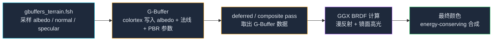

这一节我们会讲解：

- 原版渲染只靠一张 albedo 贴图，就像一个只有"长相"没有"肤质"的人
- PBR 多带了四张信息卡：金属度、粗糙度、法线、环境光遮蔽
- LabPBR 1.3 格式怎么把这么多信息塞进有限的纹理通道
- Iris 提供的 `MC_SPECULAR_MAP` 和 `MC_NORMAL_MAP` 宏免去了你手动找纹理的麻烦
- PBR 管线的大致流程：从哪里读贴图、在哪里算光照、最后写到哪里

好吧，我们开始吧。你在第 2 章已经让方块有了基础的漫反射光照，看起来已经比原版强多了。但如果你仔细盯着铁块和石头看，会不会有一个直觉：它们都应该反光，但反光的方式好像不应该一样？

铁块应该亮得像镜子碎片，石头应该闷闷地哑光。原版 Minecraft 不管这些——它只给每个方块一张颜色贴图（albedo），然后所有方块用同一套光照。铁块和石头挨在一起时，光照上没有任何区别。这不真实，也不好看。

> 原版渲染的哲学是"贴图上画成什么样就是什么样"。PBR 的哲学是"真实世界里每种材料的反光行为都不一样，你得告诉 GPU 这些行为规则"。

---

## 单张贴图够用吗？

内心独白一下：如果我只给你一张方块的彩色照片，你能猜出它的表面是光滑还是粗糙吗？好像不太行。一张铁块的照片和一张灰色石头的照片，在纯颜色上差别很小。但如果我让你去摸一摸呢？你立刻就能分出来——铁块滑溜，石头磨手。

GPU 没有手，但它有另一套办法：我可以额外塞给它几张"说明书"性质的贴图。这几张贴图不直接决定颜色，而是描述"这个面怎么反光"、"这个面的微观凹凸是什么样的"、"这个面是金属吗"。这些都是物理渲染（Physically Based Rendering, PBR）关心的东西。

PBR 就是"让光照计算贴近真实物理"的一套方法论。它不是某个神秘的算法，而是一套约定：你给 GPU 什么样的输入，GPU 用什么样的公式，最后保证出来的结果不违反能量守恒（这个第 7.4 节会细讲）。

> PBR 不是具体的公式，而是一套关于"真实材料应该怎么和光打交道"的共识。

---

## PBR 的四张核心贴图

一个完整的 PBR 流程通常需要这些额外的贴图（除了你已有的颜色贴图）：

- **法线贴图 (Normal Map)**：给平的方块表面添加微观凹凸感。每个像素存的不再是颜色，而是"这个微小表面片段朝哪个方向"。砖缝凹进去、砖面凸出来，所有这些细节都可以通过扰动法线来欺骗人眼。
- **高光/粗糙度贴图 (Specular/Roughness Map)**：描述表面的光滑程度。像一面抛光大理石（粗糙度接近 0）和一块粗糙砂岩（粗糙度接近 1），它们的高光表现天差地别。
- **金属度贴图 (Metalness Map)**：标记哪些像素是金属。金属和绝缘体对光的反应完全不同——金属没有漫反射，它只反射；绝缘体既有漫反射又有镜面反射。
- **环境光遮蔽贴图 (AO Map)**：提前"烤"好的局部阴影信息。角落、缝隙天然比开阔区域更暗，AO 贴图把这个信息补进光照里。

顺便说一下，你可能听过"PBR 工作流分两种：metalness-roughness 和 specular-glossiness"。MC 光影社区主流（也是我们本章采用的）是 metalness-roughness 工作流。它用两张贴图（specular + normal）就能覆盖上面所列的四类信息，靠的是聪明地利用了 RGBA 四个通道。

---

## LabPBR 1.3：通道里塞了什么

LabPBR 是由 MC 光影社区定义的一套约定，规定了 `_s`（specular）贴图和 `_n`（normal）贴图的通道布局。1.3 版本是目前最广泛采用的格式：

| 贴图后缀 | 通道 | 存储内容 | 含义 |
|----------|------|----------|------|
| `_s` | R | 光滑度 (smoothness) | 1 = 镜面般光滑，0 = 极粗糙 |
| `_s` | G | 金属度 (metalness / F0) | 1 = 纯金属，0 = 绝缘体 |
| `_s` | B | 自发光 (emission) | 发光强度，如岩浆块 |
| `_s` | A | 次表面散射 (SSS) | 皮肤、树叶这类半透明材质 |
| `_n` | R | 法线 X (tangent-space) | `[-1,1]` 映射到 `[0,1]` |
| `_n` | G | 法线 Y (tangent-space) | `[-1,1]` 映射到 `[0,1]` |
| `_n` | B | 高度图 (height/displacement) | 用于视差映射 |
| `_n` | A | （保留/可选） | 某些资源包存额外信息 |

你看出来了吗？本来需要四张独立贴图的信息，现在被压缩成两张贴图的八个通道。R 通道管光滑度，G 通道管金属度——你要做的就是在 shader 里按这个约定去读。

> LabPBR 本质上是一份"社区公约"：大家一起遵守同一套通道布局，光影包和资源包才能互相配合。

---

## Iris 帮你省掉的体力活

如果你要自己定位 `_s` 和 `_n` 贴图，你需要去翻资源包的文件名、拼接字符串、处理缺失贴图的 fallback。好消息是，Iris 已经帮你做了这些。

在 `gbuffers_terrain.fsh` 里，你可以直接用这两个宏声明采样器：

```glsl
uniform sampler2D tex;           // 颜色贴图（原版 atlas）
uniform sampler2D norm;          // → MC_NORMAL_MAP  自动指向 _n 贴图
uniform sampler2D specular;      // → MC_SPECULAR_MAP 自动指向 _s 贴图
```

Iris 会在每个片元里，把当前方块对应的 `_s`、`_n` 贴图放进 `norm` 和 `specular` 这两个采样器。你几乎不用操心贴图查找逻辑——你只需要用标准的 `texture()` 函数去采样它们。

> `MC_NORMAL_MAP` 和 `MC_SPECULAR_MAP` 是 Iris 为你打开的"资源包后门"，让你在 shader 里像采原版贴图一样自然地去采 PBR 贴图。

---

## 整条 PBR 管线是什么样

在你开始写代码之前，先在心里画一张地图：



在第 4 章你已经掌握了 G-Buffer 的"写入→读取"流水线。PBR 不过是在这张流水线里多塞了几条信息：法线不只是面法线，还要叠上法线贴图的扰动；材质不再是一个固定的"石头/铁"标签，而是由光滑度和金属度共同决定的一对连续值。

你不必一口气掌握全部。这一节的要点是让你知道 PBR 的输入从哪来、最后要走到哪去。接下来的三节，我们会逐一把 GGX 高光公式、贴图采样细节、能量守恒规则拆开揉碎。


---

## 本章要点

- 原版渲染只有一张 albedo 贴图，无法区分金属和石头的光照行为。
- PBR 额外引入法线、粗糙度、金属度、AO 四类信息来描述材质的反光特性。
- LabPBR 1.3 将 specular 贴图（光滑度/金属度/自发光/SSS）和 normal 贴图（法线 XY/高度图）分别打包进两张 RGBA 纹理。
- Iris 通过 `MC_SPECULAR_MAP` 和 `MC_NORMAL_MAP` 宏自动绑定资源包中的 `_s` 和 `_n` 贴图，你无需手动查找。
- 整个 PBR 管线的流程：gbuffers 采样 PBR 贴图 → 写入 G-Buffer → 光照 pass 取出 → GGX BRDF 计算 → 最终输出。

这里的要点是：PBR 不是"加几张贴图就好看了"，而是一套让材质信息流入光照公式的完整约定。理解了输入格式和管线流程，你就拿到了打开 PBR 世界的第一把钥匙。

下一节：[7.2 — GGX 微表面模型：高光的数学心脏](/07-pbr/02-ggx/)
