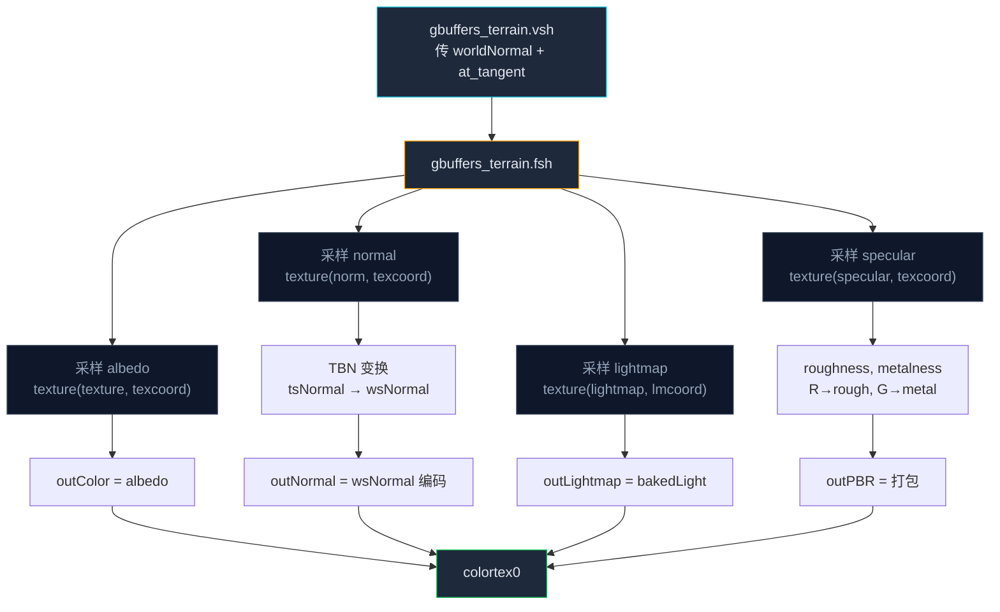

这一节我们会讲解：

- 配置 gbuffers_terrain.vsh：传切线、传世界空间法线
- 配置 gbuffers_terrain.fsh：PBR 贴图采样 + G-Buffer 打包
- 写一个简化的光照 pass，让 GGX + 能量守恒在屏幕上可见
- 加载 PBR 资源包并验证：铁块该亮的地方亮、石块该哑的地方哑
- 自检清单：确认每一步的输出都符合预期

好吧，我们开始吧。前面四节你拿到了理念、公式、采样代码和守恒规则——现在是把它们缝成一件衣服的时候了。本节你将改动两个文件（`gbuffers_terrain.vsh` + `gbuffers_terrain.fsh`）和新增/修改一个光照 pass，然后加载一张社区 PBR 资源包（如 Patrix、HardTop VanillaAccurate 或 Faithful PBR），亲眼看到铁块的镜面高光跟随视角移动。

---

## 第一步：准备环境

在开始之前，确保你已经满足这些前置条件：

- 你已经有一个能用延迟光照管线的 shaderpack（至少第 5 章的 G-Buffer + deferred 基础设施就位）。
- 你的 Iris 版本支持 `MC_SPECULAR_MAP` 和 `MC_NORMAL_MAP`（Iris 1.5+ 即可）。
- 你下载了一张包含 `_s` 和 `_n` 贴图的 LabPBR 资源包。推荐选择 Vanilla 风格 PBR（如 HardTop VanillaAccurate PBR），这样原版方块看起来变化可控。

> 如果资源包缺失某个方块的 `_s` / `_n`，Iris 会返回全 0 的默认采样——结果就是该方块自动降级为"粗糙绝缘体"，与原版接近，不会崩 shader。

---

## 第二步：修改 gbuffers_terrain.vsh

第 2.2 节的 vsh 只传了 `texcoord`、`vertexColor`、`normal`、`lmcoord`。现在你需要多加两个东西：**世界空间法线**（而不是眼空间）和 **Iris 提供的切线 `at_tangent`**。

```glsl
#version 330 compatibility

out vec2 texcoord;
out vec4 vertexColor;
out vec3 worldNormal;    // ← 改名：世界空间法线
out vec2 lmcoord;
out vec3 at_tangent;     // ← 新：传给 .fsh 的切线

void main() {
    gl_Position = gl_ModelViewProjectionMatrix * gl_Vertex;
    texcoord    = (gl_TextureMatrix[0] * gl_MultiTexCoord0).xy;
    vertexColor = gl_Color;

    // 眼空间法线 → 世界空间法线
    vec3 eyeNormal = gl_NormalMatrix * gl_Normal;
    worldNormal = mat3(gbufferModelViewInverse) * eyeNormal;

    lmcoord  = (gl_TextureMatrix[1] * gl_MultiTexCoord1).xy;
    at_tangent = gl_NormalMatrix * vec3(1.0, 0.0, 0.0);
}
```

`gbufferModelViewInverse` 是 Iris 提供的 uniform，它就是 `gl_ModelViewMatrix` 的逆矩阵。把它用在法线上，就能把眼空间法线转成世界空间法线。至于 `at_tangent`——Iris 在 gbuffers pass 里会为每个面自动计算切线方向，你只需要声明 `out vec3 at_tangent` 并赋给 `gl_NormalMatrix * (1,0,0)` 即可。它不是精确的几何切线，但和面法线大致正交，足够我们后面做 Gram-Schmidt 修正。

---

## 第三步：重写 gbuffers_terrain.fsh（PBR 版）

这是整个实战的核心。你的 `.fsh` 现在要同时干四件事：采样颜色、采样法线、采样 PBR 参数、把所有东西写进 G-Buffer。

```glsl
#version 330 compatibility

uniform sampler2D texture;
uniform sampler2D lightmap;
uniform sampler2D norm;       // MC_NORMAL_MAP
uniform sampler2D specular;   // MC_SPECULAR_MAP

in vec2 texcoord;
in vec4 vertexColor;
in vec3 worldNormal;
in vec2 lmcoord;
in vec3 at_tangent;

/* RENDERTARGETS: 0,1,2,3 */
layout(location = 0) out vec4 outColor;
layout(location = 1) out vec4 outNormal;
layout(location = 2) out vec4 outLightmap;
layout(location = 3) out vec4 outPBR;

void main() {
    // ─── 颜色 ───
    vec4 albedo = texture(texture, texcoord) * vertexColor;

    // ─── PBR 参数 ───
    vec4 specSample  = texture(specular, texcoord);
    float roughness  = 1.0 - specSample.r;
    float metalness  = specSample.g;

    // ─── 法线（微表面） ───
    vec4 normalSample = texture(norm, texcoord);
    vec3 tsNormal = normalize(vec3(normalSample.rg * 2.0 - 1.0, 1.0));

    vec3 N = normalize(worldNormal);
    vec3 T = normalize(at_tangent - N * dot(at_tangent, N));
    vec3 B = cross(N, T);
    vec3 wsNormal = normalize(mat3(T, B, N) * tsNormal);

    // ─── lightmap ───
    vec4 bakedLight = texture(lightmap, lmcoord);

    // ─── 写入 G-Buffer ───
    outColor    = albedo;
    outNormal   = vec4(wsNormal * 0.5 + 0.5, 1.0);
    outLightmap = bakedLight;
    outPBR      = vec4(roughness, metalness, 0.04, 0.0);
    //                  R=rough   G=metal    B=F0   A=预留
}
```

这段代码你大部分在第 7.3 节见过。注意 `outPBR` 里我直接把绝缘体默认 F0（0.04）写进了 B 通道——这样光照 pass 甚至可以省掉这个分支判断。



---

## 第四步：光照 pass —— 让 PBR 真正画出来

G-Buffer 装满了没用，得有人在光照阶段读它。这里给一个简化版的光照 pass（可以放在 `deferred.fsh` 或你已有的 composite pass 里）。它假设你能拿到以下 G-Buffer 采样器：

```glsl
uniform sampler2D colortex0;  // albedo
uniform sampler2D colortex1;  // world normal (编码后)
uniform sampler2D colortex2;  // lightmap
uniform sampler2D colortex3;  // PBR 参数 (roughness, metalness, F0)

uniform vec3 sunPosition;  // Iris 提供的太阳方向（世界空间）
uniform vec3 cameraPosition; // Iris 提供的相机位置

const float PI = 3.14159265359;

// ── GGX 零件 ──
float D_GGX(float NoH, float roughness) {
    float a = roughness * roughness;
    float a2 = a * a;
    float denom = NoH * NoH * (a2 - 1.0) + 1.0;
    return a2 / (PI * denom * denom);
}

float G_Smith(float NoV, float NoL, float roughness) {
    float k = (roughness + 1.0) * (roughness + 1.0) / 8.0;
    return (NoV / (NoV * (1.0 - k) + k)) * (NoL / (NoL * (1.0 - k) + k));
}

vec3 F_Schlick(float VoH, vec3 F0) {
    return F0 + (1.0 - F0) * pow(1.0 - VoH, 5.0);
}

void main() {
    vec2 uv = gl_FragCoord.xy / vec2(viewWidth, viewHeight); // 假设有这两个 uniform

    vec4 albedoSample = texture(colortex0, uv);
    vec3 albedo = albedoSample.rgb;

    vec3 N = normalize(texture(colortex1, uv).rgb * 2.0 - 1.0);

    vec4 pbr = texture(colortex3, uv);
    float roughness = pbr.r;
    float metalness = pbr.g;
    float F0_dielectric = pbr.b;  // 0.04

    vec3 F0 = mix(vec3(F0_dielectric), albedo, metalness);

    // 重建世界坐标（简化：用深度 + 逆矩阵，此处略，假设有 worldPos）
    // vec3 worldPos = reconstructWorldPos(uv, depth);
    vec3 V = normalize(cameraPosition); // 简化示意
    vec3 L = normalize(sunPosition);
    vec3 H = normalize(V + L);

    float NoV = max(dot(N, V), 0.001);
    float NoL = max(dot(N, L), 0.0);
    float NoH = max(dot(N, H), 0.0);
    float VoH = max(dot(V, H), 0.0);

    if (NoL <= 0.0) { gl_FragColor = vec4(0.0); return; }

    float D = D_GGX(NoH, roughness);
    float G = G_Smith(NoV, NoL, roughness);
    vec3  F = F_Schlick(VoH, F0);

    vec3 specular = (D * G * F) / (4.0 * NoV * NoL + 0.001);

    vec3 kD = (1.0 - F) * (1.0 - metalness);
    vec3 diffuse = kD * albedo / PI;

    vec4 lightmap = texture(colortex2, uv);
    float skyLight  = lightmap.r;
    float blockLight = lightmap.g;

    vec3 lightColor = vec3(1.0, 0.95, 0.85); // 日光暖色
    vec3 ambient = albedo * 0.03;            // 最小环境光

    vec3 color = ambient + (diffuse + specular) * lightColor * NoL * (skyLight + blockLight);

    gl_FragColor = vec4(color, 1.0);
}
```

内心独白一下：这段光照 pass 的骨架和你第 5 章写的延迟光照几乎一样。区别只在于：漫反射和高光不再用连续的两个独立公式，而是被能量守恒绑在一起——Fresnel 先拿走镜面反射比例 `F`，剩下的 `1 - F` 才给漫反射。

---

## 第五步：加载 PBR 资源包，观察效果

现在打开 Minecraft，加载你的 shaderpack，再叠一张 PBR 资源包（放在 resourcepacks 目录）。进入一个创造性世界，摆出以下方块阵列：

- **铁块 (Iron Block)**：应该是全场最亮的镜面高光——粗糙度极低，F0 无色但很高。
- **金块 (Gold Block)**：高光应该带暖金色调——因为 F0 = albedo（金色），金属度 = 1，漫反射 = 0。
- **石头 (Stone)**：几乎没有明显高光——高粗糙度，低 F0（0.04），主要以漫反射呈现。
- **木板 (Oak Planks)**：和石头类似但有纹理——同样绝缘体，但粗糙度略低（木头的细微光滑感）。
- **钻石块 (Diamond Block)**：如果你用的资源包给它配了低粗糙度，它会像玻璃一样反光——F0 仍为 0.04（绝缘体），但粗糙度低让高光锐利。

动一动视角——你会看到铁块和金块上的高光**跟着你的头一起移动**。那些高光不是贴图上画好的一团白，而是 GGX 公式根据 `V`（视线方向）和 `L`（光线方向）实时算出来的。


---

## 自检清单

对照检查，确保每一环都通了：

- [ ] `gbuffers_terrain.vsh` 的 `out vec3 at_tangent` 声明了，且 `.fsh` 的 `in vec3 at_tangent` 对上了。
- [ ] `.fsh` 里 `texture(norm, texcoord)` 读到了不是全 0 的数据（如果某个方块全 0，检查资源包是否有该方块的 `_n` 贴图）。
- [ ] `roughness = 1.0 - specSample.r` 不是反的（如果铁块粗糙得像石头，检查是否有 `roughness = specSample.r` 的错误）。
- [ ] TBN 矩阵的构建顺序和叉积方向正确——在复杂方块模型上，法线贴图凹凸方向不应该反转。
- [ ] 光照 pass 里 `kD = (1.0 - F) * (1.0 - metalness)` 这两项都在——缺任何一项都会导致能量不守恒。
- [ ] 金块的漫反射确实是 0 吗？如果金块还有漫反射的"黄底"，是你的 metalness 没从 G-Buffer 读进光照 pass。
- [ ] 屏幕边缘的方块高光正常吗？如果边缘处 G 函数产生奇怪暗边，检查 `NoV` 是否被 `max(..., 0.001)` 保护了（避免除零）。

> 自检时不要跳过任何一项。PBR 是一个精密玩意儿——任何一环脱节，最后都会变成"也不难看，但总觉得哪里不对"的效果。

---

## 如果看不到效果

不要着急——这是完全正常的。几个常见原因：

**资源包没有 `_s`/`_n` 贴图**。确认你的资源包目录下有类似 `assets/minecraft/textures/block/iron_block_s.png` 和 `iron_block_n.png` 的文件。不是所有叫"PBR"的资源包都严格按 LabPBR 命名——有些用的是旧格式（如 `_specular`）。

**Iris 宏未生效**。检查你的 `.fsh` 文件里 `uniform sampler2D norm;` 和 `uniform sampler2D specular;` 的变量名是否正确。Iris 的 `StandardMacros.java` 中，`MC_NORMAL_MAP` 对应 `norm`，`MC_SPECULAR_MAP` 对应 `specular`。变量名不对，宏不会自动替换。

**粗糙度范围没对齐**。有些资源包用 `_s` 的 R 通道直接存粗糙度（0=光滑, 1=粗糙），和你假设的光滑度相反。如果你发现铁块高光散得像石头、石头反而锃亮——就是这个原因。可以临时加上 `#define INVERT_ROUGHNESS` 分支来处理两种资源包。

---

## 本章要点

- `gbuffers_terrain.vsh` 新增 `at_tangent` 输出和世界空间法线转换（`gbufferModelViewInverse`）。
- `gbuffers_terrain.fsh` 同时采样四张贴图（albedo / normal / specular / lightmap），解包 PBR 参数，构造 TBN 矩阵，写入 G-Buffer。
- 光照 pass 读取 G-Buffer 中的粗糙度和金属度，运行 GGX BRDF + 能量守恒合成。
- 铁块应呈现锐利镜面高光，金块高光带暖色且无漫反射，石头和木头维持哑光漫反射。
- `(1.0 - F) * (1.0 - metalness)` 是能量守恒和金属工作流的核心一行，缺任何一项都会破坏物理正确性。
- 自检清单涵盖了最常见的坑：通道方向、TBN 叉积、F0 初值、除零保护。

这里的要点是：PBR 实战和你之前写的延迟光照相比，代码量差不多——真正的区别不在"写得更多"，而在"每行的物理含义互锁了"。Fresnel 锁住了高光和漫反射的比例，metalness 锁住了金属的行为，roughness 锁住了高光的锐度。一旦所有锁都扣上，你就不需要"凭感觉调参数"——物理会替你做出正确的决定。

下一节：第 8 章将进入阴影的世界——[7.1 Shadow Mapping：从光源的视角看世界](/08-shadows/01-shadow-intro/)。但在此之前，强烈建议你把本节的自检清单完整过一遍，确保你的 PBR 管线每一条 G-Buffer 通道都在正确传输数据。
