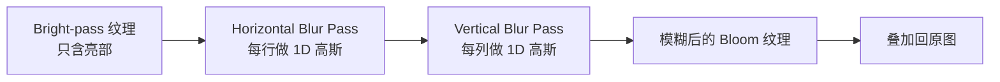

这一节我们会讲解：

- Bloom 在眼睛里和在屏幕上的同一个原理——亮处向外洇开
- 用 `dot(rgb, vec3(0.299, 0.587, 0.114))` 把人眼亮度从颜色中榨出来
- 分离高斯模糊为什么不是一次 2D 大卷积，而是两次 1D 小卷积
- 降采样怎样用 1/4 分辨率换 4 倍性能
- `composite4` 负责提取和模糊，`composite5` 负责叠回去

好吧，我们开始吧。你已经让方块有了法线光照，甚至有了 G-Buffer 和阴影。现在问一个更"摄影"的问题：为什么太阳周围应该有一圈光晕？

这听起来像骗术，但它是真实的物理现象。强光穿过镜头、穿过眼球的晶状体，会被散射。光圈不是完美的针孔，所以亮光会"洇"到邻居像素上。游戏光照通常不模拟这个物理，所以我们需要手动造——这就是 Bloom。

> Bloom 的核心公式只有三步：提取亮部 → 模糊 → 叠回原图。

---

## 第一步：哪些像素应该发光？

内心小剧场：你现在盯着一张发光画面。太阳的 RGB 可能是 `(3.2, 3.0, 2.5)`——远大于 `1.0`，这是延迟光照算出来的 HDR 值。但草地呢？`(0.3, 0.6, 0.2)`，很暗。你不想让草地发光，你只想要真正的亮区参与 Bloom。

于是有了亮度提取。经典做法是用人眼亮度权重做点积：

```glsl
float luminance = dot(color.rgb, vec3(0.299, 0.587, 0.114));
```

这三个数不是随便选的。人眼对绿色最敏感——0.587，红色中等——0.299，蓝色最弱——0.114。就像摄影师调黑白照片：同样的瓦数，绿灯看起来比蓝灯亮得多。这个公式把三通道彩色压缩成一个亮度标量，模拟你眼睛实际感知到的明亮程度。

然后设定阈值：

```glsl
float threshold = 0.8;
vec3 bright = color.rgb * step(threshold, luminance);
```

`step(threshold, luminance)` 的规则是：亮度没到门槛，关；到达或超了，开。于是暗处被截成 `vec3(0)`，只有耀眼的火把、太阳、发光浆果才会幸存下来。

你也可以做得更柔和——用 `smoothstep`，让过渡带一点渐变：

```glsl
float knee = 0.3;
float brightness = smoothstep(threshold - knee, threshold + knee, luminance);
vec3 bright = color.rgb * brightness;
```

`smoothstep` 不像 `step` 那么一刀切。它在 `threshold - knee` 到 `threshold + knee` 之间做一条 S 形过渡，暗处到亮处有一个柔和的斜坡。这样 Bloom 不会在物体的硬边缘突然"亮起来"，更像真实镜头。

---

## 第二步：把亮点糊开——高斯模糊

你现在有一张亮区图，全是 0，只有少数像素有颜色。如果把这张图直接叠到原图上，太阳旁边不会有光晕——它只是更亮了，但没有扩散。

所以我们心里嘀咕一句：能不能让每个亮像素把它自己的颜色"分一点"给周围的像素？

能。卷积核做的就是这件事。一个 N×N 的高斯核矩阵以当前像素为中心，给周围的像素分配权重。最朴素的高斯核长这样——每个像素的新颜色，等于周围邻居的加权平均：

$$
G(x, y) = \frac{1}{2\pi\sigma^2} e^{-\frac{x^2 + y^2}{2\sigma^2}}
$$

但直接做一个 9×9 的 2D 卷积，每个像素要采样 81 次。1920×1080 就是 1920×1080×81 ≈ 1.6 亿次纹理采样。每帧。你还想同时跑光线追踪吗？

聪明人发现了：**高斯核是可以分离的**。一个 2D 高斯卷积可以拆成：先在水平方向做一次 1D 高斯（每行采样 9 个邻居），再把结果在垂直方向做一次 1D 高斯（每列再采样 9 个）。两次共采样 18 次，不是 81 次。



水平 pass 的 GLSL 大概长这样——你沿 X 方向采样一排邻居，用预设好的权重数组加权求和：

```glsl
uniform sampler2D colortex4; // bright-pass 结果放在 colortex4

in vec2 texcoord;

vec3 blurHorizontal() {
    vec2 texelSize = 1.0 / vec2(viewWidth, viewHeight);
    float weight[5] = float[](0.227027, 0.1945946, 0.1216216, 0.054054, 0.016216);
    vec3 result = texture(colortex4, texcoord).rgb * weight[0];

    for (int i = 1; i < 5; i++) {
        result += texture(colortex4, texcoord + vec2(texelSize.x * i, 0.0)).rgb * weight[i];
        result += texture(colortex4, texcoord - vec2(texelSize.x * i, 0.0)).rgb * weight[i];
    }
    return result;
}
```

这个 `weight[5]` 数组是从 2D 高斯核拆出来的 1D 分量，sigma≈1.0 时常见的一组值。水平 pass 只沿 X 轴读邻居（注意 `vec2(texelSize.x * i, 0.0)` 只有 X 在变），垂直 pass 格式一样，只是把偏移调到 `vec2(0.0, texelSize.y * i)`。

做完水平的，把结果写进一张临时纹理，再在垂直 pass 中沿着 Y 轴重复同样的操作。两次下来，亮点就糊开了。

---

## 第三步：降采样——偷懒的艺术

你可能会想：能不能少算几个像素？原图 1920×1080 做 5-tap 高斯，每帧每个像素要采 2×9=18 次。如果先把亮部图缩到 1/4 分辨率（960×540），像素总数变成 1/4，模糊完再拉回来，画面肉眼看不出区别。

```glsl
// 在 composite4 的 blur prep pass 里写入半分辨率纹理
vec2 halfTexel = 1.0 / (vec2(viewWidth, viewHeight) * 0.5);
vec2 downSampledUV = texcoord * 0.5; // 只读 1/4 的像素
```

具体做法是：`composite4` 里渲染到一张分辨率更小的 color attachment 上（Iris 的 `RENDERTARGETS` 可以通过 properties 配置 buffer 分辨率），在低分辨率纹理上做模糊，然后在 `composite5` 里用双线性插值采样回去——GPU 的硬件纹理过滤会免费帮你拉大。

---

## 完整管线：composite4 + composite5

Iris 的 composite 编号不是随便定的。BSL 的惯例是：

| Pass | 职责 |
|---|---|
| `composite4` | 亮部提取（bright-pass），写入 `colortex4`，再做水平+垂直模糊 |
| `composite5` | 读取模糊后的 Bloom 纹理，叠加回主画面 |

`composite4.fsh` 的伪代码：

```glsl
/* RENDERTARGETS: 4 */
layout(location = 0) out vec4 outBloom;

void main() {
    vec3 color = texture(colortex0, texcoord).rgb;
    float lum = dot(color, vec3(0.299, 0.587, 0.114));
    vec3 bright = color * smoothstep(0.5, 1.0, lum);

    // 做水平模糊...（可以拍成两次 pass，也可以在同一次里直接用大核近似）
    vec3 blurred = blurHorizontal(bright);
    // 然后垂直 pass 在另一个 composite pass 或同一帧里用另一张临时纹理完成

    outBloom = vec4(blurred, 1.0);
}
```

`composite5.fsh` 的伪代码：

```glsl
uniform sampler2D colortex0; // 主画面
uniform sampler2D colortex4; // 模糊后的 Bloom

in vec2 texcoord;

/* RENDERTARGETS: 0 */
layout(location = 0) out vec4 outColor;

void main() {
    vec3 scene = texture(colortex0, texcoord).rgb;
    vec3 bloom = texture(colortex4, texcoord).rgb;

    float bloomStrength = 0.3;
    outColor = vec4(scene + bloom * bloomStrength, 1.0);
}
```

最后一行就是 Bloom 的全部：`scene + bloom * strength`。不是乘，是加。因为 Bloom 是额外洇出的光，你要把它"加上去"，而不是把原有画面压暗。


---

## 本章要点

- Bloom 模拟真实镜头/眼睛的强光散射——亮处光晕洇到邻居像素。
- 亮度提取用 `dot(rgb, vec3(0.299, 0.587, 0.114))`，这是人眼感知亮度的经验权重。
- `step(threshold, lum)` 做硬截断；`smoothstep` 在阈值附近做柔和过渡。
- 2D 高斯模糊可以拆成两次 1D 高斯——水平 pass + 垂直 pass，采样次数从 N² 降到 2N。
- 先在低分辨率上模糊，再拉回原分辨率，降采样能省大量采样，肉眼几乎看不出来。
- Iris 惯例：`composite4` 做 Bloom 预处理，`composite5` 把 Bloom 叠加回主画面。
- 叠加公式是 `scene + bloom * strength`，加不是乘。

---

下一节：[8.2 — 色调映射：从 HDR 走进屏幕](/08-post/02-tonemap/)
