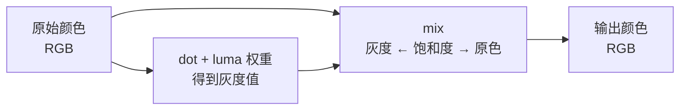

这一节我们会讲解：

- 饱和度、对比度、色温在 GLSL 里长什么样
- `mix(luma, color, saturation)` 为什么是饱和度控制的标准写法
- 对比度不只是"亮暗差"——它是一根绕着中灰旋转的跷跷板
- 暖/冷色调的矩阵变换——从 Kelvin 色温到 RGB 偏移
- LUT（Look-Up Table）的原理——把复杂调色变成一张 3D 纹理查表

好吧，我们开始吧。色调映射让亮度合理了。但你看画面可能还是有点"平"——像用手机出厂设置拍的。你想要调出那种"黎明时分的冷蓝"或者"日落时分的暖金"，这就是色彩分级的地盘。

> 色彩分级 = 把物理正确的颜色，转化成符合你想表达的情绪的颜色。

---

## 饱和度：颜色有多浓郁

内心的第一反应：饱和度不就是"颜色的鲜艳程度"吗？对，但你得能算出来。

一个颜色由两部分组成：**亮度**（luma，黑白的部分）和**色调**（chroma，颜色独有的部分）。饱和度为 0，就是纯灰度，只有亮度没有色调；饱和度拉满，就是原色原味。

标准公式出奇的简单：

```glsl
float luma = dot(color.rgb, vec3(0.299, 0.587, 0.114));
float saturation = 1.5; // >1 更艳, <1 更灰
color.rgb = mix(vec3(luma), color.rgb, saturation);
```

`mix(a, b, t)` 在 `t=0` 时返回 `a`，`t=1` 时返回 `b`。把 `luma`（纯灰度）放在 `a`，原色放在 `b`，`saturation` 就是"我从灰度往鲜艳偏多少"的旋钮。



你可以把这个旋钮绑到 `shaders.properties` 的 slider 上，让用户在 UI 里调。就像相机的饱和度滑杆——右拉更鲜艳，左拉更淡雅，最左就变成黑白电影。

---

## 对比度：灰阶的"拉伸"

对比度的直觉也简单：亮处更亮，暗处更暗。问题是你得定义"中灰"在哪。

常见做法是以 `0.5` 为中灰点，把颜色绕着中灰做拉伸：

```glsl
float contrast = 1.3; // >1 更对比, <1 更平
color.rgb = (color.rgb - 0.5) * contrast + 0.5;
```

把颜色"减去 `0.5`"，就是把它移到以 0 为中心的坐标系；乘上 `contrast`，距离拉大或缩小；再加回 `0.5`，回到正常的 0~1 范围。

内心小剧场：你把一根橡皮筋从中点 `0.5` 捏住，然后捏住两端往外拉。`contrast = 1.3` 就在做这件事——原来在 `0.4` 和 `0.6` 的两个像素，现在是 `0.37` 和 `0.63`，视觉上的"明暗差异"被放大了。

但有一个代价：极端值会被推超出 `[0, 1]`。比如原值 `0.95`，`(0.95 - 0.5) * 1.3 + 0.5 = 1.085`。所以通常跟在色调映射之后——色调映射已经把颜色压到了接近 `[0,1]`，此时调对比度溢出的风险很小。

---

## 色温：暖与冷的秘密

你有没有注意过：白炽灯的光偏黄（约 2700K），中午的阳光偏白（约 5500K），阴天的光偏蓝（约 7000K）。Kelvin 色温越高，色调越冷；色温越低，色调越暖。

GLSL 里最简单的色温调整是用一个"冷暖轴"——暖色偏 `RGB(1, 0.9, 0.8)`，冷色偏 `RGB(0.8, 0.9, 1)`：

```glsl
float warmth = 0.3; // >0 偏暖, <0 偏冷
vec3 warmShift = vec3(0.15, 0.05, -0.1) * warmth;
color.rgb += warmShift;
```

这只是粗糙近似。更精确的做法是把 Kelvin 色温映射成真实的 RGB 偏移量。虚幻引擎的 White Balance 做法大概是这样的——用一条从 1000K 到 40000K 的拟合曲线，低 Kelvin 时 R 通道放大、B 通道缩小，高 Kelvin 时反过来。简化版：

```glsl
// temperature: 1000~40000K
float t = temperature / 1000.0;

float r, g, b;
if (t <= 66.0) {
    r = 1.0;
    g = clamp(0.3900815787690196 * log(t) - 0.6318414437886274, 0.0, 1.0);
    b = clamp(0.543206789110196 * log(t - 10.0) - 1.19625408914, 0.0, 1.0);
} else {
    r = clamp(1.292936186062745 * pow(t - 60.0, -0.1332047592), 0.0, 1.0);
    g = clamp(1.129890860895294 * pow(t - 60.0, -0.0755148492), 0.0, 1.0);
    b = 1.0;
}
vec3 whiteBalance = vec3(r, g, b);
color.rgb *= whiteBalance;
```

好吧，不用被这些奇怪的常数吓到。它们只是物理学家和工程师拟合出来的经验曲线。你甚至可以完全不看它怎么来的，只在 `shaders.properties` 里绑一个 `temperature` slider，用户拉一拉，画面就冷暖切换。

---

## LUT：一键导入电影调色

如果以上三个旋钮还不够，那就该 LUT 出场了。LUT（Look-Up Table，色彩查找表）是一张 3D 纹理——把 RGB 当成 XYZ 坐标，纹理里存的是"如果输入是这个颜色，输出应该变成那个颜色"的映射。

一张典型的 3D LUT 纹理长这样：

```
分辨率为 N³ × N 的 2D 图片
比如 64³ 的 LUT 展开成 64×4096 的贴图
```

在 GLSL 里读取 LUT：

```glsl
uniform sampler2D colorGradeLUT;

vec3 applyLUT(vec3 color) {
    const float lutSize = 64.0;
    float scale = (lutSize - 1.0) / lutSize;
    float offset = 0.5 / lutSize;

    vec3 scaled = color * scale + offset;

    // 3D → 2D 坐标映射
    float slice = scaled.b * (lutSize - 1.0);
    float slice0 = floor(slice);
    float slice1 = min(slice0 + 1.0, lutSize - 1.0);
    float frac = slice - slice0;

    vec2 uv0 = vec2(scaled.r + slice0, scaled.g) / lutSize;
    vec2 uv1 = vec2(scaled.r + slice1, scaled.g) / lutSize;

    vec3 col0 = texture(colorGradeLUT, uv0).rgb;
    vec3 col1 = texture(colorGradeLUT, uv1).rgb;

    return mix(col0, col1, frac);
}
```

内心独白一下：这个函数做的事很简单。把 RGB 三个数当作 3D 空间里的坐标，然后查表。`64³` 的 LUT 意味着 RGB 每个通道被分成 64 格，所以总共有 262144 个颜色条目。你在 Photoshop 里调好一个预设，导出 .cube 文件，再转成 2D 贴图，塞进 `shaders/tex/` 目录。之后这行代码就是你的整个调色板。

---

## 完整的 composite.fsh 后处理链

把你学到的串起来，`composite.fsh` 底部会是这样的顺序：

```glsl
// 1. 色调映射
vec3 mapped = ACESFitted(sceneColor * exposure);

// 2. 饱和度
float luma = dot(mapped, vec3(0.299, 0.587, 0.114));
mapped = mix(vec3(luma), mapped, Saturation);

// 3. 对比度
mapped = (mapped - 0.5) * Contrast + 0.5;

// 4. 色温
mapped += vec3(0.1, 0.03, -0.08) * Warmth;

// 5. LUT（如果有）
mapped = applyLUT(mapped);

outColor = vec4(mapped, 1.0);
```

这里的 `Saturation`、`Contrast`、`Warmth` 可以是 `shaders.properties` 里定义的宏——用户在菜单里拖拖滑杆，画面实时响应。这就是为什么很多光影包有几十个滑杆可选：不是技术炫技，而是美术需要。

---

## 本章要点

- 饱和度 = `mix(luma, color, saturation)`，画面绕灰度轴旋转。
- 对比度 = `(color - 0.5) * contrast + 0.5`，以 `0.5` 为支点的明暗拉伸。
- 色温用 RGB 三通道偏移来模拟 Kelvin 色温：温暖偏红黄，冷色偏蓝。
- LUT 是 3D 色彩查找表，把复杂调色压缩成一次纹理采样。
- 后处理顺序：色调映射 → 饱和度 → 对比度 → 色温 → LUT → 输出。


---

下一节：[8.4 — FXAA 快速抗锯齿：一条边缘一个方向](/08-post/04-fxaa/)
