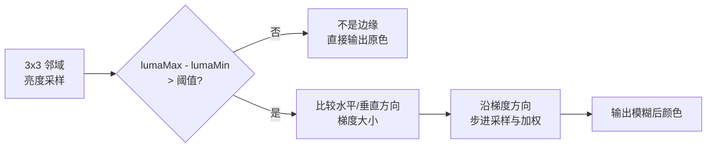

这一节我们会讲解：

- 为什么方块棱角看起来像楼梯——像素是方的
- FXAA 不上采样，它怎么做到抗锯齿的
- 边缘检测：用颜色梯度和亮度差异找到"锯齿线"
- 方向判断：沿边模糊，而不是把整张画面一起涂糊
- 完整 FXAA 代码如何嵌入 `composite6.fsh`

好吧，我们开始吧。你现在把你的光影画面放大到像素级。看到没？方块的斜边不是一条干净直线，而是一排"楼梯"。每个台阶就是一个像素。这不是 bug，是屏幕物理决定的——像素是正方形，斜线只能用正方形拼出来。

原生方案是超级采样（SSAA / MSAA）——每个像素采样多次，拿平均颜色。这在 Minecraft 不现实，因为延迟渲染 pipeline 太贵，你不可能把整个 G-Buffer 渲染 2 倍或 4 倍分辨率。

还有一招不靠多采样：**在已经画好的画面里，找到楼梯棱角，沿着棱角模糊它。** 这就是 FXAA。

> FXAA 不开高分辨率，而是找到锯齿边缘，把棱角上不该出现的硬过渡"抹匀"。

---

## 第一步：找到边缘——亮度差检测

内心小剧场：你现在是像素 `(x, y)`。你往上下左右看一眼。如果你和邻居的亮度差很大，你很可能在一根边缘上。草和天空交接处，亮度一跳就是一个台阶。

FXAA 的第一步，是先算出当前像素和周围邻居的亮度——不是看一两个邻居，而是看 3×3 邻域——找出亮度最高的和最低的：

```glsl
float lumaCenter  = rgbToLuma(color.rgb);
float lumaDown    = rgbToLuma(texture(colortex0, texcoord + vec2( 0.0, -texelSize.y)).rgb);
float lumaUp      = rgbToLuma(texture(colortex0, texcoord + vec2( 0.0,  texelSize.y)).rgb);
float lumaLeft    = rgbToLuma(texture(colortex0, texcoord + vec2(-texelSize.x, 0.0)).rgb);
float lumaRight   = rgbToLuma(texture(colortex0, texcoord + vec2( texelSize.x, 0.0)).rgb);

float lumaMin = min(lumaCenter, min(min(lumaDown, lumaUp), min(lumaLeft, lumaRight)));
float lumaMax = max(lumaCenter, max(max(lumaDown, lumaUp), max(lumaLeft, lumaRight)));
```

如果 `lumaMax - lumaMin` 很小（比如小于 `0.05`），说明周围很平滑，没有边缘，直接输出原色，省掉后续计算。这个提前退出的判断是 FXAA 高效的根本——大部分像素在天空、草地、水面内部，根本不需要处理。

```glsl
float contrastThreshold = 0.0833;
if (lumaMax - lumaMin < max(contrastThreshold, lumaMax * contrastThreshold)) {
    outColor = vec4(color.rgb, 1.0);
    return; // 不是边缘，跳过
}
```

注意这里的阈值不是固定数。它乘了一个 `lumaMax` 做相对判断——暗处的 `0.05` 差异算大，亮处的 `0.05` 可能只是微弱的纹理变化。`max(absolute, relative)` 保证了亮区和暗区各有合理的门槛。这就是 FXAA 源码里著名的 `EDGE_THRESHOLD_MIN` 和 `EDGE_THRESHOLD_MAX` 之间的权衡——常量并非随手拍脑袋。

---

## 第二步：判断边缘方向

好，你确认这是个边缘像素。然后呢？你不是随便往四周胡乱模糊——否则画面像抹了油。

你需要知道这个边缘是往哪个方向摆的——是水平边缘，还是垂直边缘，还是斜的。FXAA 用了一个巧妙的办法：比较水平方向的亮度变化和垂直方向的亮度变化，哪边跳得大就沿哪边做模糊。

```glsl
float lumaDownLeft  = rgbToLuma(texture(colortex0, texcoord + vec2(-texelSize.x, -texelSize.y)).rgb);
float lumaUpRight   = rgbToLuma(texture(colortex0, texcoord + vec2( texelSize.x,  texelSize.y)).rgb);
float lumaUpLeft    = rgbToLuma(texture(colortex0, texcoord + vec2(-texelSize.x,  texelSize.y)).rgb);
float lumaDownRight = rgbToLuma(texture(colortex0, texcoord + vec2( texelSize.x, -texelSize.y)).rgb);

// 两个对角线方向的梯度
float edgeHorizontal = abs(-2.0 * lumaLeft  + lumaUpLeft   + lumaDownLeft)
                     + abs(-2.0 * lumaRight + lumaUpRight  + lumaDownRight);

float edgeVertical   = abs(-2.0 * lumaUp    + lumaUpLeft   + lumaUpRight)
                     + abs(-2.0 * lumaDown  + lumaDownLeft + lumaDownRight);

bool isHorizontal = edgeHorizontal >= edgeVertical;
```

内心独白：`edgeHorizontal` 在做什么？`-2.0 * lumaLeft + lumaUpLeft + lumaDownLeft` 是一个简化的二阶导数——如果左边像素和它的上下邻居亮度差很大，说明这里有一条垂直边缘（水平方向的亮度在跳）。这和数学课的拉普拉斯算子精神一致，但 FXAA 选择了更便宜的局部近似——它不在乎边缘是几阶导数，只在乎跳得够不够大、向左模糊还是向下模糊更合理。



---

## 第三步：沿边缘方向搜索和模糊

找到方向后，FXAA 沿着边缘的两端各走几步，采几个远邻像素，用它们的颜色来"抹平"这条棱。完整 FXAA 搜索和加权见经典实现——NVIDIA 的 Timothy Lottes 写的那篇白皮书。核心逻辑是：

```glsl
float pixelStep;
if (isHorizontal) {
    pixelStep = texelSize.y;
    // 沿着垂直方向搜索
} else {
    pixelStep = texelSize.x;
    // 沿着水平方向搜索
}

// 两端步进，找到边缘终点
float edgeLength;
vec2 edgeDirection;

// ... 搜索逻辑，找到最优 blend 偏移量 ...

vec3 finalColor = 0.5 * (
    texture(colortex0, texcoord + edgeDirection * edgeLength).rgb +
    texture(colortex0, texcoord - edgeDirection * edgeLength).rgb
);
```

详细源码你可以在网上找到 >100 行的完整实现，但你不一定需要自己逐行手写。`composite6.fsh` 是 BSL 里 FXAA 的传统位置。通常做法是：在 `composite6` 里 include `lib/antialiasing/fxaa.glsl`，然后调用 `FXAA(colortex0, texcoord)` 函数，把输出写回 colortex0。

---

## 完整 composite6.fsh 框架

下面是你在 `composite6.fsh` 里的最低配版本——简化算法，省略了精确的子像素偏移和搜索半径自适应，但保留了核心三步检测+模糊。把它理解为"FXAA 的教具版"——能跑、能看效果、值得你理解每行在做什么：

```glsl
#version 330 compatibility

uniform sampler2D colortex0;
uniform vec2 viewWidthHeight;

in vec2 texcoord;

/* RENDERTARGETS: 0 */
layout(location = 0) out vec4 outColor;

float rgbToLuma(vec3 rgb) {
    return dot(rgb, vec3(0.299, 0.587, 0.114));
}

void main() {
    vec2 texelSize = 1.0 / viewWidthHeight;
    vec3 color = texture(colortex0, texcoord).rgb;

    // 读取 3x3 邻域
    vec3 cU  = texture(colortex0, texcoord + vec2( 0.0,                texelSize.y)).rgb;
    vec3 cD  = texture(colortex0, texcoord + vec2( 0.0,               -texelSize.y)).rgb;
    vec3 cL  = texture(colortex0, texcoord + vec2(-texelSize.x,         0.0)).rgb;
    vec3 cR  = texture(colortex0, texcoord + vec2( texelSize.x,         0.0)).rgb;
    vec3 cUL = texture(colortex0, texcoord + vec2(-texelSize.x,         texelSize.y)).rgb;
    vec3 cUR = texture(colortex0, texcoord + vec2( texelSize.x,         texelSize.y)).rgb;
    vec3 cDL = texture(colortex0, texcoord + vec2(-texelSize.x,        -texelSize.y)).rgb;
    vec3 cDR = texture(colortex0, texcoord + vec2( texelSize.x,        -texelSize.y)).rgb;

    float lC = rgbToLuma(color), lU = rgbToLuma(cU), lD = rgbToLuma(cD);
    float lL = rgbToLuma(cL), lR = rgbToLuma(cR);
    float lUL = rgbToLuma(cUL), lUR = rgbToLuma(cUR);
    float lDL = rgbToLuma(cDL), lDR = rgbToLuma(cDR);

    // 判断是不是边缘
    float lMin = min(min(min(min(lC, lU), min(lD, lL)), min(lR, lUL)), min(min(lUR, lDL), lDR));
    float lMax = max(max(max(max(lC, lU), max(lD, lL)), max(lR, lUL)), max(max(lUR, lDL), lDR));
    float contrast = lMax - lMin;

    if (contrast < 0.06) {
        outColor = vec4(color, 1.0);
        return;
    }

    // 判断水平还是垂直边缘
    float hEdge = abs(lL + lR - 2.0 * lC) * 2.0
                + abs(lUL + lDL - 2.0 * lL)
                + abs(lUR + lDR - 2.0 * lR);
    float vEdge = abs(lU + lD - 2.0 * lC) * 2.0
                + abs(lUL + lUR - 2.0 * lU)
                + abs(lDL + lDR - 2.0 * lD);

    // 沿边缘方向取两端做三像素混合
    vec3 result;
    if (hEdge > vEdge) {
        result = (cL + color + cR) / 3.0;
    } else {
        result = (cU + color + cD) / 3.0;
    }

    outColor = vec4(result, 1.0);
}
```

这个教具版简化了搜索半径、子像素偏移、端点锚查（end-of-edge anchor search）和抗锯齿量自适应。换句话说，它在长斜边上效果尚可，但在极陡的单一像素锯齿上不如完整 FXAA。但它胜在你一眼就能看懂——你先理解"三像素混合"，再去追完整版就不难了。

> ⚠️ **纹理分辨率的坑**：`texelSize = 1.0 / viewWidthHeight` 仅在屏幕分辨率和 colortex 分辨率一致时正确。如果 colortex0 被配置为半分辨率（比如 `composite4` 的 buffer），你需要用 `1.0 / textureSize(colortex0, 0)` 代替，否则采样的偏移量会错位，边缘检测完全失效。

---

## FXAA 的代价

FXAA 不完美。它偶尔会把文字、UI 或细线也模糊掉，因为它无法区分"锯齿棱角"和"本来就是细线的内容"。另外，它只是在已经锯齿的画面里修修补补，不真正增加信息量。TAA（时序抗锯齿）利用历史帧提供的信息量大得多，但代价是鬼影和更复杂的实现——那是更高级的话题了。

---

## 本章要点

- 锯齿来自像素的方形网格——斜线只能用"楼梯"逼近。
- FXAA 在已经渲染完的画面中检测边缘，沿边缘方向模糊来"抹平"棱角。
- 边缘检测：比较当前像素和周围邻居的亮度变化，幅度小则跳过。
- 方向判断：水平梯度和垂直梯度比较大小，取梯度更大的方向进行模糊。
- 完整 FXAA 搜索边缘端点，并做自适应步进加权，约 100 行 GLSL。
- 教具版：上中下/左中右三像素平均，少量 GLSL 即可取出可感知的抗锯齿效果。
- FXAA 开销低，但会轻微模糊整体画面纹理。Iris 惯例放在 `composite6`。


---

下一节：[8.5 — 实战：电影感调色](/08-post/05-project/)
