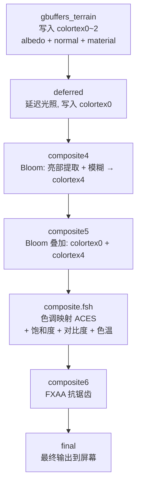

这一节我们会讲解：

- 把 8.1~8.4 的东西串进一个完整的 composite 管线
- 色调映射 + 暖色偏移 = 只用两行 GLSL 出电影感
- `shaders.properties` 里怎么配 composite pass 的执行顺序
- 自检清单——从亮部提取到最终输出的每一道
- 如果画面不对，最可能炸在哪一环
- 光影包里完整的文件结构长什么样

好吧，我们开始吧。你不是来背理论的。你是来把整个后处理链装进一个能跑的光影包，眯起眼睛看一眼画面，说："嗯，像电影。"

这一节我们往前迈一步：把第 8.1~8.4 节的所有碎片，缝进一个完整的管线，让它跑在 Minecraft 里。

---

## 管线全景：你的 composite pass 们到底谁先谁后

先别急着敲代码。我们先像导演一样站在剪辑台前，把一整个 composite 链铺开。



这里有一个新面孔：`composite.fsh`（不带编号）。在 Iris 里，`composite`（无后缀数字）通常排在所有带编号的 composite 之前、`gbuffers` 和 `deferred` 之后。BSL 用它来承担色调映射和色彩分级——等到 composite4/5 的 Bloom 处理完之后，composite 拿到的是已经叠好 Bloom 的 HDR 画面，再做最后一级的颜色处理。

---

## composite4.fsh：亮部提取 + 模糊

你先拿着延迟光照算好的 `colortex0`，把亮部切出来——然后用上一节做的分离高斯（或一个省事的单 pass 高斯核）糊开。

```glsl
#version 330 compatibility

uniform sampler2D colortex0;
uniform vec2 viewWidthHeight;

in vec2 texcoord;

/* RENDERTARGETS: 4 */
layout(location = 0) out vec4 outBloom;

float luma(vec3 c) { return dot(c, vec3(0.299, 0.587, 0.114)); }

void main() {
    vec3 color = texture(colortex0, texcoord).rgb;
    float brightness = luma(color);

    // 亮部提取：只保留 > 0.7 的部分，做个 soft knee
    float threshold = 0.7;
    float bright = smoothstep(threshold - 0.2, threshold + 0.2, brightness);
    vec3 highlight = color * bright;

    // 简单 5-tap 水平 + 垂直合并（省一个 pass 的降级做法）
    vec2 texel = 1.0 / viewWidthHeight;
    vec3 blur = highlight * 0.4;
    blur += texture(colortex0, texcoord + vec2( texel.x, 0.0)).rgb * bright * 0.15;
    blur += texture(colortex0, texcoord + vec2(-texel.x, 0.0)).rgb * bright * 0.15;
    blur += texture(colortex0, texcoord + vec2(0.0,  texel.y)).rgb * bright * 0.15;
    blur += texture(colortex0, texcoord + vec2(0.0, -texel.y)).rgb * bright * 0.15;

    outBloom = vec4(blur, 1.0);
}
```

---

## composite5.fsh：Bloom 叠加

读取 `colortex0`（主画面）和 `colortex4`（糊好的亮部），加回去。

```glsl
#version 330 compatibility

uniform sampler2D colortex0;
uniform sampler2D colortex4;

in vec2 texcoord;

/* RENDERTARGETS: 0 */
layout(location = 0) out vec4 outColor;

void main() {
    vec3 scene = texture(colortex0, texcoord).rgb;
    vec3 bloom = texture(colortex4, texcoord).rgb;
    float strength = 0.4;

    outColor = vec4(scene + bloom * strength, 1.0);
}
```

---

## composite.fsh：色调映射 + 色彩分级

现在拿着已经叠了 Bloom 的 HDR 画面，做最后一刀——色调映射 + 暖色调。

```glsl
#version 330 compatibility

uniform sampler2D colortex0;
uniform float eyeBrightnessSmooth;

in vec2 texcoord;

/* RENDERTARGETS: 0 */
layout(location = 0) out vec4 outColor;

vec3 ACESFitted(vec3 x) {
    const float a = 2.51, b = 0.03, c = 2.43, d = 0.59, e = 0.14;
    return clamp((x * (a * x + b)) / (x * (c * x + d) + e), 0.0, 1.0);
}

void main() {
    vec3 color = texture(colortex0, texcoord).rgb;

    // 自动曝光
    float exposure = mix(0.4, 1.6, eyeBrightnessSmooth);
    color *= exposure;

    // ACES 色调映射
    color = ACESFitted(color);

    // 暖色调：暗部微微偏暖
    float warmth = 0.04;
    vec3 warmShift = vec3(0.12, 0.04, -0.08) * warmth;
    color += warmShift * (1.0 - dot(color, vec3(0.299, 0.587, 0.114)));
    // 暗处加暖更多，亮处加暖更少

    // 微调对比度，保持自然
    float contrast = 1.05;
    color = (color - 0.5) * contrast + 0.5;

    outColor = vec4(color, 1.0);
}
```

最后的暖色调偏移有个小技巧：`(1.0 - luma)` 作为权重，暗处暖色加得多，亮处加得少。这样天空的白云不会被染成黄色，只有阴影区和地面暗部会带上微微的琥珀调。这就是"电影感"那根弦的微妙处——不是满屏泼暖色，而是让阴影有温度。


---

## composite6.fsh：FXAA

用 8.4 节那套 FXAA 框架。这里只做最小调用——读 colortex0（已经是调好色映射的 LDR 画面），跑边缘检测+模糊，写回 colortex0。

```glsl
#version 330 compatibility

uniform sampler2D colortex0;
uniform vec2 viewWidthHeight;

in vec2 texcoord;

/* RENDERTARGETS: 0 */
layout(location = 0) out vec4 outColor;

// ... 8.4 节的 FXAA 代码 ...
```

---

## 文件结构：你的光影包现在长什么样

做完这一章，你的 `shaders/` 目录应该长这样：

```
shaders/
├── shaders.properties         # 管线配置、UI 选项
├── world0/                    # 主世界
│   ├── gbuffers_terrain.vsh
│   ├── gbuffers_terrain.fsh
│   ├── deferred.vsh
│   ├── deferred.fsh
│   ├── composite.vsh          # 全屏四边形
│   ├── composite.fsh          # 色调映射 + 色彩分级
│   ├── composite4.vsh
│   ├── composite4.fsh         # Bloom 提取 + 模糊
│   ├── composite5.vsh
│   ├── composite5.fsh         # Bloom 叠加
│   ├── composite6.vsh
│   ├── composite6.fsh         # FXAA
│   └── final.vsh / final.fsh  # 最终输出（如果使用）
└── (tex/ ── 可选 LUT 纹理)
```

---

## shaders.properties 的关键配置

Iris 需要知道哪些 pass 存在、每个 pass 使用的缓冲分辨率。最小配置：

```properties
screen.RENDERING = <empty>

# 告诉 Iris 哪些 composite pass 存在
compositePrograms=composite composite4 composite5 composite6 final

# 缓冲分辨率（-1 = 屏幕分辨率, 0.5 = 半分辨率）
scale.composite4=0.5
scale.composite5=-1
scale.composite6=-1
```

注意 `scale.composite4=0.5`——Bloom 在 1/4 像素数（0.5×0.5）的缓冲上做，这是性能友好的关键一步。

---

## 自检清单

跑起来之后，对照下面这十条检查你的画面：

| # | 检查项 | 期望效果 |
|---|--------|---------|
| 1 | 太阳周围有柔和光晕 | 太阳本身亮，周围向外渐淡 |
| 2 | 火把/发光方块也泛光 | 暗处的发光物最明显 |
| 3 | 天空颜色自然，不过曝 | 正午蓝天不是纯白，有层次 |
| 4 | 洞穴内部提亮 | 走进黑暗洞穴，画面自动变亮 |
| 5 | 光晕不覆盖 UI | HUD、快捷栏不受 Bloom 影响 |
| 6 | 方块棱角平滑 | 远看方块边缘锯齿明显减少 |
| 7 | 贴图细节不丢失 | 石头纹理仍然清晰，没有被抹平 |
| 8 | 阴影区微微偏暖 | 暗处方块带一丝暖调，但不过分 |
| 9 | 无黑屏/白屏/报错 | Iris 调试模式 (Ctrl+D) 无报错 |
| 10 | FPS 可接受 | Bloom 用半分辨率后，性能下降 < 5% |

---

## 如果画面不对——最可能的三个坑

**坑一：Bloom 覆盖了整个画面**。阈值设太低了。把 `threshold` 从 `0.7` 提到 `1.0` 试试——让只有真正亮的像素通过。

**坑二：色调映射后画面偏灰**。检查是否在色调映射前做了 `clamp(color, 0.0, 1.0)`——如果颜色被截到 `[0,1]` 再进色调映射，高光的 `2.5` 已经被拍扁成 `1.0`，ACES 根本没发挥空间。色调映射必须吃原始 HDR 数据。另外确认 `composite` 的输入来自 `composite5` 的输出（已经叠过 Bloom 的 colortex0），而不是从 gbuffers 直连。

**坑三：FXAA 完全没效果**。最可能的原因：`texelSize` 用的是屏幕分辨率，但 `colortex0` 被前面的 pass 缩小了。用 `textureSize(colortex0, 0)` 来算 texel 大小。另一个常见问题是 FXAA 放错位置——如果色调映射还没做，HDR 画面里的亮度差异在暗区不足以触发边缘检测阈值；FXAA 必须跑在色调映射之后的 LDR 上。

---

## 总结：你刚完成了一整套电影级后处理

停下来想一想：三章前你的画面还只是"能看见方块"。现在你已经有了：

- 亮部提取 + 高斯模糊的 **Bloom**
- 好莱坞级 **ACES 色调映射**
- 自适应 **自动曝光**——洞穴走进去眼不瞎
- 暗部 **暖色调**——画面情绪变得有温度
- **FXAA 抗锯齿**——棱角变平滑

这些不是独立特效。它们像一组镜头滤镜：从物理正确 → 镜头光晕 → 曝光矫正 → 调色 → 去锯齿。顺序就是一张照片从 RAW 到成片的过程。

> 你现在的后处理链已经比很多独立游戏还完整。而这只是你光影包的一半——前面还有 gbuffers、deferred、阴影在等着继续打磨。

---

## 本章要点

- 完整后处理链：composite4(Bloom) → composite5(叠加) → composite(色调映射) → composite6(FXAA) → final。
- `shaders.properties` 里通过 `compositePrograms=` 声明存在的 pass，通过 `scale.` 配置缓冲分辨率。
- ACES 色调映射 + 暗部暖色偏移 = 两行代码出电影感。
- Bloom 亮部阈值要在 HDR 阶段判断——色调映射前的原始光照值才分得清太阳和草。
- FXAA 必须在色调映射之后的 LDR 上跑——否则暗区边缘检测阈值失效。
- 用自检清单逐条比对，优先级：无报错 > 亮度合理 > Bloom 正常 > 抗锯齿有效 > 色彩满意。

---

> **这是第八部分的终点，也是你光影后处理的起点。** 下一步：第九部分——天空与大气。
