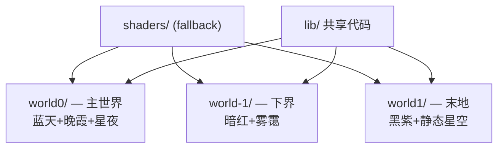

这一节我们会讲解：

- 为什么三个维度的光照不能共用一套代码
- Iris 的 `world0`、`world-1`、`world1` 目录规则
- 主世界的暖光、下界的暗红、末地的冷紫——它们从哪来
- 如何用 `#include` 共享核心逻辑，同时隔离维度差异
- 实战：把 sky pass 拆成三份，每个维度独立写

到目前为止，你所有的 shader 文件都在项目的根 `shaders/` 目录下，对吧？在主世界它们工作得好好的——蓝天、金色夕阳、正常的日影。然后你走到下界传送门前，走了进去……

然后你看到的是一片怪异的东西：橘红的天空被你的主世界太阳光照亮了，蓝色的天空底色漏了出来，阴影的方向也不对。问题出在哪？

回答很简单：你没有告诉光影"你在下界了"。

> 主世界的太阳方向 `sunPosition` 在下界没有任何意义——下界根本没有太阳。

好吧，我们开始吧。

---

## 三个维度：三套不同的光照规则

内心独白一下：主世界、下界、末地各自需要什么？

主世界是最完整的——太阳、月亮、星空的昼夜循环，蓝天 + 晚霞 + 朝霞的大气散射，大地色调偏暖的日光。这是你前面十几章一直在做的环境。

下界完全不同。它有暮色的红色雾霭，巨大的空洞，天花板低矮。光源不是天空，而是岩浆海、荧石和灵魂火。天空颜色几乎和地面环境光融为一体——暗红底、近乎没有方向感。你不需要一个明亮的蓝天，你需要一个低亮度的暗红笼罩。

末地又是另一回事。真空的黑色天空、紫色的虚空粒子、静止的时间。地面不是泥土和石头，而是一种苍白的末地石。这里的颜色偏冷，可以加一些黯淡的紫色散射。

> 三个维度 = 三个不同的"宇宙"，你的光影得会认路。


---

## world0、world-1、world1

Iris 用目录名来区分维度。这个规则不是我们发明的——打开 BSL 的 `shaders/` 目录你就能看到。

```
shaders/
├── shaders.properties
├── lib/                  # 公用的函数和宏
├── program/              # #include 模板
├── world0/               # 主世界 (Overworld)
│   ├── gbuffers_terrain.vsh
│   ├── gbuffers_terrain.fsh
│   ├── composite.fsh
│   └── ...
├── world-1/              # 下界 (Nether)
│   ├── gbuffers_terrain.vsh
│   ├── gbuffers_terrain.fsh
│   ├── composite.fsh
│   └── ...
└── world1/               # 末地 (The End)
    ├── gbuffers_terrain.vsh
    ├── gbuffers_terrain.fsh
    ├── composite.fsh
    └── ...
```

Iris 加载光影时，先检查当前维度的目录有没有文件，有就用；没有就回退到根 `shaders/` 目录。所以最省力的起步方式是：先把你已经写好的文件保留在 `shaders/` 根目录（充当"默认版本"），然后把需要维度特化的 pass 单独复制到 `world-1/` 和 `world1/` 下。

> world0 = 主世界，world-1 = 下界，world1 = 末地。记不住？主世界是最正常的，所以编号 0；下界在"底下"，所以是 -1；末地编号是 1。

---

## 从宏预检到维度判断

你可以在 shader 里用 Iris 提供的宏来知道自己在哪个维度：

```glsl
#ifdef NETHER
    // 下界特有的处理
#endif

#ifdef END
    // 末地特有的处理
#endif
```

但实际上更推荐目录结构的方式。为什么？因为条件编译可以隔离代码，但不能隔离整个管线。如果你的下界不需要太阳方向光，你可以在 `world-1/composite.fsh` 里干脆不导入相关的光照库，而不是在主世界的 `composite.fsh` 里写一堆 `#ifdef NETHER`。

```glsl
// world0/composite.fsh — 主世界版本
#include "/program/composite.glsl"     // 共享的后处理框架
#include "/lib/color/skyColor.glsl"   // 蓝天 + 晚霞散射
#include "/lib/atmospherics/clouds.glsl"
```

```glsl
// world-1/composite.fsh — 下界版本
#include "/program/composite.glsl"     // 同样的后处理框架
// 注意：不导入 skyColor.glsl，下界不用蓝天
// 注意：不导入 clouds.glsl，下界地面以下没云
// 但导入红色的环境光计算
#include "/lib/color/netherColor.glsl"
```

内心独白下：这不就等于把"哪个文件该出现在哪里"放在了目录结构里，而不是挤在代码的条件判断里？对。目录是物理事实——打开文件夹就能看到哪些效应只在主世界生效。这比在代码里搜索 `#ifdef NETHER` 要直观太多了。

---

## 下界光照怎么调

下界有特殊规则：维度里没有 `sunPosition` 的方向光。光照完全来自环境——Minecraft 的方块光照系统和少量天光残留。

```glsl
// world-1/gbuffers_terrain.fsh 的片段
vec3 N = normalize(normal);
vec3 bakedLight = texture(lightmap, lmcoord).rgb;

// 下界没有太阳，diffuse 贡献为零
// 但 bakedLight 仍能给出火把、岩浆的方块光
// 加一层暗红色环境基底
vec3 ambientNether = vec3(0.08, 0.02, 0.04); // 很暗的红紫调
outColor.rgb = albedo.rgb * (bakedLight * 1.2 + ambientNether);
```

火把和岩浆在 `lightmap` 里仍然是亮的——Minecraft 在下界会正常更新方块光。天空光在下界基本为 0，所以你不需要费心去模拟太阳。

> 下界光照 = 方块光 + 微量红色环境光。没有方向，只有强度。

---

## 实战：拆 sky pass

把你在 `composite.fsh`（或 `gbuffers_skybasic.fsh` / `gbuffers_skytextured.fsh`）里的天空计算，按维度拆开。

1. 把主世界的天空留到 `world0/gbuffers_skybasic.fsh`。
2. 复制一份到 `world-1/gbuffers_skybasic.fsh`，换成暗红底色 + 低强度大气散射（或干脆不要散射）。
3. 再复制一份到 `world1/gbuffers_skybasic.fsh`，换成深黑紫底色 + 静态的紫色星空。



别忘了，下界和末地也可能需要独立的 `shaders.properties` 子条目——但不是必须的。通常主世界的 `shaders.properties` 可以通用，除非你的特定维度有完全不同的滑杆配置（比如下界单独的天空亮度滑杆）。

---

## 本章要点

- 主世界、下界、末地的光照环境完全不同：主世界有太阳方向光，下界主要靠方块光，末地是真空冷色调。
- Iris 用 `world0/`（主世界）、`world-1/`（下界）、`world1/`（末地）的目录结构来隔离不同维度的着色器。
- 根 `shaders/` 目录作为回退；维度目录只放需要特化的文件。
- 推荐用目录分离代替大量 `#ifdef NETHER` 条件编译，更直观、更好维护。
- 下界光照 = `lightmap` 方块光 + 微量暗红环境光，不做方向光。
- 天空 pass 按维度拆分：主世界用蓝色大气散射，下界用暗红雾，末地用暗紫底色。

这里的要点是：当一个光影从主世界跑进下界，它不是在"切换光照参数"——它在切换整个着色器程序。目录结构就是那个开关。

下一节：[10.2 — 配置界面设计](/10-ship/02-config-ui/)
