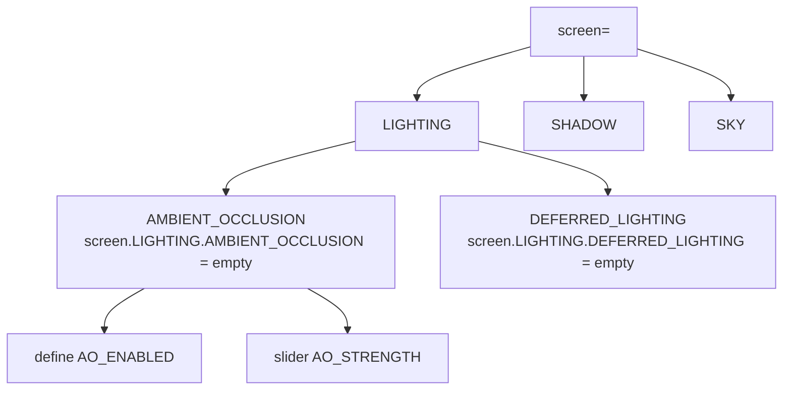

这一节我们会讲解：

- `shaders.properties` 的 `screen=` 层级如何组织设置页面
- `sliders=` 怎样定义滑块的范围、默认值和步长
- 多语言 `.lang` 文件让不同语言的使用者都能看懂你的选项
- `block.properties`、`item.properties`、`entity.properties` 的方块 ID 映射
- 实战：搭一个三级页面结构——光照 / 阴影 / 天空 / 后处理

第 2 章你见过 `shaders.properties` 最基本的用法——绑定一个 checkbox 控制灰度的 `#define`。现在你的光影已经不是简单滤镜了：它有体积云、有 SSAO、有软阴影、有调色映射。用户需要的是一个能分类浏览、有滑杆、有描述的完整设置界面——不是一长串不明所以的开关。

> 好的光影设置界面像一本菜单：用户不用读完 shader 源码就知道吃什么。

好吧，我们开始吧。

---

## 页面层级：screen

`shaders.properties` 的 `screen=` 定义的是页面树的根层级。你可以写多个 `screen=`，每个代表一个主页面，里面可以嵌套子页面。

```properties
screen = LIGHTING SHADOW SKY ATMOSPHERICS POST COLOR
```

这行定义了六个主页面。用户在光影菜单里会看到一排标签：光照、阴影、天空、大气、后处理、颜色。

每个主页面可以下设子页面。在 `screen=` 行声明主页面名之后，用 `screen.NAME` 的形式写子页面内容：

```properties
screen.LIGHTING = AMBIENT_OCCLUSION DEFERRED_LIGHTING
screen.LIGHTING.AMBIENT_OCCLUSION = <empty>
screen.LIGHTING.DEFERRED_LIGHTING = <empty>
```

`<empty>` 表示这个页面没有进一步的子页面——只有直接的选项项。如果你在 `<empty>` 页面上定义选项（比如 AO 的开关和强度），这些选项就挂在这个子页面下面。




> 页面层级 = 菜单结构。`screen=` 写根，`screen.NAME` 写分支，`<empty>` 是叶子页。

---

## 定义选项：define 和 sliders

checkbox 类的开关选项最直接——在 `shaders.properties` 里用 `define.OPTION_NAME =` 指定显示名和默认值：

```properties
screen.LIGHTING.AMBIENT_OCCLUSION = <empty>
define.AO_ENABLED = AO 开关
define.AO_STRENGTH = AO 强度

AO_ENABLED = true
AO_STRENGTH = 1.0
```

这里有一个很容易踩的坑：Iris 通过扫描 shader 源码中的 `#define OPTION_NAME` 行来发现可配置选项。如果 shader 源码里只有 `#ifdef AO_ENABLED` 但没有独立的 `#define AO_ENABLED` 行，`shaders.properties` 的配置不会生效。**每个需要可配置的宏都必须在源码中有一个 `#define` 声明作为锚点。**

滑杆 `sliders=` 是另一个最常见的配置类型。你需要同时指定可选值列表、翻译名、默认值和滑杆像素宽度：

```properties
sliders = AO_STRENGTH CLOUD_COVERAGE SHADOW_FILTER_RADIUS

# 滑杆值列表：管道分隔的取值
slider.AO_STRENGTH.values = 0.0|0.2|0.4|0.6|0.8|1.0

# 显示名引用（.lang 文件里的 key）
slider.AO_STRENGTH.text = option.ao_strength

# 步进值
slider.AO_STRENGTH.interval = 0.2
```

控制滑杆范围有两种方式。显式列表 `values = 0.0|0.2|0.4|...|1.0` 适合离散档次；用 `interval` 定义步长。有些光影也用 `min` / `max` / `step` 的三元组——具体取决于你的 Iris 版本，查阅 Iris Docs 里的 `shaders.properties` 规范最安全。

颜色选择器更直接：

```properties
screen.COLOR = <empty>
define.FOG_COLOR = 雾颜色
FOG_COLOR = 0.8 0.85 0.9
```

三浮点数会被 Iris 解释为 RGB 颜色选择器。

---

## .lang 文件：多语言支持

`shaders.properties` 里的显示名可以引用了 `.lang` 文件的 key。这些 key 就像翻译索引——英文文件定义美式显示，中文文件定义中文显示。

在 `shaders/` 下新建 `lang/` 目录。至少放一个英文文件 `en_US.lang`。你还可以加 `zh_CN.lang`（简体中文）、`zh_TW.lang`（繁体中文）等。

`lang/en_US.lang`：
```properties
# 光照页
option.ao_enabled=AO Enabled
option.ao_strength=AO Strength
screen.lighting=Lighting
screen.shadow=Shadows
screen.sky=Sky
screen.post=Post Processing

# 滑杆档位
value.ao_strength.0.0=Off
value.ao_strength.0.2=Very Low
value.ao_strength.0.4=Low
value.ao_strength.0.6=Medium
value.ao_strength.0.8=High
value.ao_strength.1.0=Ultra
```

`lang/zh_CN.lang`：
```properties
option.ao_enabled=环境光遮蔽
option.ao_strength=AO 强度
screen.lighting=光照
screen.shadow=阴影
screen.sky=天空
screen.post=后处理

value.ao_strength.0.0=关闭
value.ao_strength.0.2=非常低
value.ao_strength.0.4=低
value.ao_strength.0.6=中
value.ao_strength.0.8=高
value.ao_strength.1.0=极高
```

内心独白：为什么要把文本从 `shaders.properties` 里抽到 `.lang` 里？因为你的光影可能被法文圈、日文圈、俄文圈的玩家下载。如果他们只看到英文选项名，他们不会懂 "Ambient Occlusion" 是什么意思。多语言不是锦上添花——对非英语用户来说，它就是你光影的门面。

> 多语言不是炫耀你会的语言数量，而是让不懂英文的人也能用你的光影。

---

## block.properties / item.properties / entity.properties

这三类文件不是放在 `shaders/` 下的——它们是资源包文件，放在光影的顶层目录（和你打包的 `shaders/` 同级）。

`block.properties` 让你按方块 ID 做分类。比如把水归到半透明类：

```properties
block.0 = minecraft:water minecraft:ice minecraft:glass
block.1 = minecraft:stone minecraft:dirt minecraft:grass_block
```

`entity.properties` 同理，用于区分动物、怪物、投射物等。这些分类可以在你后续写性能优化（按实体类型决定 LOD）、或做特殊渲染（发光的怪物套用不同 shader）时做条件判断。

> 这些 `.properties` 文件是光影自己读的元数据，不是 Iris 的配置系统，但很多成熟光影用它们做灵活的分类。

---

## 本章要点

- `screen=` 定义主页面；`screen.NAME=` 定义子页面；`<empty>` 标记叶子页面。
- 每个可配置选项需要在 shader 源码中有 `#define OPTION_NAME` 锚点行。
- `sliders=` 配合 `values=` 列出可选值、`interval=` 定义步进。
- `.lang` 文件提供显示名的多语言翻译，至少提供 `en_US.lang`。
- 颜色选择器用三个浮点数的格式，Iris 自动渲染为 RGB 色板。
- `block.properties` 等文件按方块/物品/实体 ID 做分类映射，帮助光影在着色阶段按类判断。

这里的要点是：`shaders.properties` 不只是配置开关，它是你光影产品的用户界面。把页面层级设计好、滑杆范围合理、翻译完整，你的光影看起来就离"半成品"远了一大截。

下一节：[10.3 — 兼容性处理](/10-ship/03-compat/)
