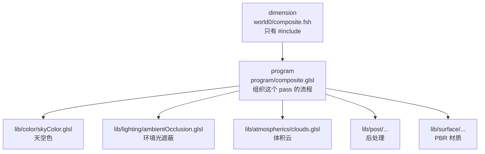
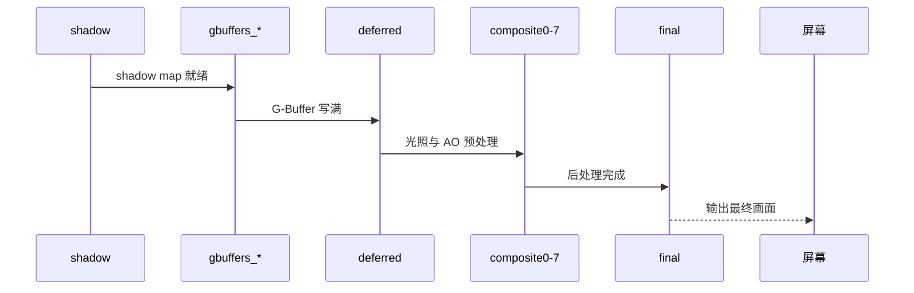

这一节我们会讲解：

- BSL v10 的三层架构：dimension → program → lib
- 数据流：从 shadow 到 final，整个帧经历了什么
- lib/ 目录下的模块划分——哪些该拆、哪些该合
- BSL 衍生生态：Complementary、AstraLex 如何基于同一套骨架成长
- 你在自己光影里可以怎样借鉴这套结构

在前面的章节里，我反复提到 BSL 怎么做、BSL 怎么组织。好吧，现在我们把 BSL 解开，不是看它每一行代码在干什么（那可能是另一个本教程的量），而是看它怎么把几百个文件、上千行代码管得井井有条。

> BSL 不是圣经，但它是一本写得干净的工程案例。

---

## 三层架构

BSL v10 的 `shaders/` 目录打开有三个关键文件夹，每一层有不同的职责。

第一层：**dimension（维度）**——`world0/`、`world-1/`、`world1/`。这一层我们在 10.1 节聊过。BSL 的维度文件只干一件事：根据当前维度 `#include` 对应的 program 模板。以 `world0/composite.fsh` 为例，整个文件可能只有 13 行：

```glsl
#version 330 compatibility

/* DRAWBUFFERS:067 */
#include "/program/composite.glsl"
```

就这么短。它把一切工作下放给了 program 层。

第二层：**program（模板）**——`program/` 下的文件是维度的下一级。以 `composite.glsl` 为例，它会 `#include` 所需的 lib 模块，组织这个 pass 的计算流程。这是光影的逻辑骨架——"这个 pass 什么时候该干什么"都写在这里。

第三层：**lib（功能库）**——`lib/` 不仅是最大的目录，也是最精彩的一层。天空色、材质 PBR、AO、阴影、反射、雾、云、后处理——每一个功能都是独立模块。模块之间尽量低耦合：`surface/materialGbuffers.glsl` 只管从贴图提取材质属性，不关心这些属性是用来算光照还是用来做反射。



> dimension 是开关，program 是流程，lib 是积木。这三层分开，你的光影才能像积木一样地改和扩展。


---

## 一帧的旅程：从 shadow 到 final

内心独白：如果你是一帧画面，你走过哪些工位？把这个流水线看清楚，以后你 debug 就会更快定位"是哪个工位出事了"。

1. **shadow / shadowcomp**：从太阳的视角渲染整个场景，生成 shadow map。BSL 的 `shadow.glsl` 不只画深度，还可能做多级阴影和滤波预处理。`shadowcomp.csh`（compute shader）进一步处理 shadow map。

2. **gbuffers_terrain / water / entities 等**：这是几何阶段。BSL 的 `gbuffers_terrain` 负责把 albedo、normal、material 属性写入 G-Buffer。你在第 2 章到第 4 章学的东西，在 BSL 里是 `lib/surface/materialGbuffers.glsl` 的具体实现。

3. **deferred / deferred1**：从 G-Buffer 取数据，计算环境光遮蔽、反射预处理。BSL 的 `deferred.glsl` 和 `deferred1.glsl` 分工：一个做 AO，一个做反射基础，避免把太多步骤塞进同一个 pass。

4. **composite0~7**：后处理长链。每条链做一件事或一类事：

- composite0：亮部提取（Bloom 准备）
- composite1~3：模糊（Bloom）
- composite4：Bloom 合成
- composite5：色调映射和色彩分级
- composite6：FXAA
- composite7：TAA

5. **final**：最后一环，把画面交给屏幕。



> 一帧的寿命很短，但它的路很长。知道每一步在做什么，你才能在"画质像屎"的时候找到是第几步开始烂的。

---

## lib/ 目录的模块哲学

打开 BSL 的 `lib/`，你会看到一堆子目录：

| 子目录 | 职责 | 代表作 |
|--------|------|--------|
| `surfaces/` | 材质 PBR | `materialGbuffers.glsl`（从贴图提取属性）、`ggx.glsl`（高光 BRDF） |
| `lighting/` | 光照计算 | `ambientOcclusion.glsl`（SSAO）、`shadows.glsl`（PCF 阴影） |
| `color/` | 色彩管理 | `skyColor.glsl`（大气散射）、`lightColor.glsl`（光源色调） |
| `atmospherics/` | 大气效果 | `clouds.glsl`（体积云）、`fog.glsl`（高度雾）、`lightShafts.glsl`（体积光） |
| `reflections/` | 反射 | `simpleReflections.glsl`（SSR）、`raytrace.glsl`（光线追踪） |
| `post/` | 后处理 | Bloom、色调映射 |
| `antialiasing/` | 抗锯齿 | `fxaa.glsl`、`taa.glsl` |
| `vertex/` | 顶点变换 | `waving.glsl`（草叶摆动） |

内心独白：如果你的光影里光照计算和材质提取混在同一个函数里，那你需要拷问自己："我能不能把'这个表面是金属吗'和'金属该怎么亮'拆到两个文件里？"

拆分的黄金规则是：**一个模块解决一个问题，而且这个问题能被一句话描述清楚**。"从贴图里提取粗糙度"是一句话。"从贴图里提取粗糙度然后用它计算高光同时调整环境光"是三句话——后者应该拆成两个模块。

> 模块不是越多越好，但"一个函数同时做了三件事"总比"三个文件各做一件事"更难 debug。

---

## BSL 衍生生态

你可能听过 Complementary Shaders、AstraLex、Lux —— 这些都是 BSL 的衍生分支。它们的做法通常不是从零开始，而是 fork BSL 的仓库，在同一个骨架下根据自己的艺术方向改动一些模块。

这意味着什么？意味着 BSL 的架构本身就鼓励 fork 和定制。如果你在 `lib/color/skyColor.glsl` 只改天空颜色，你可以保证改动不会破坏 `surfaces/` 或 `lighting/`。如果你想让整包光影走另一种美术方向——比如更偏日式清新——你改的不是"整个光影"，而是"几个模块"。

对你自己的光影来说：如果你也从一开始就用相似的三层架构，将来你整理代码、换天空效果、添加新的 PBR pass 时，就不需要把所有文件全部重读一遍。你只需要找到那个模块，改它，重新打包。

---

## 本章要点

- BSL 三层架构：dimension（按维度选模板）→ program（流程编排）→ lib（功能模块）。
- 一帧数据流：shadow → gbuffers G-Buffer → deferred 光照预处理 → composite0~7 后处理链 → final 输出。
- lib/ 下每个子目录负责一个独立领域（光照、材质、大气、反射、后处理等）。
- 模块拆分原则：一个模块做一件能被一句话讲清楚的事。
- BSL 的架构支持 fork 和定制，Complementary、AstraLex 等衍生光影都是改模块而非重构整体。

这里的要点是：你不是在读 BSL 的每一行代码——你是在读它的目录结构。目录结构就是架构的 DNA。从现在开始，把你的光影也往这个方向上靠近，文件多不怕，文件乱才怕。

下一节：[10.5 — 你的下一步](/10-ship/05-next-steps/)
